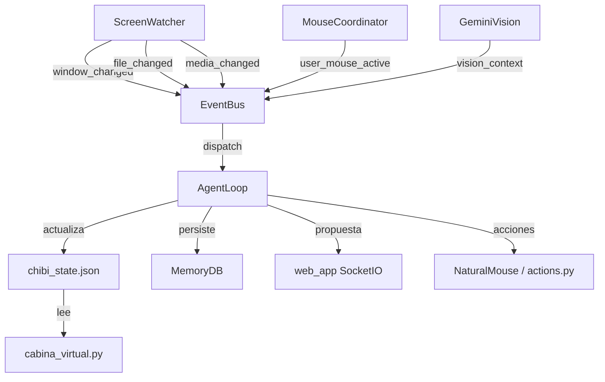

# Documento de Diseño — Alisha Agente Operativo

## Visión General

Este diseño evoluciona a Alisha de asistente de chat reactiva a **Agente Operativo Real**: un sistema que percibe el entorno de forma continua, toma iniciativa, ejecuta acciones con naturalidad y persiste su memoria en base de datos.

El principio rector es **fail-silent**: cada componente nuevo está aislado en su propio módulo con manejo de excepciones exhaustivo. Si cualquier componente falla, Alisha sigue funcionando exactamente como antes.

### Restricciones de diseño

- **No modificar**: `brain.py`, `cabina_virtual.py`, `tts_engine.py`
- **No romper**: el chat web (Flask/SocketIO) ni el modelo Live2D
- **Compatibilidad**: `agent_memory.py` existente debe seguir funcionando sin cambios
- **Plataforma**: Python 3.11+ en Windows 11
- **Fail-silent**: toda excepción se captura y registra; nunca se propaga al sistema principal

---

## Arquitectura

El sistema se organiza en capas concéntricas:

```
┌─────────────────────────────────────────────────────────────┐
│                      Alisha_IA.py                           │
│  (proceso único: web + Live2D + bandeja + AgentLoop)        │
└──────────────────────┬──────────────────────────────────────┘
                       │ inicia como hilo daemon
┌──────────────────────▼──────────────────────────────────────┐
│                     agent_loop.py                           │
│  AgentLoop ─── EventBus ─── ScreenWatcher                  │
│       │                                                     │
│  StateMapper  MouseCoordinator  GeminiVision  MemoryDB      │
└──────────────────────┬──────────────────────────────────────┘
                       │ lee/escribe
┌──────────────────────▼──────────────────────────────────────┐
│               chibi_state.json                              │
│  (canal de comunicación entre procesos)                     │
└─────────────────────────────────────────────────────────────┘
```

### Diagrama de flujo de eventos



### Principio de integración mínima

Los archivos existentes reciben cambios mínimos:

| Archivo | Cambio |
|---|---|
| `Alisha_IA.py` | +4 líneas: importar e iniciar `AgentLoop` |
| `actions.py` | Reemplazar `pyautogui.moveTo/click` con wrapper `NaturalMouse` |
| `web_app.py` | +1 endpoint `/api/agent/status`, +1 evento SocketIO `propuesta_asistencia` |

---

## Componentes e Interfaces

### 1. `agent_loop.py` — AgentLoop + EventBus + ScreenWatcher

**EventBus**: sistema pub/sub en memoria, thread-safe.

```python
class EventBus:
    def subscribe(self, event_type: str, handler: Callable) -> None
    def publish(self, event_type: str, data: dict) -> None
    # Eventos: window_changed, file_changed, media_changed,
    #          app_context_changed, user_mouse_active
```

**ScreenWatcher**: monitorea ventanas, archivos y medios cada 5 segundos.

```python
class ScreenWatcher:
    def start(self) -> None
    def stop(self) -> None
    def _detect_window(self) -> None      # ctypes.windll
    def _detect_files(self) -> None       # os.stat en directorio de trabajo
    def _detect_media(self) -> None       # alisha_media.get_media_info()
    def _categorize_app(self, title: str, process: str) -> str  # rol
```

**StateMapper**: traduce estados operativos a parámetros Live2D.

```python
class StateMapper:
    def apply(self, state: str) -> None   # escribe en chibi_state.json
    def transition_to_idle(self) -> None  # transición gradual 2s
```

**AgentLoop**: bucle central de percepción-decisión-acción.

```python
class AgentLoop:
    def start(self) -> None
    def stop(self) -> None
    def get_status(self) -> dict          # para /api/agent/status
    def _cycle(self) -> None              # cada 5 segundos
    def _handle_event(self, event_type: str, data: dict) -> None
```

### 2. `natural_mouse.py` — NaturalMouse

Movimientos curvos con curva de Bézier cuadrática.

```python
class NaturalMouse:
    def mover_a(self, x: int, y: int) -> None
    def click_natural(self, x: int, y: int) -> None
    def _bezier_curve(self, p0, p1, p2, steps) -> list[tuple]
    def _ease_in_out(self, t: float) -> float
    def _calcular_duracion(self, distancia: float) -> float  # 0.3–1.2s
```

### 3. `mouse_coordinator.py` — MouseCoordinator

Detecta movimiento del usuario y cede el control.

```python
class MouseCoordinator:
    def start(self) -> None
    def stop(self) -> None
    def is_user_active(self) -> bool      # True si movió en últimos 3s
    def _poll_loop(self) -> None          # cada 100ms
    # Fallback: pyautogui.position() si pynput no disponible
```

### 4. `gemini_vision.py` — GeminiVision

Análisis semántico silencioso de capturas de pantalla.

```python
class GeminiVision:
    def start(self) -> None
    def stop(self) -> None
    def get_latest_description(self) -> Optional[str]  # < 30s de antigüedad
    def capture_and_analyze(self) -> Optional[str]     # captura inmediata
    def _capture_loop(self) -> None                    # cada 10–15s
    def _analyze(self, img_bytes: bytes) -> Optional[str]
```

Buffer circular de las últimas 5 descripciones en memoria.

### 5. `assistance_protocol.py` — AssistanceProtocol

Protocolo de 4 pasos para asistencia operativa.

```python
class AssistanceProtocol:
    TRIGGER_KEYWORDS = {"ayudame con", "hacé un", "creá un", "analizá", "buscá info sobre"}
    
    def should_trigger(self, message: str) -> bool
    def execute(self, message: str, socketio) -> None  # async en hilo
    def _step1_capture(self) -> Optional[str]          # GeminiVision
    def _step2_generate(self, context: str, request: str) -> str  # brain.py
    def _step3_propose(self, proposal: str, socketio) -> None     # SocketIO emit
    def _step4_create(self, proposal: str) -> str                 # actions.py
    def _notify_error(self, step: int, error: str, socketio) -> None
```

### 6. `memory_db.py` — MemoryDB

Base de datos SQLite con fallback a JSON.

```python
class MemoryDB:
    def __init__(self, db_path: str = "alisha_memory.db")
    def save_conversation(self, entrada: str, respuesta: str, estado_emocional: str) -> None
    def load_recent(self, n: int = 20) -> list[dict]
    def buscar_contexto(self, query: str) -> list[dict]  # LIKE en SQLite
    def save_preference(self, clave: str, valor: str) -> None
    def get_preference(self, clave: str) -> Optional[str]
    def start_session(self) -> int                       # retorna session_id
    def end_session(self, session_id: int, resumen: str) -> None
    def _archive_old_records(self) -> None               # > 10.000 registros
    def _fallback_to_json(self) -> None                  # si SQLite falla
```

---

## Modelos de Datos

### chibi_state.json — campos nuevos

El archivo existente se extiende con campos adicionales (nunca se sobreescriben los existentes):

```json
{
  "estado": "neutral",
  "hablando": false,
  "gaze_x": 0.0,
  "gaze_y": 0.0,
  "rol_activo": "companion",
  "media_actual": {
    "title": "Blinding Lights",
    "artist": "The Weeknd",
    "app": "Spotify"
  },
  "agent_heartbeat": 1720000000.0,
  "ultimo_movimiento_usuario": 1720000000.0,
  "agent_state": "IDLE"
}
```

### alisha_memory.db — esquema SQLite

```sql
CREATE TABLE IF NOT EXISTS conversaciones (
    id              INTEGER PRIMARY KEY AUTOINCREMENT,
    timestamp       TEXT    NOT NULL,
    entrada         TEXT    NOT NULL,
    respuesta       TEXT    NOT NULL,
    estado_emocional TEXT   DEFAULT 'neutral'
);

CREATE TABLE IF NOT EXISTS conversaciones_archivo (
    id              INTEGER PRIMARY KEY AUTOINCREMENT,
    timestamp       TEXT    NOT NULL,
    entrada         TEXT    NOT NULL,
    respuesta       TEXT    NOT NULL,
    estado_emocional TEXT   DEFAULT 'neutral',
    archivado_en    TEXT    NOT NULL
);

CREATE TABLE IF NOT EXISTS preferencias (
    clave           TEXT    PRIMARY KEY,
    valor           TEXT    NOT NULL,
    timestamp       TEXT    NOT NULL
);

CREATE TABLE IF NOT EXISTS sesiones (
    id                  INTEGER PRIMARY KEY AUTOINCREMENT,
    inicio              TEXT    NOT NULL,
    fin                 TEXT,
    actividad_principal TEXT    DEFAULT '',
    resumen             TEXT    DEFAULT ''
);

CREATE INDEX IF NOT EXISTS idx_conv_timestamp ON conversaciones(timestamp);
CREATE INDEX IF NOT EXISTS idx_conv_entrada   ON conversaciones(entrada);
```

### Evento SocketIO `propuesta_asistencia`

```json
{
  "paso": 3,
  "propuesta": "Voy a crear un documento Word con el análisis de tu CV...",
  "contexto_visual": "Tenés Word abierto con un CV en inglés",
  "acciones_previstas": ["crear_word", "escribir_texto"]
}
```

### Evento SocketIO `propuesta_confirmada`

```json
{
  "paso": 4,
  "archivo_creado": "C:/Users/User/Desktop/analisis_cv.docx",
  "mensaje": "Listo, lo guardé en tu escritorio."
}
```

### Estado de sub-componentes (`/api/agent/status`)

```json
{
  "agent_loop": "running",
  "screen_watcher": "running",
  "mouse_coordinator": "running",
  "gemini_vision": "running",
  "memory_db": "sqlite",
  "last_heartbeat": 1720000000.0,
  "current_state": "IDLE",
  "rol_activo": "senior_dev",
  "media_actual": null
}
```

---

## Propiedades de Corrección

*Una propiedad es una característica o comportamiento que debe ser verdadero en todas las ejecuciones válidas del sistema — esencialmente, una declaración formal sobre lo que el sistema debe hacer. Las propiedades sirven como puente entre especificaciones legibles por humanos y garantías de corrección verificables automáticamente.*

### Propiedad 1: StateMapper preserva campos existentes

*Para cualquier* diccionario de campos preexistentes en `chibi_state.json`, cuando el `StateMapper` escribe un nuevo estado operativo, todos los campos preexistentes deben seguir presentes con sus valores originales — solo los campos de estado y gaze son actualizados.

**Valida: Requisito 2.5**

---

### Propiedad 2: StateMapper mapea estados a rangos de parámetros correctos

*Para cualquier* estado operativo válido del conjunto {IDLE, THINKING, WORKING, OVERLOADED}, los parámetros Live2D resultantes deben satisfacer las restricciones de rango especificadas: IDLE produce `gaze_x=0.0, gaze_y=0.0`; THINKING produce `gaze_x ∈ [-0.3, 0.3], gaze_y ∈ [-0.2, 0.2]`; WORKING produce `gaze_y=-0.1`; OVERLOADED produce `gaze_x ∈ [-0.5, 0.5], gaze_y=0.3`.

**Valida: Requisito 2.1, 2.2, 2.3, 2.4**

---

### Propiedad 3: NaturalMouse — la curva de Bézier siempre termina en el destino

*Para cualquier* par de coordenadas de origen `(x0, y0)` y destino `(x1, y1)` válidas en pantalla, el último punto generado por la curva de Bézier cuadrática debe ser igual al punto de destino dentro de ±1 píxel de tolerancia.

**Valida: Requisito 3.1**

---

### Propiedad 4: NaturalMouse — duración acotada y proporcional a la distancia

*Para cualquier* par de puntos de origen y destino, la duración calculada del movimiento debe estar en el rango [0.15s, 1.2s], y para distancias mayores a 50 píxeles debe ser monótonamente no-decreciente con respecto a la distancia euclidiana entre los puntos.

**Valida: Requisito 3.2, 3.3**

---

### Propiedad 5: MemoryDB — round-trip de conversación

*Para cualquier* conversación válida (entrada no vacía, respuesta no vacía, estado emocional no vacío), guardarla con `save_conversation` y luego recuperarla con `load_recent` debe producir un registro con los mismos valores de entrada, respuesta y estado emocional.

**Valida: Requisito 9.3**

---

### Propiedad 6: MemoryDB — búsqueda retorna subconjunto relevante

*Para cualquier* query de búsqueda no vacía y cualquier conjunto de conversaciones en la base de datos, todos los resultados retornados por `buscar_contexto(query)` deben contener la query (o parte de ella) en el campo `entrada` o `respuesta`.

**Valida: Requisito 9.5**

---

### Propiedad 7: AssistanceProtocol — detección de palabras clave es exhaustiva y precisa

*Para cualquier* mensaje de texto, `should_trigger` debe retornar `True` si y solo si el mensaje contiene al menos una de las palabras clave de activación definidas en `TRIGGER_KEYWORDS` (comparación case-insensitive).

**Valida: Requisito 8.1**

---

### Propiedad 8: EventBus — entrega a todos los suscriptores exactamente una vez

*Para cualquier* tipo de evento y cualquier número N de handlers suscritos a ese tipo, publicar un evento debe invocar exactamente los N handlers registrados, cada uno exactamente una vez, con los datos del evento sin modificar.

**Valida: Requisito 1.2, 1.3, 1.4**

---

### Propiedad 9: ScreenWatcher — clasificación de apps asigna rol correcto

*Para cualquier* título de ventana que contenga el nombre de una aplicación conocida, la función de clasificación debe asignar el rol correspondiente a esa categoría; y para cualquier título que no contenga ninguna aplicación conocida, debe asignar `rol="companion"`.

**Valida: Requisito 4.2, 4.3, 4.4, 4.5, 4.7**

---

### Propiedad 10: GeminiVision — buffer circular retiene las últimas 5 descripciones

*Para cualquier* secuencia de N descripciones agregadas al buffer (N ≥ 1), el buffer debe contener exactamente `min(N, 5)` descripciones, y estas deben ser las N más recientes en el orden en que fueron agregadas.

**Valida: Requisito 6.3**

---

### Propiedad 11: GeminiVision — filtro de frescura de 30 segundos

*Para cualquier* descripción almacenada en el buffer, `get_latest_description` debe retornarla si y solo si su timestamp tiene menos de 30 segundos de antigüedad respecto al momento de la consulta.

**Valida: Requisito 6.4**

---

### Propiedad 12: MouseCoordinator — umbral de detección de movimiento

*Para cualquier* par de posiciones de mouse (anterior, actual), el MouseCoordinator debe publicar el evento `user_mouse_active` si y solo si la distancia euclidiana entre ambas posiciones es mayor a 5 píxeles.

**Valida: Requisito 5.2**

---

## Manejo de Errores

### Estrategia global: fail-silent con degradación elegante

Cada componente nuevo sigue este patrón:

```python
try:
    # operación del componente
    resultado = hacer_algo()
except Exception as e:
    # registrar sin propagar
    print(f"[ComponenteX] Error (ignorado): {e}")
    resultado = valor_por_defecto
```

### Tabla de fallos y comportamiento esperado

| Componente | Fallo | Comportamiento |
|---|---|---|
| `AgentLoop` | Excepción en ciclo | Log + continuar siguiente ciclo |
| `ScreenWatcher` | `ctypes` falla | Usar título vacío, no publicar evento |
| `MouseCoordinator` | `pynput` no disponible | Fallback a `pyautogui.position()` polling |
| `GeminiVision` | API error | Log + esperar 60s + reintentar |
| `GeminiVision` | CPU > 70% | Pausar capturas hasta CPU < 60% |
| `MemoryDB` | SQLite bloqueado/corrupto | Fallback a JSON existente |
| `NaturalMouse` | `FailSafeException` | Detener movimiento, no propagar |
| `AssistanceProtocol` | Cualquier paso falla | Notificar usuario en voseo + ofrecer continuar |
| `StateMapper` | `chibi_state.json` corrupto | Crear archivo nuevo con defaults |
| `Alisha_IA.py` | AgentLoop falla al iniciar | Log + continuar sin AgentLoop |

### Aislamiento de hilos

Cada componente corre en su propio hilo daemon. Los fallos en un hilo no afectan a los demás:

```
Hilo principal (bandeja)
├── Hilo web (Flask/SocketIO)  ← NO TOCAR
├── Hilo AgentLoop
│   ├── Hilo ScreenWatcher
│   ├── Hilo MouseCoordinator
│   └── Hilo GeminiVision
└── Hilo saludo inicial
```

### Timeout de operaciones externas

- Llamadas a Gemini API: timeout de 15 segundos
- Lectura de `chibi_state.json`: try/except sin timeout (operación local)
- Operaciones SQLite: timeout de 5 segundos (WAL mode para concurrencia)

---

## Estrategia de Testing

### Enfoque dual

Se combinan tests de ejemplo (para comportamientos específicos) y tests basados en propiedades (para invariantes universales).

### Tests de propiedades (Hypothesis)

Cada propiedad del diseño se implementa como un test con Hypothesis (mínimo 100 iteraciones):

```python
# Tag format: Feature: alisha-agente-operativo, Property N: <texto>
@given(st.dictionaries(...))
@settings(max_examples=100)
def test_state_mapper_preserves_fields(...):
    # Feature: alisha-agente-operativo, Property 1: StateMapper preserva campos existentes
    ...
```

**Biblioteca**: `hypothesis` (ya presente en el proyecto, ver `.hypothesis/`)

### Tests de ejemplo (pytest)

- Inicialización de cada componente sin errores
- Fallback a JSON cuando SQLite falla
- Detección correcta de apps por categoría
- Protocolo de asistencia con mock de brain y SocketIO
- Heartbeat escrito en chibi_state.json

### Tests de integración (manuales / smoke)

- Iniciar `Alisha_IA.py` y verificar que el AgentLoop aparece en `/api/agent/status`
- Verificar que el chat web sigue funcionando con el AgentLoop activo
- Verificar que el modelo Live2D responde a cambios de estado

### Cobertura mínima esperada

| Módulo | Tipo de test | Cobertura objetivo |
|---|---|---|
| `StateMapper` | Propiedad + ejemplo | 90% |
| `NaturalMouse` | Propiedad + ejemplo | 85% |
| `MemoryDB` | Propiedad + ejemplo | 85% |
| `EventBus` | Propiedad + ejemplo | 90% |
| `AssistanceProtocol` | Ejemplo + mock | 75% |
| `GeminiVision` | Ejemplo + mock | 70% |
| `MouseCoordinator` | Ejemplo | 70% |
