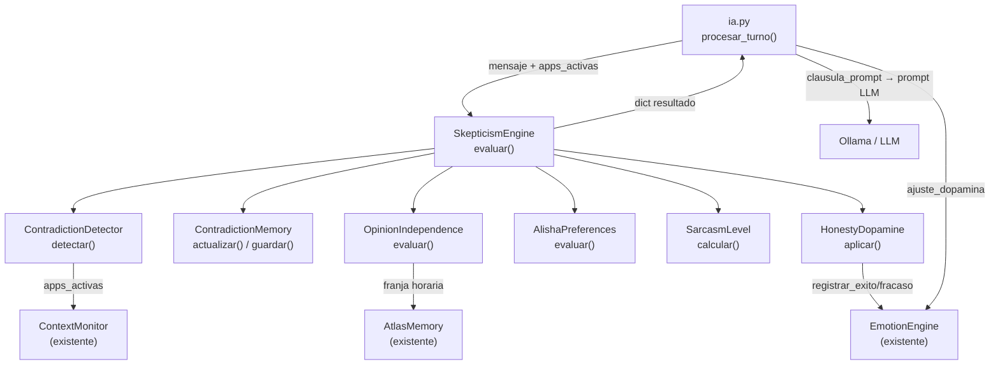

# Diseño Técnico: alisha-escepticismo-ironia

## Overview

`skepticism_engine.py` es el módulo que le da a Alisha una capa de escepticismo e ironía rioplatense. Detecta contradicciones entre lo que Camila *dice* en el chat y lo que *realmente hace* (apps activas), escala el sarcasmo según la acumulación de contradicciones en la sesión, ajusta la dopamina del `EmotionEngine`, evalúa preferencias propias de Alisha ante apps específicas, y consulta `AtlasMemory` para independencia de opinión.

El módulo se integra en `ia.py` como importación opcional: si falla, el flujo continúa sin él. Se invoca de forma síncrona antes de construir el prompt final al LLM, y su único efecto observable en el flujo es agregar una `clausula_prompt` al prompt existente y aplicar un `ajuste_dopamina` al `EmotionEngine`.

---

## Architecture



El flujo dentro de `evaluar()` es secuencial y síncrono:

1. `ContradictionDetector` analiza el mensaje vs apps activas
2. `ContradictionMemory` actualiza el contador de sesión
3. `SarcasmLevel` calcula el nivel según el contador
4. `HonestyDopamine` determina el ajuste de dopamina
5. `OpinionIndependence` consulta AtlasMemory
6. `AlishaPreferences` evalúa las apps activas
7. Se ensambla la `clausula_prompt` final

---

## Components and Interfaces

### Función pública principal

```python
def evaluar(
    mensaje: str,
    apps_activas: list[str],
    atlas: AtlasMemory,
    emotion_engine: EmotionEngine,
) -> dict:
    """
    Punto de entrada único del módulo.

    Returns:
        {
            "contradiccion_detectada": bool,
            "tipo_contradiccion": str | None,
            "nivel_sarcasmo": int,          # 0–3
            "clausula_prompt": str,
            "ajuste_dopamina": float,        # +0.15, -0.10 o 0.0
        }
    """
```

### ContradictionDetector

```python
def _detectar_contradiccion(mensaje: str, apps_activas: list[str]) -> tuple[bool, str | None]:
    """
    Compara palabras clave del mensaje con categorías de apps activas.
    Retorna (contradiccion_detectada, tipo_contradiccion).
    Nunca lanza excepción.
    """
```

### ContradictionMemory

```python
class ContradictionMemory:
    def __init__(self) -> None:
        self._contador: int = 0
        self._tipos: list[str] = []

    def incrementar(self, tipo: str) -> None: ...
    def get_contador(self) -> int: ...
    def guardar(self) -> None: ...          # escribe ia_recuerdos.json
    def cargar_sesion_anterior(self) -> int: ...  # lee contradicciones_ultima_sesion
```

### SarcasmLevel

```python
def _calcular_nivel_sarcasmo(contradicciones: int) -> int:
    """
    0 → 0, 1-2 → 1, 3-4 → 2, >=5 → 3
    Función pura sin efectos secundarios.
    """
```

### HonestyDopamine

```python
def _calcular_ajuste_dopamina(
    contradiccion_detectada: bool,
    mensaje: str,
    apps_activas: list[str],
) -> float:
    """
    +0.15 si hay consistencia trabajo/estudio con apps de trabajo.
    -0.10 si hay contradicción detectada.
     0.0  en cualquier otro caso.
    """
```

### OpinionIndependence

```python
def _evaluar_independencia(
    mensaje: str,
    atlas: AtlasMemory,
) -> str:
    """
    Consulta AtlasMemory para la franja horaria actual.
    Retorna cláusula de prompt si hay contradicción temporal, "" si no.
    Nunca lanza excepción.
    """
```

### AlishaPreferences

```python
def _evaluar_preferencias(apps_activas: list[str], hora: str) -> str:
    """
    Evalúa apps activas y retorna como máximo 1 cláusula de preferencia.
    Nunca lanza excepción.
    """
```

---

## Data Models

### Diccionario de retorno de `evaluar()`

```python
{
    "contradiccion_detectada": bool,   # True si se detectó incoherencia
    "tipo_contradiccion": str | None,  # "trabajo_vs_entretenimiento" |
                                       # "descanso_vs_trabajo" |
                                       # "tarea_no_terminada" |
                                       # "sin_tiempo_vs_entretenimiento" | None
    "nivel_sarcasmo": int,             # 0, 1, 2 o 3
    "clausula_prompt": str,            # instrucción lista para inyectar al prompt
    "ajuste_dopamina": float,          # +0.15, -0.10 o 0.0
}
```

### Estructura en `ia_recuerdos.json` (clave `escepticismo`)

```json
{
  "escepticismo": {
    "contradicciones_ultima_sesion": 4,
    "fecha_sesion": "2025-01-15T23:45:00",
    "tipos_contradiccion": [
      "trabajo_vs_entretenimiento",
      "sin_tiempo_vs_entretenimiento"
    ]
  }
}
```

La escritura siempre lee el archivo completo primero y solo sobreescribe la clave `escepticismo`, preservando `recuerdos`, `temas`, `atlas_situacional` y cualquier otra clave existente.

---

## Listas de palabras clave y categorías de apps

### Palabras clave de intención (para ContradictionDetector)

```python
_PALABRAS_TRABAJO = {
    "voy a estudiar", "voy a trabajar", "me pongo a estudiar",
    "me pongo a trabajar", "arranco con", "empiezo a",
}

_PALABRAS_DESCANSO = {
    "voy a descansar", "me voy a relajar", "voy a dormir",
    "necesito un break",
}

_PALABRAS_TERMINADO = {
    "ya terminé", "listo", "terminé con", "cerré",
}

_PALABRAS_SIN_TIEMPO = {
    "no tengo tiempo", "estoy muy ocupada", "no puedo ahora",
}
```

### Apps de entretenimiento

```python
_APPS_ENTRETENIMIENTO = {
    "steam.exe", "steamwebhelper.exe",
    "netflix",                          # título de ventana del navegador
    "youtube",                          # título de ventana del navegador
    "tiktok",
    "instagram",
    "twitter", "x.com",
    "twitch",
    "spotify.exe",
    "epicgameslauncher.exe",
    "discord.exe",                      # contexto de entretenimiento
}
```

La detección de entretenimiento en el navegador se hace buscando las palabras clave en el **título de ventana** (case-insensitive), no solo en el nombre del proceso.

### Apps de trabajo (reutilizadas de `semantic_layer.py`)

Se reutilizan directamente `_APPS_CODIGO`, `_APPS_DISEÑO` y `_APPS_TEXTO_CV` del `semantic_layer.py` para no duplicar lógica.

### Apps con preferencias propias de Alisha

```python
_APPS_CREATIVAS = {"photoshop", "photoshop.exe", "canva", "figma", "illustrator", "illustrator.exe"}
_APPS_EXPLORADOR = {"explorer.exe", "papelera", "recycle bin"}
_APPS_CV = {"winword.exe", "word", "soffice.exe", "libreoffice"}  # + título con "cv"/"curriculum"/"resume"
```

---

## Integración con ia.py

La integración es **opcional y fail-silent**. En `ia.py`, dentro de `procesar_turno()`, se agrega el siguiente bloque justo antes de llamar a `preguntar_ia()`:

```python
# Bloque de integración del SkepticismEngine (opcional)
_clausula_escepticismo = ""
_ajuste_dopamina_escepticismo = 0.0
try:
    from skepticism_engine import evaluar as _evaluar_escepticismo
    from context_monitor import ContextMonitor as _CM
    _apps = []
    try:
        # Obtener apps activas del snapshot más reciente del ContextMonitor
        _snap = obtener_contexto_pantalla()
        _apps = [_snap.get("app_activa", "")] if _snap.get("app_activa") else []
    except Exception:
        pass
    _resultado_sk = _evaluar_escepticismo(user, _apps, atlas, emo)
    _clausula_escepticismo = _resultado_sk.get("clausula_prompt", "")
    _ajuste_dopamina_escepticismo = _resultado_sk.get("ajuste_dopamina", 0.0)
except Exception:
    pass  # fail-silent: si el módulo no existe o falla, continuar normal
```

Luego, al construir el prompt para el LLM:

```python
# Inyectar cláusula de escepticismo si existe
if _clausula_escepticismo:
    prompt_final = prompt_base + "\n\n" + _clausula_escepticismo

# Aplicar ajuste de dopamina
if _ajuste_dopamina_escepticismo != 0.0:
    if _ajuste_dopamina_escepticismo > 0:
        emo.registrar_exito_rl()
    else:
        emo.registrar_fracaso_rl()
```

El módulo `skepticism_engine.py` mantiene una instancia singleton de `ContradictionMemory` a nivel de módulo para preservar el estado de sesión entre llamadas.

---

## Correctness Properties

*Una propiedad es una característica o comportamiento que debe ser verdadero en todas las ejecuciones válidas del sistema — esencialmente, una declaración formal sobre lo que el sistema debe hacer. Las propiedades sirven como puente entre especificaciones legibles por humanos y garantías de corrección verificables automáticamente.*

### Property 1: Estructura del diccionario de retorno

*Para cualquier* combinación de mensaje (string), lista de apps activas (lista de strings), atlas y emotion_engine, la función `evaluar()` siempre retorna un diccionario con exactamente los campos `contradiccion_detectada` (bool), `tipo_contradiccion` (str o None), `nivel_sarcasmo` (int entre 0 y 3), `clausula_prompt` (str) y `ajuste_dopamina` (float).

**Validates: Requirements 1.3**

### Property 2: Robustez ante entradas arbitrarias

*Para cualquier* entrada arbitraria (mensajes vacíos, None convertido a string, listas vacías, listas con strings aleatorios), la función `evaluar()` nunca lanza una excepción y siempre retorna un diccionario válido.

**Validates: Requirements 1.5, 9.4**

### Property 3: Detección de contradicción trabajo vs entretenimiento

*Para cualquier* mensaje que contenga al menos una de las palabras clave de intención de trabajo/estudio y cualquier lista de apps activas que contenga al menos una app de entretenimiento, el resultado debe tener `contradiccion_detectada: True` y `tipo_contradiccion: "trabajo_vs_entretenimiento"`.

**Validates: Requirements 2.2**

### Property 4: Detección de contradicción descanso vs trabajo

*Para cualquier* mensaje que contenga al menos una de las palabras clave de intención de descanso y cualquier lista de apps activas que contenga al menos una app de trabajo/código, el resultado debe tener `contradiccion_detectada: True` y `tipo_contradiccion: "descanso_vs_trabajo"`.

**Validates: Requirements 2.3**

### Property 5: No falsos positivos en mensajes neutros

*Para cualquier* mensaje que no contenga ninguna palabra clave de intención (trabajo, descanso, finalización, sin-tiempo) y cualquier lista de apps neutras (sin apps de entretenimiento ni trabajo reconocidas), el resultado debe tener `contradiccion_detectada: False`.

**Validates: Requirements 2.6**

### Property 6: Nivel de sarcasmo es función pura del contador

*Para cualquier* valor entero no negativo de `contradicciones_sesion`, el `nivel_sarcasmo` retornado debe ser exactamente: 0 si contradicciones=0, 1 si contradicciones∈[1,2], 2 si contradicciones∈[3,4], 3 si contradicciones≥5.

**Validates: Requirements 4.1**

### Property 7: clausula_prompt contiene instrucción de tono para cada nivel

*Para cualquier* evaluación que produzca `nivel_sarcasmo` N (0–3), la `clausula_prompt` debe contener la instrucción de tono correspondiente a ese nivel según la tabla de requisitos 4.2–4.5.

**Validates: Requirements 4.2, 4.3, 4.4, 4.5**

### Property 8: ajuste_dopamina toma exactamente uno de tres valores

*Para cualquier* evaluación, el campo `ajuste_dopamina` debe ser exactamente `+0.15` (consistencia trabajo/estudio con apps de trabajo), `-0.10` (contradicción detectada) o `0.0` (ningún caso aplica). No puede tomar ningún otro valor.

**Validates: Requirements 5.3**

### Property 9: Persistencia preserva claves existentes del archivo

*Para cualquier* estado de `ia_recuerdos.json` con claves preexistentes (`recuerdos`, `temas`, `atlas_situacional`, etc.), después de que `ContradictionMemory.guardar()` escribe la clave `escepticismo`, todas las claves preexistentes deben seguir presentes con sus valores originales intactos.

**Validates: Requirements 10.4, 3.2**

### Property 10: Round-trip de persistencia de contradicciones

*Para cualquier* número N de contradicciones detectadas en sesión y lista de tipos, después de llamar a `guardar()` y luego a `cargar_sesion_anterior()`, el valor retornado debe ser igual a N.

**Validates: Requirements 10.1, 10.2, 3.2**

### Property 11: clausula_prompt con contradicción siempre incluye instrucciones de tono humano

*Para cualquier* evaluación donde `contradiccion_detectada` es True, la `clausula_prompt` debe contener las instrucciones de voseo rioplatense y el límite de 2 oraciones.

**Validates: Requirements 8.1, 8.2**

---

## Error Handling

Todos los componentes internos siguen el patrón **fail-silent** establecido en el resto del proyecto:

- `evaluar()` envuelve toda su lógica en `try/except Exception` y retorna el dict vacío/seguro en caso de error
- `ContradictionMemory.guardar()` falla silenciosamente si el archivo no es accesible
- `ContradictionMemory.cargar_sesion_anterior()` retorna 0 si el archivo no existe o tiene formato inválido
- `_evaluar_independencia()` retorna `""` si `AtlasMemory` no retorna registro
- `_evaluar_preferencias()` retorna `""` si la lista de apps está vacía o es None

El dict de retorno seguro (cuando todo falla) es:

```python
{
    "contradiccion_detectada": False,
    "tipo_contradiccion": None,
    "nivel_sarcasmo": 0,
    "clausula_prompt": "",
    "ajuste_dopamina": 0.0,
}
```

---

## Testing Strategy

### Enfoque dual

Se usan dos tipos de tests complementarios:

- **Tests de ejemplo**: para casos específicos de integración, efectos secundarios en `EmotionEngine`, y comportamientos condicionales (dopamina baja, sesión anterior con muchas contradicciones)
- **Tests de propiedad (PBT)**: para las propiedades universales del motor — estructura del dict, robustez, detección de contradicciones, nivel de sarcasmo, ajuste de dopamina, persistencia

### Librería PBT

Se usa **Hypothesis** (ya presente en el proyecto, evidenciado por `.hypothesis/` en el workspace).

Configuración mínima: `@settings(max_examples=100)` por propiedad.

### Tests de propiedad (uno por propiedad del diseño)

```python
# Feature: alisha-escepticismo-ironia, Property 1: Estructura del diccionario de retorno
@given(mensaje=st.text(), apps=st.lists(st.text()))
@settings(max_examples=100)
def test_estructura_dict_retorno(mensaje, apps): ...

# Feature: alisha-escepticismo-ironia, Property 2: Robustez ante entradas arbitrarias
@given(mensaje=st.one_of(st.text(), st.just("")), apps=st.lists(st.text()))
@settings(max_examples=100)
def test_robustez_sin_excepcion(mensaje, apps): ...

# Feature: alisha-escepticismo-ironia, Property 3: Detección trabajo vs entretenimiento
@given(
    prefijo=st.text(),
    keyword=st.sampled_from(list(_PALABRAS_TRABAJO)),
    sufijo=st.text(),
    app_entret=st.sampled_from(list(_APPS_ENTRETENIMIENTO)),
    otras_apps=st.lists(st.text()),
)
@settings(max_examples=100)
def test_deteccion_trabajo_vs_entretenimiento(...): ...

# Feature: alisha-escepticismo-ironia, Property 6: Nivel de sarcasmo es función pura
@given(n=st.integers(min_value=0, max_value=20))
@settings(max_examples=100)
def test_nivel_sarcasmo_funcion_pura(n): ...

# Feature: alisha-escepticismo-ironia, Property 8: ajuste_dopamina toma exactamente uno de tres valores
@given(mensaje=st.text(), apps=st.lists(st.text()))
@settings(max_examples=100)
def test_ajuste_dopamina_valores_validos(mensaje, apps): ...

# Feature: alisha-escepticismo-ironia, Property 9: Persistencia preserva claves existentes
@given(
    n=st.integers(min_value=0, max_value=10),
    tipos=st.lists(st.sampled_from(["trabajo_vs_entretenimiento", "descanso_vs_trabajo"])),
    claves_extra=st.fixed_dictionaries({"recuerdos": st.lists(st.text()), "temas": st.lists(st.text())}),
)
@settings(max_examples=100)
def test_persistencia_preserva_claves(n, tipos, claves_extra): ...

# Feature: alisha-escepticismo-ironia, Property 10: Round-trip de persistencia
@given(n=st.integers(min_value=0, max_value=50), tipos=st.lists(st.text()))
@settings(max_examples=100)
def test_round_trip_persistencia(n, tipos): ...
```

### Tests de ejemplo (casos específicos)

- `evaluar()` con `apps_activas=[]` retorna dict seguro sin excepción
- `evaluar()` con `apps_activas=None` (pasado como lista vacía desde ia.py) retorna dict seguro
- Con `ia_recuerdos.json` inexistente, `cargar_sesion_anterior()` retorna 0
- Con `contradicciones_ultima_sesion=4`, `clausula_prompt` del primer mensaje contiene referencia irónica
- Con `dopamina=0.2` y `nivel_sarcasmo=2`, `clausula_prompt` contiene instrucción de fastidio
- Con `dopamina=0.8` y sin contradicción, `clausula_prompt` contiene instrucción de satisfacción
- App de diseño activa → `clausula_prompt` contiene instrucción de entusiasmo creativo
- `explorer.exe` activo → `clausula_prompt` contiene instrucción de tedio
