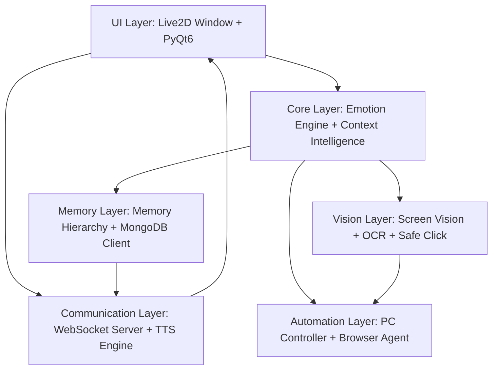
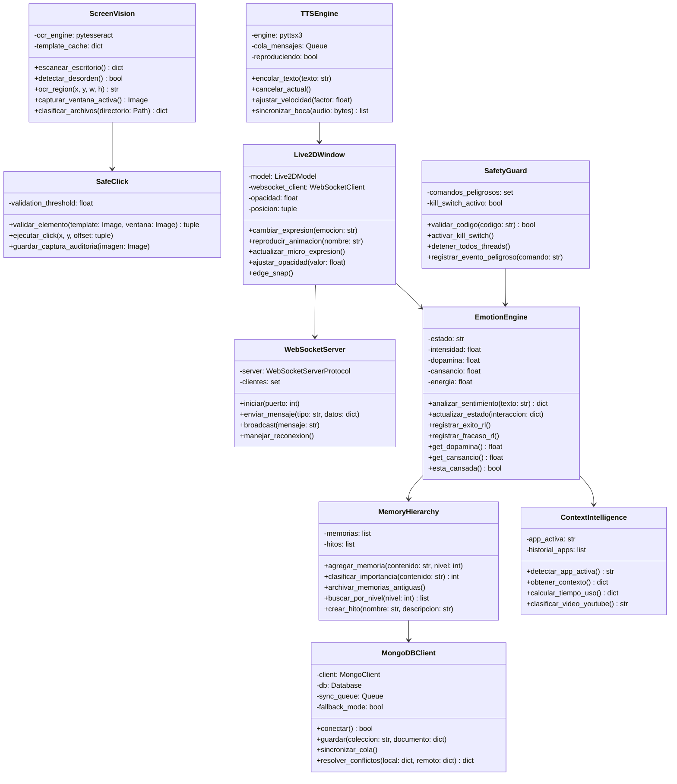
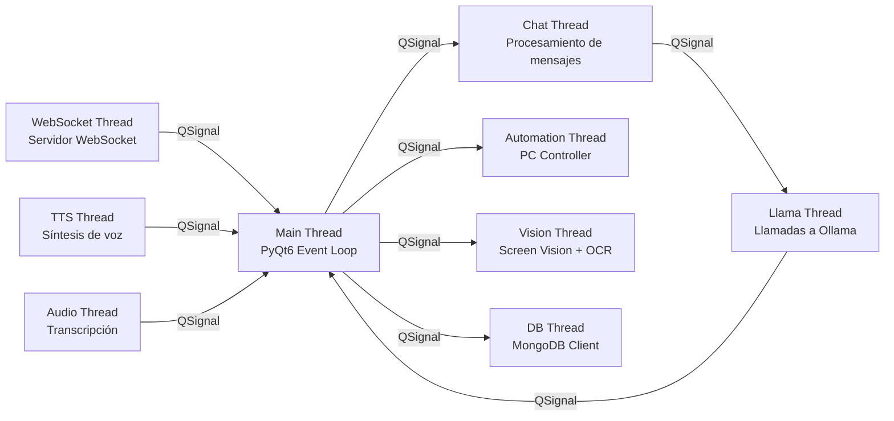
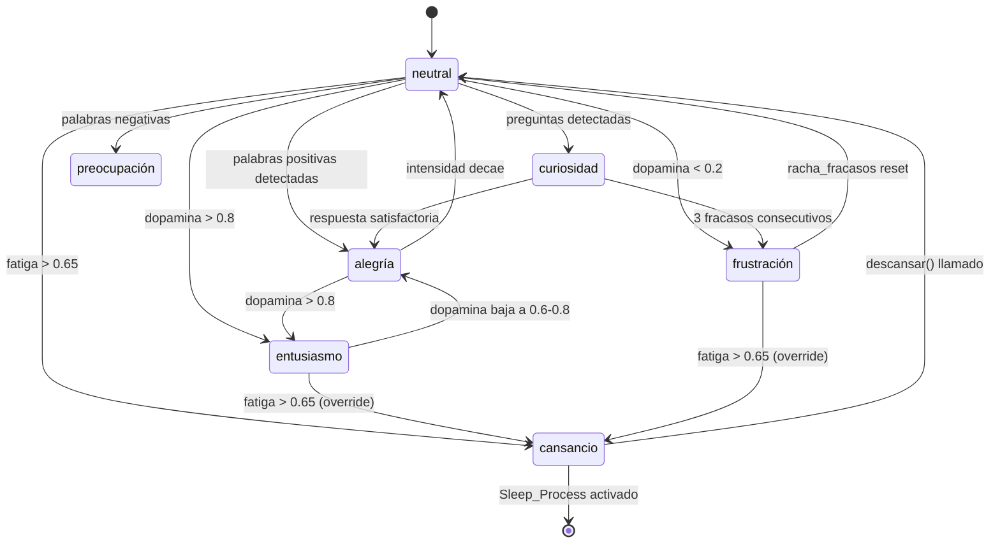
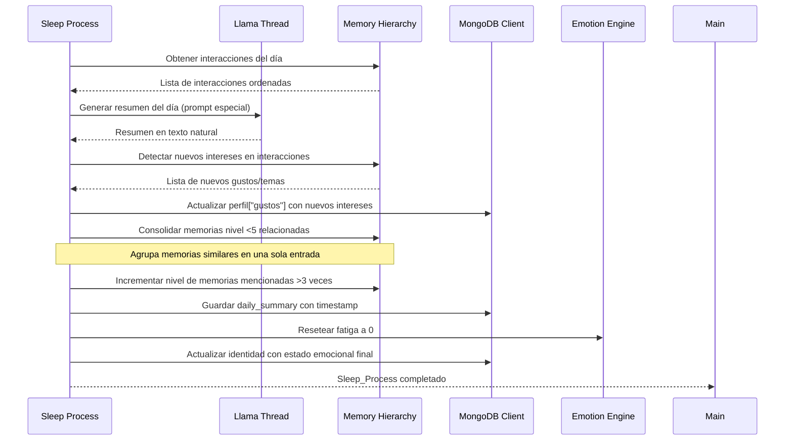
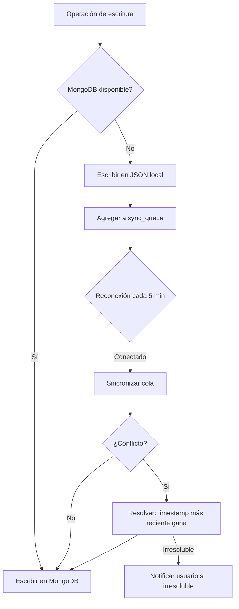
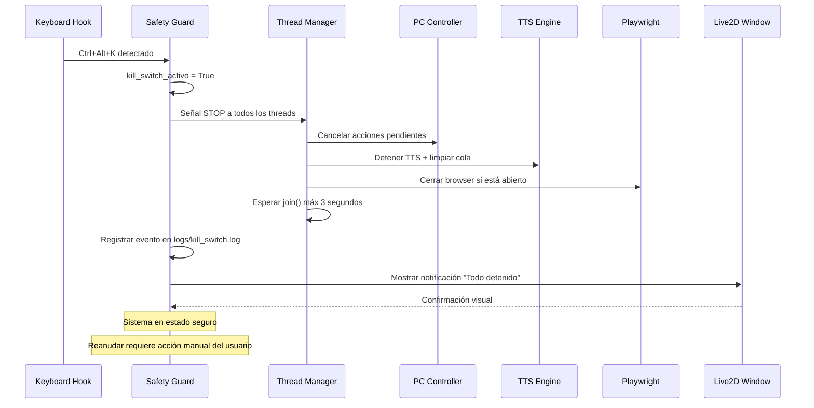

# Diseño: alisha-mejoras-avanzadas

## Introducción

Este documento describe el diseño técnico de las mejoras avanzadas para Alisha, una agente híbrida inteligente con interfaz PyQt6 + Live2D. Las mejoras transforman a Alisha en un compañero virtual con emociones genuinas, cognición avanzada, capacidades de visión y automatización inteligente, memoria jerárquica y una interfaz Live2D expresiva en tiempo real.

El diseño se enfoca en:
- **Arquitectura modular** con separación clara de responsabilidades
- **Threading seguro** usando QThreads de PyQt6 para operaciones concurrentes
- **Persistencia dual** MongoDB + JSON para alta disponibilidad
- **Comunicación en tiempo real** mediante WebSockets para sincronización Live2D
- **Seguridad** con validación de acciones y kill switch global

## Overview

### Arquitectura de Alto Nivel

El sistema se organiza en 6 capas principales:



### Componentes Principales

| Componente | Responsabilidad | Thread |
|------------|----------------|--------|
| **EmotionEngine** | Gestión de estado emocional, dopamina, fatiga, análisis NLP | Main |
| **ScreenVision** | Captura de pantalla, OCR, detección de desorden | Vision Thread |
| **PCController** | Automatización de acciones del sistema operativo | Automation Thread |
| **MemoryHierarchy** | Gestión de memoria con niveles de importancia | Main |
| **MongoDBClient** | Persistencia dual MongoDB + JSON con sincronización | DB Thread |
| **Live2DWindow** | Renderizado del modelo Live2D con animaciones | Main (PyQt6) |
| **WebSocketServer** | Comunicación en tiempo real con interfaz web | WebSocket Thread |
| **TTSEngine** | Síntesis de voz con sincronización de animaciones | TTS Thread |
| **SafetyGuard** | Validación de acciones peligrosas y kill switch | Main |
| **ContextIntelligence** | Detección de aplicación activa y contexto | Main |
| **AudioListener** | Transcripción de reuniones con Whisper | Audio Thread |

## Arquitectura

### Diagrama de Componentes



### Arquitectura de Threading

El sistema utiliza QThreads de PyQt6 para evitar bloqueos en la interfaz:



**Reglas de Threading**:
1. Solo el Main Thread puede modificar la UI (Live2DWindow)
2. Todos los threads usan QSignals para comunicarse con Main Thread
3. MongoDB_Client usa locks de threading para escrituras concurrentes
4. EmotionEngine usa atomic operations para actualizaciones de estado
5. Watchdog en Main Thread detecta threads bloqueados >30s y los reinicia

### Flujo de Datos Principal

```mermaid
sequenceDiagram
    participant U as Usuario
    participant UI as Live2D Window
    participant EE as Emotion Engine
    participant CT as Chat Thread
    participant LT as Llama Thread
    participant MH as Memory Hierarchy
    participant WS as WebSocket Server
    participant TTS as TTS Engine
    
    U->>UI: Mensaje de texto
    UI->>CT: Procesar mensaje
    CT->>EE: Analizar sentimiento
    EE->>EE: Actualizar dopamina/fatiga
    CT->>MH: Buscar contexto relevante
    MH-->>CT: Recuerdos + contexto
    CT->>LT: Generar respuesta (Llama 3)
    LT->>EE: Obtener tono emocional
    EE-->>LT: Instrucción de tono
    LT-->>CT: Respuesta generada
    CT->>MH: Guardar interacción
    CT->>EE: Actualizar estado emocional
    EE->>WS: Enviar cambio de emoción
    WS->>UI: Actualizar expresión Live2D
    CT->>TTS: Encolar texto para hablar
    TTS->>UI: Sincronizar animación de boca
    TTS-->>U: Audio de respuesta


## Modelos de Datos

### Diseño de Base de Datos MongoDB

El sistema usa MongoDB como almacenamiento principal con 7 colecciones. Cada colección tiene un esquema definido y estrategia de índices.

#### Colección: `historial`

Almacena cada interacción usuario-Alisha con contexto emocional completo.

```json
{
  "_id": "ObjectId",
  "fecha": "ISODate",
  "entrada": "string",
  "respuesta": "string",
  "pensamiento": "string",
  "emocion": "string",
  "dopamina_snapshot": 0.75,
  "fatiga_snapshot": 0.30,
  "ventana_activa": "string",
  "temas": ["string"],
  "sentimiento": {
    "polaridad": 0.6,
    "subjetividad": 0.4,
    "categoria": "positivo"
  },
  "sesion_id": "string"
}
```

Índices:
- `{ fecha: -1 }` — consultas por fecha descendente
- `{ temas: 1 }` — búsqueda por tema
- `{ emocion: 1, fecha: -1 }` — análisis de tendencias emocionales
- TTL: documentos con `fecha` > 90 días y `nivel_importancia` < 3 se eliminan automáticamente

#### Colección: `perfil`

Documento único (upsert) con el perfil acumulado del usuario.

```json
{
  "_id": "perfil_camila",
  "nombre": "Camila",
  "gustos": ["crochet", "programación", "diseño"],
  "intereses_detectados": {
    "youtube": ["tutoriales Python", "diseño UI"],
    "apps_frecuentes": ["VS Code", "Canva", "Chrome"]
  },
  "estadisticas": {
    "total_interacciones": 1240,
    "dias_activos": 45,
    "app_mas_usada": "VS Code",
    "tiempo_uso_semanal": { "VS Code": 1800, "Chrome": 900 }
  },
  "archivos_organizados": 87,
  "ultima_actualizacion": "ISODate"
}
```

#### Colección: `memorias`

Memorias clasificadas por nivel de importancia con soporte de archivado.

```json
{
  "_id": "ObjectId",
  "contenido": "string",
  "nivel": 8,
  "permanente": false,
  "fecha_creacion": "ISODate",
  "fecha_ultimo_acceso": "ISODate",
  "veces_mencionada": 3,
  "categoria": "preferencia",
  "archivada": false,
  "tags": ["string"]
}
```

Índices:
- `{ nivel: -1, archivada: 1 }` — consultas por importancia
- `{ permanente: 1 }` — memorias permanentes
- `{ fecha_creacion: 1 }` — para TTL de memorias antiguas
- TTL parcial: documentos con `nivel < 5` y `fecha_creacion` > 30 días se mueven a `memorias_archivadas`

#### Colección: `hitos`

Logros y proyectos completados con línea de tiempo.

```json
{
  "_id": "ObjectId",
  "nombre": "string",
  "descripcion": "string",
  "fecha": "ISODate",
  "aniversario": "MM-DD",
  "emocion_asociada": "entusiasmo",
  "categoria": "proyecto",
  "celebrado": false,
  "tags": ["string"]
}
```

Índices:
- `{ aniversario: 1 }` — para recordatorios de aniversario
- `{ fecha: -1 }` — línea de tiempo

#### Colección: `daily_summaries`

Resúmenes diarios generados por el Sleep_Process.

```json
{
  "_id": "ObjectId",
  "fecha": "ISODate",
  "resumen": "string",
  "interacciones_count": 42,
  "emociones_predominantes": ["alegría", "curiosidad"],
  "temas_del_dia": ["Python", "diseño"],
  "nuevos_intereses": ["FastAPI"],
  "fatiga_final": 0.65,
  "dopamina_final": 0.72,
  "memorias_consolidadas": 5
}
```

#### Colección: `app_cache`

Cache de aplicaciones detectadas con metadatos aprendidos.

```json
{
  "_id": "nombre_proceso",
  "nombre_display": "Visual Studio Code",
  "categoria": "desarrollo",
  "activa_modo_concentracion": true,
  "tiempo_total_uso": 72000,
  "primera_vez_visto": "ISODate",
  "proposito_aprendido": "Editor de código"
}
```

#### Colección: `identidad`

Estado emocional persistido entre sesiones (documento único).

```json
{
  "_id": "alisha_estado",
  "estado": "neutral",
  "intensidad": 0.5,
  "dopamina": 0.72,
  "cansancio": 0.0,
  "energia": 0.8,
  "racha_fracasos": 0,
  "interacciones_sesion": 0,
  "ultima_actualizacion": "ISODate"
}
```

#### Estrategia de Índices y TTL

```python
# Índices críticos a crear al inicializar MongoDB
INDICES_REQUERIDOS = {
    "historial": [
        [("fecha", -1)],
        [("temas", 1)],
        [("emocion", 1), ("fecha", -1)],
    ],
    "memorias": [
        [("nivel", -1), ("archivada", 1)],
        [("permanente", 1)],
        # TTL: memorias de nivel < 5 con más de 30 días
        [("fecha_creacion", 1)],  # TTL index con expireAfterSeconds=2592000
    ],
    "hitos": [
        [("aniversario", 1)],
        [("fecha", -1)],
    ],
}
```


## Diseño del Sistema de Emociones

### Curva de Saciedad de Dopamina

La dopamina no sube linealmente. Cada éxito consecutivo produce un incremento menor (saciedad):

```
Δdopamina = base_increment * (1 - dopamina_actual)^0.5

Donde:
  base_increment = 0.15 (éxito estándar)
  dopamina_actual ∈ [0.0, 1.0]

Ejemplos:
  dopamina=0.0 → Δ = 0.15 * 1.0   = 0.150
  dopamina=0.5 → Δ = 0.15 * 0.707 = 0.106
  dopamina=0.8 → Δ = 0.15 * 0.447 = 0.067
  dopamina=1.0 → Δ = 0.15 * 0.0   = 0.000  (saciedad total)
```

Cuando `dopamina >= 0.95`, el sistema aplica el cap de saciedad: los próximos 5 éxitos solo incrementan 50% del valor calculado.

### Cálculo de Fatiga con Multiplicador Nocturno

```python
def calcular_fatiga(horas_activas: float, interacciones_hora: int, hora_actual: int) -> float:
    fatiga_base = (horas_activas * 5) + (interacciones_hora * 2)
    
    # Multiplicador nocturno: 00:00 - 06:00
    multiplicador = 1.3 if 0 <= hora_actual < 6 else 1.0
    
    fatiga_final = min(100.0, fatiga_base * multiplicador)
    return fatiga_final
```

Umbrales de comportamiento:
| Fatiga | Efecto |
|--------|--------|
| < 50% | Normal |
| 50-70% | Respuestas 20% más cortas |
| > 70% | Typos (1/50 palabras), omitir mayúsculas (30% de oraciones) |
| > 90% | Estado forzado a "cansancio", TTS -15% velocidad |

### Algoritmo de Introducción de Errores por Cansancio

```python
def aplicar_errores_cansancio(texto: str, fatiga: float) -> str:
    if fatiga <= 0.70:
        return texto
    
    palabras = texto.split()
    resultado = []
    
    for i, palabra in enumerate(palabras):
        # Typo: 1 cada 50 palabras
        if i % 50 == 49 and random.random() < fatiga:
            palabra = _introducir_typo(palabra)
        resultado.append(palabra)
    
    # Omitir mayúscula inicial en 30% de oraciones
    texto_final = " ".join(resultado)
    if random.random() < 0.30:
        texto_final = texto_final[0].lower() + texto_final[1:]
    
    return texto_final

def _introducir_typo(palabra: str) -> str:
    """Intercambia dos letras adyacentes o duplica una."""
    if len(palabra) < 3:
        return palabra
    i = random.randint(0, len(palabra) - 2)
    chars = list(palabra)
    chars[i], chars[i+1] = chars[i+1], chars[i]
    return "".join(chars)
```

### Transiciones de Estado Emocional



**Regla de override**: Si `fatiga > 0.65`, el estado se fuerza a `cansancio` independientemente de otros triggers, excepto `frustración` que puede coexistir.


## Diseño de la Integración Live2D

### Protocolo WebSocket

El servidor WebSocket corre en `ws://localhost:8765`. Todos los mensajes son JSON con la estructura:

```json
{
  "type": "emotion_change | text_bubble | animation_trigger | state_update | micro_expression",
  "timestamp": "ISO8601",
  "payload": { ... }
}
```

#### Tipos de Mensajes

**`emotion_change`** — Cambio de emoción principal:
```json
{
  "type": "emotion_change",
  "timestamp": "2026-04-12T10:30:00Z",
  "payload": {
    "emotion": "alegría",
    "intensity": 0.85,
    "secondary_emotion": "entusiasmo",
    "transition_ms": 500
  }
}
```

**`text_bubble`** — Globo de texto sobre el modelo:
```json
{
  "type": "text_bubble",
  "timestamp": "2026-04-12T10:30:01Z",
  "payload": {
    "text": "¡Hola! ¿En qué te ayudo?",
    "duration_ms": 3000,
    "style": "speech | thought | whisper"
  }
}
```

**`animation_trigger`** — Animación específica:
```json
{
  "type": "animation_trigger",
  "timestamp": "2026-04-12T10:30:02Z",
  "payload": {
    "animation": "cosquillas | bostezo | parpadeo | celebracion | cabeceo",
    "loop": false,
    "priority": 1
  }
}
```

**`micro_expression`** — Micro-expresión superpuesta:
```json
{
  "type": "micro_expression",
  "timestamp": "2026-04-12T10:30:03Z",
  "payload": {
    "expression": "concentracion | sorpresa | curiosidad | traviesa",
    "duration_ms": 800,
    "blend_weight": 0.4
  }
}
```

**`state_update`** — Actualización de estado para la UI web:
```json
{
  "type": "state_update",
  "timestamp": "2026-04-12T10:30:04Z",
  "payload": {
    "dopamina": 0.75,
    "energia": 0.60,
    "fatiga": 0.35,
    "estado": "curiosidad",
    "mongodb_connected": true
  }
}
```

### Mapeo de Emociones a Parámetros Live2D

| Emoción | ParamEyeLOpen | ParamEyeROpen | ParamMouthForm | ParamBrowLY | ParamBrowRY | ParamAngleX |
|---------|--------------|--------------|----------------|-------------|-------------|-------------|
| alegría | 1.0 | 1.0 | 1.0 | 0.5 | 0.5 | 0 |
| curiosidad | 1.0 | 1.0 | 0.3 | 0.8 | 0.8 | 15 |
| entusiasmo | 1.0 | 1.0 | 0.8 | 0.6 | 0.6 | 0 |
| preocupación | 0.8 | 0.8 | -0.3 | -0.5 | -0.5 | -5 |
| frustración | 0.7 | 0.7 | -0.5 | -0.8 | -0.8 | 0 |
| cansancio | 0.4 | 0.4 | 0.0 | -0.3 | -0.3 | -10 |
| neutral | 1.0 | 1.0 | 0.0 | 0.0 | 0.0 | 0 |
| nostalgia | 0.9 | 0.9 | 0.2 | 0.2 | 0.2 | -8 |

### Sistema de Micro-expresiones y Combinaciones

Las micro-expresiones se superponen a la emoción principal con un `blend_weight` de 0.3-0.5:

| Combinación | Animación resultante |
|-------------|---------------------|
| WORKING + cansancio | `anim_head_drop` — cabeza cae levemente |
| alegría + entusiasmo | `anim_bounce` — pequeño salto |
| frustración + concentración | `anim_frown_focus` — ceño fruncido intenso |
| neutral + aburrimiento | `anim_idle_look_around` — mirada errante |
| cualquiera + sorpresa | `anim_eyebrow_raise` — cejas suben rápido |

Ciclo de micro-expresiones idle (cada 5-10 segundos aleatorio):
```python
MICRO_EXPRESIONES_IDLE = [
    "parpadeo_lento",    # 40% probabilidad
    "mirada_lateral",    # 25% probabilidad
    "sonrisa_sutil",     # 20% probabilidad
    "cabeza_tilt",       # 15% probabilidad
]
```

### Física de Ventana y Edge Snapping

```python
SNAP_THRESHOLD_PX = 20  # píxeles de distancia para activar snap
SNAP_ANIMATION_MS = 150  # duración de la animación de snap

def calcular_snap(pos: tuple, screen_rect: QRect, window_size: tuple) -> tuple:
    """
    Retorna la posición ajustada si está dentro del umbral de snap.
    Soporta snap a los 4 bordes y 4 esquinas.
    """
    x, y = pos
    w, h = window_size
    sw, sh = screen_rect.width(), screen_rect.height()
    
    # Snap horizontal
    if x < SNAP_THRESHOLD_PX:
        x = 0
    elif x + w > sw - SNAP_THRESHOLD_PX:
        x = sw - w
    
    # Snap vertical
    if y < SNAP_THRESHOLD_PX:
        y = 0
    elif y + h > sh - SNAP_THRESHOLD_PX:
        y = sh - h
    
    return (x, y)
```

La posición se persiste en `chibi_prefs.json`:
```json
{
  "posicion": [1820, 900],
  "opacidad": 1.0,
  "snap_habilitado": true,
  "modo_concentracion_auto": true,
  "apps_concentracion": ["Code.exe", "WINWORD.EXE", "EXCEL.EXE"]
}
```


## Diseño del Sistema de Memoria Jerárquica

### Algoritmo de Clasificación Automática de Importancia

```python
PATRONES_NIVEL_10 = [
    r"\b(nombre|llamo|soy)\b",           # identidad
    r"\b(cumpleaños|nació|nacimiento)\b", # fechas importantes
    r"\b(mamá|papá|hermano|familia)\b",   # familia
    r"\b(vivo|dirección|ciudad)\b",       # ubicación
]

PATRONES_NIVEL_8 = [
    r"\b(me gusta|amo|adoro|favorito)\b", # preferencias
    r"\b(hobby|pasatiempo|crochet)\b",    # hobbies
    r"\b(trabajo|profesión|estudio)\b",   # vida profesional
]

PATRONES_NIVEL_5 = [
    r"\b(hoy|ayer|esta semana)\b",        # eventos recientes
    r"\b(proyecto|tarea|pendiente)\b",    # trabajo actual
]

def clasificar_importancia(contenido: str) -> int:
    texto = contenido.lower()
    
    for patron in PATRONES_NIVEL_10:
        if re.search(patron, texto):
            return 10
    
    for patron in PATRONES_NIVEL_8:
        if re.search(patron, texto):
            return 8
    
    for patron in PATRONES_NIVEL_5:
        if re.search(patron, texto):
            return 5
    
    # Default: conversación casual
    return 3
```

### Proceso de Sueño Paso a Paso

El `Sleep_Process` se ejecuta en un thread separado al detectar cierre o IDLE > 2 horas:



**Consolidación de memorias**: Dos memorias se consolidan si su similitud coseno (usando embeddings simples de palabras clave) supera 0.7. La memoria consolidada hereda el nivel máximo de las originales.

### Estrategia de Sincronización Dual MongoDB-JSON



### Resolución de Conflictos

```python
def resolver_conflictos(local: dict, remoto: dict) -> dict:
    """
    Regla principal: el documento con timestamp más reciente gana.
    Para campos específicos, se aplican reglas especiales.
    """
    ts_local = local.get("ultima_actualizacion", datetime.min)
    ts_remoto = remoto.get("ultima_actualizacion", datetime.min)
    
    # Reglas especiales por campo
    ganador = local if ts_local > ts_remoto else remoto
    perdedor = remoto if ts_local > ts_remoto else local
    
    # Campos que siempre se fusionan (no se sobreescriben)
    CAMPOS_MERGE = ["gustos", "tags", "temas"]
    for campo in CAMPOS_MERGE:
        if campo in local and campo in remoto:
            if isinstance(local[campo], list):
                ganador[campo] = list(set(local[campo] + remoto[campo]))
    
    # Campos numéricos: tomar el máximo
    CAMPOS_MAX = ["total_interacciones", "archivos_organizados", "veces_mencionada"]
    for campo in CAMPOS_MAX:
        if campo in local and campo in remoto:
            ganador[campo] = max(local[campo], remoto[campo])
    
    return ganador
```


## Diseño de Seguridad

### Lista Completa de Comandos Peligrosos

```python
COMANDOS_PELIGROSOS = {
    # Eliminación de archivos
    "os.remove", "os.unlink", "shutil.rmtree", "pathlib.Path.unlink",
    # Directorios
    "os.rmdir", "shutil.rmdir",
    # Sistema operativo
    "os.system", "subprocess.call", "subprocess.run", "subprocess.Popen",
    # Formateo y apagado
    "shutdown", "format", "diskpart",
    # Modificación de registro
    "winreg.SetValue", "winreg.DeleteKey",
    # Ejecución dinámica
    "exec", "eval", "compile", "__import__",
    # Red
    "socket.connect",  # solo si destino no es localhost
}

# Patrones AST para detección de ofuscación
PATRONES_AST_PELIGROSOS = [
    # getattr(os, 'remove')(path)
    ast.Call con ast.Attribute donde attr in COMANDOS_PELIGROSOS,
    # __builtins__['exec']
    ast.Subscript sobre __builtins__,
    # importlib.import_module('os').remove
    ast.Call a importlib.import_module,
]
```

El análisis AST recorre el árbol completo del código Python antes de ejecutarlo:

```python
class DangerousCodeVisitor(ast.NodeVisitor):
    def __init__(self):
        self.peligros_encontrados = []
    
    def visit_Call(self, node):
        # Detectar llamadas directas: os.remove(...)
        if isinstance(node.func, ast.Attribute):
            nombre = f"{_get_name(node.func.value)}.{node.func.attr}"
            if nombre in COMANDOS_PELIGROSOS:
                self.peligros_encontrados.append(nombre)
        
        # Detectar eval/exec
        if isinstance(node.func, ast.Name):
            if node.func.id in {"eval", "exec", "compile"}:
                self.peligros_encontrados.append(node.func.id)
        
        self.generic_visit(node)
```

### Flujo del Kill Switch (Ctrl+Alt+K)



### Sistema de Auditoría y Logs

Estructura de directorios de logs:
```
logs/
├── safe_clicks/          # Capturas de validación de clics (PNG + timestamp)
├── dangerous_commands.log # Comandos peligrosos detectados/ejecutados
├── kill_switch.log        # Eventos de kill switch con contexto
├── sync_queue.json        # Cola de sincronización MongoDB pendiente
└── errors/               # Excepciones de threads con stack trace
```

Formato de `dangerous_commands.log`:
```
[2026-04-12T10:30:00Z] BLOCKED | os.remove("/home/user/important.txt") | Requirió confirmación
[2026-04-12T10:31:00Z] ALLOWED | os.remove("/tmp/cache.tmp") | Usuario confirmó
[2026-04-12T10:32:00Z] BLOCKED | eval("__import__('os').system('rm -rf /')") | AST ofuscado detectado
```


## Diseño de la Interfaz Web

### Estructura del Frontend

La interfaz web se sirve desde el mismo proceso Python (FastAPI) en `http://localhost:8080`:

```
web/
├── index.html          # Dashboard principal
├── static/
│   ├── css/
│   │   └── alisha.css  # Tema oscuro con acentos púrpura
│   └── js/
│       ├── dashboard.js    # Lógica principal del dashboard
│       └── websocket.js    # Cliente WebSocket
└── templates/
    └── base.html
```

**Dashboard HTML (estructura principal)**:
```html
<div class="alisha-dashboard">
  <!-- Panel de estado emocional -->
  <section class="emotion-panel">
    <div class="gauge" id="dopamina-gauge">
      <label>Dopamina</label>
      <div class="bar" style="--value: 75%"></div>
      <span class="value">75%</span>
    </div>
    <div class="gauge" id="energia-gauge">
      <label>Energía</label>
      <div class="bar" style="--value: 60%"></div>
    </div>
    <div class="gauge" id="fatiga-gauge">
      <label>Fatiga</label>
      <div class="bar warning" style="--value: 35%"></div>
    </div>
    <div class="emotion-badge" id="estado-actual">curiosidad</div>
  </section>
  
  <!-- Historial de conversación -->
  <section class="chat-history" id="chat-log"></section>
  
  <!-- Panel de memorias -->
  <section class="memories-panel" id="memories"></section>
  
  <!-- Indicador de conexión MongoDB -->
  <div class="db-status" id="db-indicator">
    <span class="dot connected"></span> MongoDB
  </div>
</div>
```

### Endpoints de la API (FastAPI)

```python
# GET /api/estado
# Retorna el estado emocional actual completo
{
  "estado": "curiosidad",
  "dopamina": 0.75,
  "energia": 0.60,
  "fatiga": 0.35,
  "mongodb_connected": true
}

# GET /api/memorias?nivel=8&limit=20
# Lista memorias filtradas por nivel de importancia

# GET /api/historial?limit=50&offset=0
# Historial de conversaciones paginado

# GET /api/hitos
# Lista de hitos ordenados por fecha

# GET /api/perfil
# Perfil completo del usuario

# POST /api/memoria/{id}/nivel
# Body: {"nivel": 9}
# Actualiza manualmente el nivel de una memoria

# GET /api/daily_summary?fecha=2026-04-12
# Resumen del día especificado

# POST /api/kill_switch
# Activa el kill switch desde la interfaz web

# GET /api/stats/apps
# Estadísticas de uso de aplicaciones
```

### Visualización de Estado en Tiempo Real

El cliente WebSocket actualiza los gauges en tiempo real:

```javascript
// websocket.js
const ws = new WebSocket('ws://localhost:8765');

ws.onmessage = (event) => {
  const msg = JSON.parse(event.data);
  
  if (msg.type === 'state_update') {
    updateGauge('dopamina-gauge', msg.payload.dopamina * 100);
    updateGauge('energia-gauge', msg.payload.energia * 100);
    updateGauge('fatiga-gauge', msg.payload.fatiga * 100);
    document.getElementById('estado-actual').textContent = msg.payload.estado;
    
    // Indicador MongoDB
    const dot = document.querySelector('.db-status .dot');
    dot.className = `dot ${msg.payload.mongodb_connected ? 'connected' : 'disconnected'}`;
  }
  
  if (msg.type === 'text_bubble') {
    appendChatMessage(msg.payload.text);
  }
};

function updateGauge(id, value) {
  const bar = document.querySelector(`#${id} .bar`);
  bar.style.setProperty('--value', `${value}%`);
  bar.className = `bar ${value > 70 ? 'warning' : value > 40 ? 'normal' : 'low'}`;
}
```


## Consideraciones de Implementación

### Dependencias y Versiones Recomendadas

```toml
# pyproject.toml / requirements.txt
PyQt6 = ">=6.6.0"
pymongo = ">=4.6.0"
websockets = ">=12.0"
fastapi = ">=0.110.0"
uvicorn = ">=0.27.0"
textblob = ">=0.18.0"
vaderSentiment = ">=3.3.2"
pytesseract = ">=0.3.10"
opencv-python = ">=4.9.0"
Pillow = ">=10.2.0"
pyttsx3 = ">=2.90"
gTTS = ">=2.5.0"
pygame = ">=2.5.0"
openai-whisper = ">=20231117"
keyboard = ">=0.13.5"
pywin32 = ">=306"        # Windows only: win32gui
pyautogui = ">=0.9.54"
playwright = ">=1.42.0"
ollama = ">=0.1.7"       # Cliente Python para Ollama
```

Tesseract OCR debe instalarse por separado:
- Windows: `winget install UB-Mannheim.TesseractOCR`
- Idiomas requeridos: `eng`, `spa`

### Orden de Inicialización de Componentes

```python
# main.py — orden crítico de inicialización
def inicializar_sistema():
    # 1. Cargar configuración y identidad
    identidad = cargar_json("ia_identidad.json")
    prefs = cargar_json("chibi_prefs.json")
    
    # 2. Inicializar EmotionEngine (singleton) y cargar estado previo
    ee = EmotionEngine.get_instance()
    ee.cargar_desde_identidad(identidad)
    
    # 3. Inicializar MongoDB (con fallback automático)
    db = MongoDBClient()
    db.conectar()  # No bloquea si falla — activa modo fallback
    
    # 4. Inicializar MemoryHierarchy (requiere DB)
    mem = MemoryHierarchy(db_client=db)
    
    # 5. Inicializar SafetyGuard y registrar hotkeys
    sg = SafetyGuard()
    sg.registrar_kill_switch()  # Ctrl+Alt+K
    
    # 6. Inicializar WebSocketServer en thread separado
    ws_server = WebSocketServer()
    ws_thread = QThread()
    ws_server.moveToThread(ws_thread)
    ws_thread.start()
    
    # 7. Inicializar TTSEngine en thread separado
    tts = TTSEngine()
    tts_thread = QThread()
    tts.moveToThread(tts_thread)
    tts_thread.start()
    
    # 8. Inicializar ContextIntelligence
    ctx = ContextIntelligence(db_client=db)
    
    # 9. Inicializar ScreenVision y SafeClick
    vision = ScreenVision()
    safe_click = SafeClick()
    
    # 10. Inicializar Live2DWindow (requiere WebSocket listo)
    window = Live2DWindow(
        emotion_engine=ee,
        ws_server=ws_server,
        prefs=prefs
    )
    
    # 11. Iniciar FastAPI en thread separado (interfaz web)
    api_thread = QThread()
    # ...
    
    return window
```

### Estrategia de Manejo de Errores Global

Cada thread tiene su propio manejador de excepciones que reporta al Main Thread via QSignal:

```python
class BaseWorkerThread(QThread):
    error_signal = pyqtSignal(str, str)  # (thread_name, error_msg)
    
    def run(self):
        try:
            self._run_impl()
        except Exception as e:
            self.error_signal.emit(self.__class__.__name__, str(e))
            logging.exception(f"Thread {self.__class__.__name__} falló")

# En Main Thread:
def on_thread_error(thread_name: str, error_msg: str):
    logging.error(f"[{thread_name}] {error_msg}")
    
    # Reiniciar threads críticos automáticamente
    THREADS_REINICIABLES = {"ChatThread", "LlamaThread", "DBThread"}
    if thread_name in THREADS_REINICIABLES:
        reiniciar_thread(thread_name)
    
    # Threads no críticos: solo loguear
    # TTS, Vision, Audio — el sistema sigue funcionando sin ellos
```

**Watchdog** — detecta threads bloqueados:
```python
def watchdog_check():
    """Llamado cada 30 segundos por QTimer en Main Thread."""
    for thread_name, thread in threads_activos.items():
        if thread.isRunning():
            ultimo_heartbeat = heartbeats.get(thread_name, 0)
            if time.time() - ultimo_heartbeat > 30:
                logging.warning(f"Thread {thread_name} bloqueado, reiniciando...")
                thread.terminate()
                reiniciar_thread(thread_name)
```


## Correctness Properties

*Una propiedad es una característica o comportamiento que debe mantenerse verdadero en todas las ejecuciones válidas del sistema — esencialmente, una declaración formal sobre lo que el sistema debe hacer. Las propiedades sirven como puente entre especificaciones legibles por humanos y garantías de corrección verificables por máquinas.*

### Property 1: Curva de saciedad de dopamina es decreciente

*Para cualquier* secuencia de N éxitos consecutivos, cada incremento de dopamina debe ser menor o igual al incremento anterior (los incrementos son no crecientes), y cuando la dopamina alcanza 1.0 el incremento es 0.

**Validates: Requirements 1.2, 1.8**

### Property 2: Multiplicador nocturno de fatiga

*Para cualquier* combinación de horas_activas e interacciones_hora, la fatiga calculada con hora nocturna (00:00-05:59) debe ser exactamente 1.3 veces la fatiga calculada con la misma entrada en hora diurna.

**Validates: Requirements 1.3, 3.2**

### Property 3: Fórmula de fatiga base

*Para cualquier* valor de horas_activas ≥ 0 e interacciones_hora ≥ 0, la fatiga base calculada debe ser igual a `(horas_activas * 5) + (interacciones_hora * 2)`, acotada a [0, 100].

**Validates: Requirements 3.1**

### Property 4: Errores por cansancio son proporcionales a la fatiga

*Para cualquier* texto de longitud ≥ 100 palabras procesado con fatiga > 70%, la densidad de typos introducidos debe ser aproximadamente 1 cada 50 palabras (±20% de tolerancia estadística).

**Validates: Requirements 1.5, 3.4**

### Property 5: JSON de respuesta siempre contiene campo "pensamiento"

*Para cualquier* entrada de usuario procesada por el Emotion_Engine, el JSON de respuesta generado debe contener el campo `"pensamiento"` con un valor no vacío.

**Validates: Requirements 1.6**

### Property 6: Persistencia de estado emocional es un round-trip

*Para cualquier* estado emocional válido (estado, intensidad, dopamina, cansancio), guardarlo en MongoDB/JSON y luego cargarlo debe producir un estado equivalente al original (dentro de precisión float de 2 decimales).

**Validates: Requirements 1.7, 10.1**

### Property 7: Memorias de nivel 10 son permanentes

*Para cualquier* conjunto de memorias que incluya al menos una de nivel 10, después de ejecutar `archivar_memorias_antiguas()` con cualquier fecha de corte, todas las memorias de nivel 10 deben seguir presentes en la lista activa.

**Validates: Requirements 8.5**

### Property 8: Clasificación automática de datos personales y preferencias

*Para cualquier* texto que contenga patrones de datos personales (nombre, cumpleaños, familia), `clasificar_importancia()` debe retornar 10; para textos con preferencias (gustos, hobbies), debe retornar ≥ 8; para conversaciones casuales sin patrones especiales, debe retornar ≤ 5.

**Validates: Requirements 8.1, 8.2, 8.3, 8.4**

### Property 9: Resolución de conflictos por timestamp más reciente

*Para cualquier* par de documentos en conflicto con timestamps distintos, `resolver_conflictos(local, remoto)` debe retornar el documento cuyo campo `ultima_actualizacion` es más reciente, y los campos de tipo lista (gustos, tags) deben ser la unión de ambos documentos.

**Validates: Requirements 10.6**

### Property 10: Mensajes WebSocket reflejan el estado emocional actual

*Para cualquier* cambio de estado emocional aplicado al EmotionEngine, el mensaje WebSocket de tipo `emotion_change` enviado debe contener exactamente el nuevo estado y su intensidad, sin pérdida ni transformación de datos.

**Validates: Requirements 12.2**

### Property 11: Safety Guard rechaza todos los comandos peligrosos

*Para cualquier* fragmento de código Python que contenga al menos un comando de la lista `COMANDOS_PELIGROSOS` (ya sea directo, via `getattr`, via `eval`, o via `importlib`), `validar_codigo()` debe retornar `False` y registrar el intento en el log de auditoría.

**Validates: Requirements 20.1, 20.2, 20.4**

### Property 12: Memorias antiguas de baja importancia se archivan

*Para cualquier* memoria con nivel < 5 y fecha de creación > 30 días, después de ejecutar el proceso de archivado, esa memoria no debe aparecer en la lista activa de memorias (debe estar en `archivada=True` o en colección separada).

**Validates: Requirements 8.6**


## Manejo de Errores

### Estrategia por Componente

| Componente | Error | Estrategia |
|------------|-------|-----------|
| MongoDB | Conexión fallida | Activar modo fallback JSON, reintentar cada 5 min |
| MongoDB | Timeout en escritura | Agregar a sync_queue, continuar |
| Ollama/Llama | Sin respuesta | Retry x3 con backoff exponencial, luego respuesta de fallback |
| Ollama/Llama | Timeout >30s | Cancelar, notificar usuario, registrar en logs |
| TTS (pyttsx3) | Error de audio | Fallback a gTTS + pygame |
| Whisper | Sin micrófono | Deshabilitar transcripción, notificar |
| OCR (tesseract) | No instalado | Deshabilitar funciones OCR, mostrar instrucción de instalación |
| WebSocket | Cliente desconectado | Reconexión automática con backoff, máx 10 intentos |
| SafeClick | Template no encontrado | Rechazar acción, notificar usuario con captura de pantalla |
| Thread | Excepción no capturada | Loguear, reiniciar thread si es crítico |
| Kill Switch | Thread no responde en 3s | `thread.terminate()` forzado |

### Respuestas de Fallback de Alisha

Cuando Ollama no está disponible, Alisha usa respuestas predefinidas según el estado emocional:

```python
FALLBACK_RESPONSES = {
    "neutral":      "Estoy teniendo problemas para conectarme a mi motor de pensamiento. ¿Podés intentar de nuevo en un momento?",
    "cansancio":    "Uy, estoy muy cansada y además no puedo conectarme bien ahora...",
    "frustración":  "Justo ahora que quería ayudarte, algo falló. Lo siento.",
    "alegría":      "¡Ay! Algo salió mal pero no me bajo el ánimo. ¿Probamos de nuevo?",
}
```

## Estrategia de Testing

### Enfoque Dual

El sistema usa dos tipos de tests complementarios:

**Tests unitarios** (pytest) — para comportamientos específicos y casos borde:
- Inicialización correcta de EmotionEngine con valores por defecto
- Fallback a JSON cuando MongoDB no está disponible
- Formato correcto de mensajes WebSocket
- Detección de aplicaciones conocidas en ContextIntelligence
- Animaciones correctas para cada emoción en Live2DWindow

**Tests de propiedades** (Hypothesis) — para propiedades universales:
- Mínimo 100 iteraciones por propiedad
- Cada test referencia su propiedad del diseño con el tag: `Feature: alisha-mejoras-avanzadas, Property N: <texto>`

### Configuración de Hypothesis

```python
from hypothesis import given, settings, HealthCheck
from hypothesis import strategies as st

@settings(
    max_examples=100,
    suppress_health_check=[HealthCheck.too_slow],
)
@given(
    horas_activas=st.floats(min_value=0, max_value=24),
    interacciones=st.integers(min_value=0, max_value=500),
    hora_actual=st.integers(min_value=0, max_value=23),
)
def test_fatiga_formula(horas_activas, interacciones, hora_actual):
    # Feature: alisha-mejoras-avanzadas, Property 3: Fórmula de fatiga base
    fatiga = calcular_fatiga(horas_activas, interacciones, hora_actual)
    fatiga_base_esperada = min(100.0, (horas_activas * 5) + (interacciones * 2))
    multiplicador = 1.3 if 0 <= hora_actual < 6 else 1.0
    assert abs(fatiga - fatiga_base_esperada * multiplicador) < 0.01
```

### Tests de Integración

Para componentes con dependencias externas (MongoDB, Ollama, WebSocket):
- Usar `mongomock` para tests de MongoDB sin servidor real
- Usar `pytest-asyncio` para tests de WebSocket
- Usar `unittest.mock` para mockear llamadas a Ollama
- 1-3 ejemplos representativos por escenario de integración

### Cobertura Objetivo

| Módulo | Cobertura mínima |
|--------|-----------------|
| EmotionEngine | 90% |
| MemoryHierarchy | 85% |
| MongoDBClient | 80% |
| SafetyGuard | 95% |
| WebSocketServer | 75% |
| ContextIntelligence | 70% |
