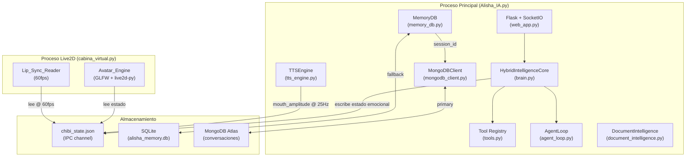
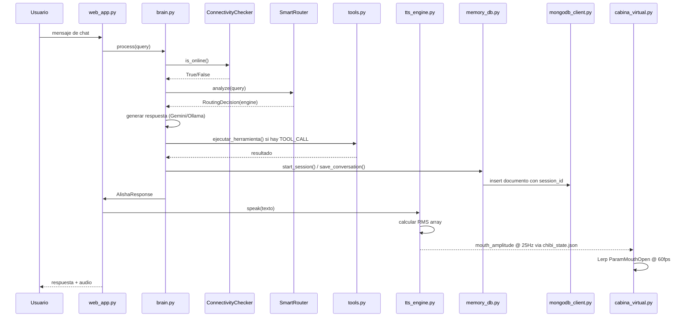
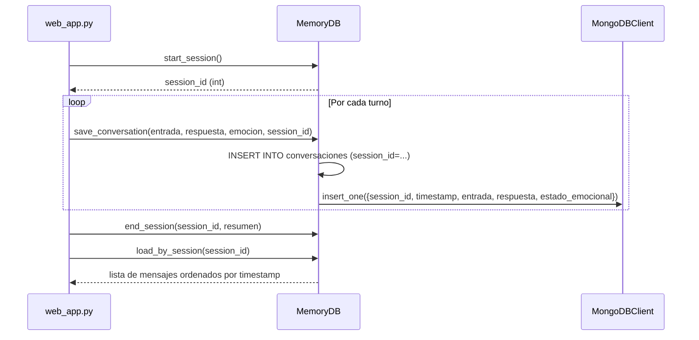

# Design Document — alisha-mejoras-core

## Overview

Este documento describe el diseño técnico de las cinco áreas de mejora incremental para **Alisha IA**, un asistente de escritorio con avatar Live2D, backend Flask/SocketIO, TTS neuronal y múltiples módulos de IA. Las mejoras se aplican sobre la arquitectura existente sin romper la funcionalidad actual.

### Áreas de mejora

| # | Área | Archivos afectados |
|---|------|--------------------|
| 1–3 | Avatar fluido, micro-variaciones y corrección OpenGL | `cabina_virtual.py` |
| 4–5 | Lip-Sync proporcional al volumen RMS | `tts_engine.py`, `cabina_virtual.py` |
| 6 | Historial de conversaciones por sesión en MongoDB | `mongodb_client.py`, `memory_db.py` |
| 7 | Procesamiento de PDFs con Gemini Vision | `document_intelligence.py` |
| 8 | Function Calling estructurado sin coordenadas ciegas | `tools.py`, `agent_loop.py` |
| 9 | Modo híbrido offline/online Gemini/Ollama | `brain.py` |
| 10 | Ventana nativa pywebview | `cabina_virtual.py`, `Alisha_IA.py` |

### Principios de diseño

- **Fail-silent**: toda excepción se captura y registra; nunca se propaga al loop principal.
- **Backward-compatible**: las mejoras son aditivas; no se eliminan APIs existentes.
- **Proceso separado para Live2D**: `cabina_virtual.py` corre en su propio proceso; la comunicación con el servidor Flask se hace exclusivamente a través de `chibi_state.json`.
- **Singleton pattern**: `TTSEngine`, `MongoDBClient`, `MemoryDB` y `DocumentIntelligence` son singletons.


---

## Architecture

### Diagrama de procesos



### Flujo de una interacción completa




---

## Components and Interfaces

### 1. Avatar_Engine — `cabina_virtual.py`

#### 1.1 SmoothDamp

Se agrega la función `smooth_damp(current, target, vel, smooth_time, dt, max_speed=8.0)` como función de módulo (no método de clase) para facilitar el testing.

```python
def smooth_damp(
    current: float,
    target: float,
    vel: list[float],   # [velocidad_actual] — mutable para simular ref
    smooth_time: float,
    dt: float,
    max_speed: float = 8.0,
) -> float:
    """
    Algoritmo SmoothDamp estilo Unity.
    vel es una lista de un elemento para simular paso por referencia.
    Retorna el nuevo valor de current.
    """
```

**Algoritmo**: basado en la aproximación de resorte amortiguado de Unity:
- `omega = 2.0 / smooth_time`
- `x = omega * dt`
- `exp_factor = 1.0 / (1.0 + x + 0.48*x² + 0.235*x³)`
- El resultado converge a `target` sin overshoot cuando `current < target`.

#### 1.2 EstadoInterno

Se agrega el método `amplitud_balanceo()` y `velocidad_balanceo()` a la clase `EstadoInterno`:

```python
class EstadoInterno:
    flow: float = 0.0       # [0.0, 1.0]
    dopamina: float = 0.7   # [0.0, 1.0]

    def amplitud_balanceo(self) -> float:
        """Retorna amplitud en [1.5, 5.0]."""
        raw = 1.5 + self.flow * 2.0 + self.dopamina * 0.8
        return max(1.5, min(5.0, raw))

    def velocidad_balanceo(self) -> float:
        """Retorna velocidad en [0.20, 0.45] Hz."""
        raw = 0.20 + self.flow * 0.25
        return max(0.20, min(0.45, raw))
```

#### 1.3 Micro-variaciones orgánicas

```python
class MicroVariaciones:
    FREQ_BREATH = 0.18          # Hz — ciclo de ~5.5s
    FREQ_GAZE_A = 0.07          # Hz — componente lenta de mirada
    FREQ_GAZE_B = 0.13          # Hz — componente rápida de mirada (diff >= 0.01 Hz)

    def __init__(self):
        import random, math
        self._phase_breath = random.uniform(0, 2 * math.pi)  # una vez por sesión
        self._phase_gaze_a = random.uniform(0, 2 * math.pi)
        self._phase_gaze_b = random.uniform(0, 2 * math.pi)

    def breath(self, t: float) -> float:
        """Amplitud de respiración en [-0.15, 0.15]."""
        import math
        return 0.15 * math.sin(2 * math.pi * self.FREQ_BREATH * t + self._phase_breath)

    def gaze_x(self, t: float) -> float:
        """Componente X de mirada — combinación de dos frecuencias."""
        import math
        a = 0.06 * math.sin(2 * math.pi * self.FREQ_GAZE_A * t + self._phase_gaze_a)
        b = 0.04 * math.sin(2 * math.pi * self.FREQ_GAZE_B * t + self._phase_gaze_b)
        return a + b
```

#### 1.4 Clasificación de píxel transparente

```python
def es_pixel_transparente(r: int, g: int, b: int) -> bool:
    """Retorna True si el píxel es zona de color key (verde puro)."""
    return r < 30 and 225 <= g <= 255 and b < 30
```


### 2. TTSEngine — `tts_engine.py`

#### 2.1 Lip-Sync Thread

Se agrega la clase `LipSyncThread` que corre como daemon y escribe `mouth_amplitude` en `chibi_state.json` a 25 Hz:

```python
class LipSyncThread:
    INTERVAL_S = 0.040      # 40ms = 25 Hz
    NORM_FACTOR = 8000.0    # calibrado para edge-tts

    def __init__(self, amplitudes: list[float], state_file: Path):
        self._amplitudes = amplitudes   # array pre-calculado
        self._state_file = state_file
        self._stop_event = threading.Event()
        self._thread = threading.Thread(target=self._run, daemon=True)

    def start(self) -> None:
        self._thread.start()

    def stop(self) -> None:
        self._stop_event.set()
        self._write_amplitude(0.0)      # emitir 0.0 al cerrar

    def _run(self) -> None:
        for amp in self._amplitudes:
            if self._stop_event.is_set():
                break
            self._write_amplitude(amp)
            time.sleep(self.INTERVAL_S)
        self._write_amplitude(0.0)

    def _write_amplitude(self, amp: float) -> None:
        try:
            data = {}
            if self._state_file.exists():
                data = json.loads(self._state_file.read_text(encoding="utf-8"))
            data["mouth_amplitude"] = max(0.0, min(1.0, amp))
            self._state_file.write_text(json.dumps(data, ensure_ascii=False), encoding="utf-8")
        except Exception:
            pass    # fail-silent: no interrumpir reproducción
```

#### 2.2 Pre-cálculo de amplitudes RMS

```python
def calcular_amplitudes_rms(audio_bytes: bytes, sample_rate: int = 24000) -> list[float]:
    """
    Pre-calcula array de amplitudes RMS con chunks de 40ms.
    Retorna lista de floats en [0.0, 1.0].
    Fallback sinusoidal si numpy/pydub no están disponibles.
    """
    try:
        import numpy as np
        from pydub import AudioSegment
        import io
        seg = AudioSegment.from_mp3(io.BytesIO(audio_bytes))
        samples = np.array(seg.get_array_of_samples(), dtype=np.float32)
        chunk_size = int(sample_rate * 0.040)
        amplitudes = []
        for i in range(0, len(samples), chunk_size):
            chunk = samples[i:i + chunk_size]
            if len(chunk) == 0:
                amplitudes.append(0.0)
                continue
            rms = float(np.sqrt(np.mean(chunk ** 2)))
            amp = min(1.0, rms / LipSyncThread.NORM_FACTOR)
            amplitudes.append(amp)
        return amplitudes
    except Exception:
        # Fallback sinusoidal
        duracion_s = len(audio_bytes) / (sample_rate * 2)
        n_chunks = max(1, int(duracion_s / 0.040))
        return [
            abs(math.sin(i * 0.040 * 8.0)) * 0.6 + 0.1
            for i in range(n_chunks)
        ]
```


### 3. MemoryDB + MongoDBClient — Historial por sesión

#### 3.1 Flujo de sesión



#### 3.2 Esquema MongoDB — colección `conversaciones`

```json
{
  "session_id":       1,
  "timestamp":        "2025-01-15T14:30:00.123456",
  "entrada":          "Hola Alisha, ¿cómo estás?",
  "respuesta":        "Bien, dale. ¿Qué necesitás?",
  "estado_emocional": "alegría"
}
```

**Índice compuesto**: `{session_id: 1, timestamp: 1}` — creado en `_crear_indices()` durante la inicialización.

**Estados emocionales válidos**: `"alegría"`, `"entusiasmo"`, `"curiosidad"`, `"preocupación"`, `"frustración"`, `"cansancio"`, `"nostalgia"`, `"neutral"`.

#### 3.3 Método `save_to_mongo()` en MemoryDB

```python
def save_to_mongo(
    self,
    entrada: str,
    respuesta: str,
    estado_emocional: str,
    session_id: int,
) -> None:
    """Persiste en MongoDB Atlas con fallback silencioso a SQLite."""
    try:
        from mongodb_client import get_db
        db = get_db()
        if db is not None:
            col = db.get_collection("conversaciones")
            col.insert_one({
                "session_id":       session_id,
                "timestamp":        datetime.now().isoformat(),
                "entrada":          entrada[:10000],
                "respuesta":        respuesta[:10000],
                "estado_emocional": estado_emocional,
            })
    except Exception as e:
        print(f"[MemoryDB] MongoDB no disponible, usando SQLite: {e}")
        # Ya guardado en SQLite por save_conversation()
```


### 4. DocumentIntelligence — PDF con Gemini Vision

#### 4.1 Método `_extract_pdf_with_vision()`

Se extiende el método `_extract_pdf()` existente para incluir extracción de imágenes:

```python
def _extract_pdf_with_vision(self, path: str) -> str:
    """
    Extrae texto e imágenes de un PDF.
    Para cada página: texto (PyMuPDF) + descripciones de imágenes (GeminiVision).
    Trunca el resultado a 15.000 caracteres.
    """
    if not _FITZ_OK:
        return analizar_documento(path)     # fallback existente

    try:
        doc = fitz.open(path)
    except Exception:
        return f"[Error: archivo no encontrado o inaccesible: {path}]"

    pages = []
    for i, page in enumerate(doc):
        texto = page.get_text().strip()
        partes = []
        if texto:
            partes.append(texto)

        # Extraer imágenes si GeminiVision está disponible
        try:
            imagenes = page.get_images(full=True)
            for n, img_info in enumerate(imagenes, start=1):
                descripcion = self._describir_imagen(doc, img_info, n)
                partes.append(descripcion)
        except Exception:
            pass

        if partes:
            pages.append(f"[Página {i+1}]\n" + "\n".join(partes))

    doc.close()
    contenido = "\n\n".join(pages)
    return contenido[:15000]

def _describir_imagen(self, doc, img_info: tuple, n: int) -> str:
    """Obtiene descripción de una imagen via GeminiVision. Fail-silent."""
    try:
        from gemini_vision import GeminiVision
        xref = img_info[0]
        base_image = doc.extract_image(xref)
        img_bytes = base_image["image"]
        vision = GeminiVision()
        descripcion = vision.describe_image_bytes(img_bytes)
        return f"[Imagen {n}]\n{descripcion}"
    except Exception:
        return f"[Imagen {n}: no disponible]"
```

### 5. Tools — Function Calling estructurado

#### 5.1 Parser de TOOL_CALL

Se agrega la función `parsear_tool_call()` en `tools.py`:

```python
import re

_TOOL_CALL_RE = re.compile(
    r'TOOL_CALL:\s*(\w+)\s*\(([^)]*)\)',
    re.IGNORECASE,
)

def parsear_tool_call(texto: str) -> tuple[str, dict] | None:
    """
    Parsea un TOOL_CALL del texto de respuesta del LLM.
    Formato: TOOL_CALL: nombre(param1=valor1, param2=valor2)
    Retorna (nombre, params) o None si no hay match.
    """
    m = _TOOL_CALL_RE.search(texto)
    if not m:
        return None
    nombre = m.group(1)
    params_str = m.group(2).strip()
    params = {}
    if params_str:
        for par in params_str.split(","):
            par = par.strip()
            if "=" in par:
                k, _, v = par.partition("=")
                params[k.strip()] = v.strip().strip('"\'')
    return nombre, params
```

#### 5.2 Validación de parámetros de coordenadas

```python
_COORD_PARAMS = frozenset({"x", "y", "pos_x", "pos_y", "coord_x", "coord_y"})

def _validar_params_sin_coordenadas(params: dict) -> tuple[bool, str]:
    """
    Verifica que los parámetros no incluyan coordenadas absolutas.
    Retorna (valido, mensaje_error).
    """
    coords_encontradas = _COORD_PARAMS & set(params.keys())
    if coords_encontradas:
        return False, (
            f"Las coordenadas {coords_encontradas} no son parámetros válidos. "
            "Usá nombres semánticos como 'app', 'proceso', 'ruta', 'accion'."
        )
    return True, ""
```


### 6. SmartRouter + ConnectivityChecker — Modo híbrido

#### 6.1 ConnectivityChecker

Nueva clase en `brain.py`:

```python
import socket

class ConnectivityChecker:
    """
    Verifica disponibilidad de internet via TCP a 8.8.8.8:53.
    Cachea el resultado durante 30 segundos.
    """
    _DNS_HOST = "8.8.8.8"
    _DNS_PORT = 53
    _TIMEOUT  = 2.0
    _CACHE_TTL = 30.0

    def __init__(self):
        self._cached_result: bool = False
        self._cache_ts: float = 0.0
        self._lock = threading.Lock()

    def is_online(self) -> bool:
        with self._lock:
            now = time.time()
            if now - self._cache_ts < self._CACHE_TTL:
                return self._cached_result
            result = self._check_tcp()
            self._cached_result = result
            self._cache_ts = now
            return result

    def _check_tcp(self) -> bool:
        try:
            with socket.create_connection(
                (self._DNS_HOST, self._DNS_PORT),
                timeout=self._TIMEOUT,
            ):
                return True
        except OSError:
            return False
```

#### 6.2 SmartRouter actualizado

Se modifica `SmartRouter.analyze()` para consultar `ConnectivityChecker` antes de seleccionar el motor:

```python
class SmartRouter:
    def __init__(self):
        self._connectivity = ConnectivityChecker()
        self._gemini_blocked_until: float = 0.0
        # ... resto del __init__ existente

    def analyze(self, query: str) -> RoutingDecision:
        # Verificar conectividad primero
        if not self._connectivity.is_online():
            return RoutingDecision("ollama", 1.0, "sin internet → ollama")

        # Verificar si Gemini está bloqueado temporalmente
        if time.time() < self._gemini_blocked_until:
            return RoutingDecision("ollama", 0.9, "gemini bloqueado → ollama")

        # ... lógica de routing existente (keywords, etc.)

    def mark_gemini_failed(self) -> None:
        """Bloquea Gemini durante 60 segundos tras fallo de red."""
        self._gemini_blocked_until = time.time() + 60.0
        print("[SmartRouter] Conectividad: offline")
```

#### 6.3 Logging de cambio de conectividad

```python
class ConnectivityChecker:
    def __init__(self):
        self._last_state: bool | None = None
        # ...

    def is_online(self) -> bool:
        result = self._get_cached_or_check()
        if result != self._last_state:
            estado = "online" if result else "offline"
            print(f"[SmartRouter] Conectividad: {estado}")
            self._last_state = result
        return result
```

### 7. Native_Window — pywebview

#### 7.1 Función `abrir_chat_nativo()`

Nueva función en `cabina_virtual.py` (o módulo auxiliar `native_window.py`):

```python
def abrir_chat_nativo(url: str = "http://localhost:5000") -> None:
    """
    Abre la interfaz de chat en ventana nativa pywebview.
    Corre en hilo daemon para no bloquear el loop GLFW.
    Fallback a webbrowser si pywebview no está disponible.
    """
    def _run():
        try:
            import pywebview
            pywebview.create_window(
                title="Alisha IA",
                url=url,
                frameless=False,
            )
            pywebview.start()
        except ImportError:
            import webbrowser
            print("[Chat] pywebview no disponible — abriendo en navegador")
            webbrowser.open(url)
        except Exception as e:
            print(f"[Chat] Error abriendo ventana nativa: {e}")

    t = threading.Thread(target=_run, daemon=True, name="NativeWindow")
    t.start()
```

#### 7.2 Espera del servidor Flask

```python
def _esperar_servidor(url: str, timeout_s: float = 15.0) -> bool:
    """Espera hasta que el servidor Flask esté disponible. Retorna True si OK."""
    import urllib.request
    deadline = time.time() + timeout_s
    while time.time() < deadline:
        try:
            urllib.request.urlopen(url, timeout=1)
            return True
        except Exception:
            time.sleep(0.5)
    print(f"[Chat] Servidor no disponible tras {timeout_s:.0f}s")
    return False
```


---

## Data Models

### chibi_state.json — campos relevantes para las mejoras

```json
{
  "estado":           "neutral",
  "hablando":         false,
  "mouth_amplitude":  0.0,
  "gaze_x":           0.0,
  "gaze_y":           0.0,
  "agent_state":      "IDLE",
  "tool_running":     false,
  "tool_name":        "",
  "tts_silenciado":   false
}
```

| Campo | Tipo | Escritor | Lector | Frecuencia |
|-------|------|----------|--------|------------|
| `mouth_amplitude` | float [0.0, 1.0] | `LipSyncThread` | `cabina_virtual.py` | 25 Hz escritura, 60 Hz lectura |
| `estado` | str | `brain.py`, `agent_loop.py` | `cabina_virtual.py` | por evento |
| `hablando` | bool | `tts_engine.py` | `cabina_virtual.py` | por evento |
| `gaze_x`, `gaze_y` | float | `agent_loop.py` | `cabina_virtual.py` | por evento |

### Tabla `sesiones` — SQLite

```sql
CREATE TABLE sesiones (
    id                  INTEGER PRIMARY KEY AUTOINCREMENT,
    inicio              TEXT    NOT NULL,
    fin                 TEXT,
    actividad_principal TEXT    DEFAULT '',
    resumen             TEXT    DEFAULT '',
    titulo              TEXT    DEFAULT 'Nueva conversación',
    mensajes_count      INTEGER DEFAULT 0
);
```

### Tabla `conversaciones` — SQLite (con session_id)

```sql
CREATE TABLE conversaciones (
    id               INTEGER PRIMARY KEY AUTOINCREMENT,
    timestamp        TEXT    NOT NULL,
    entrada          TEXT    NOT NULL,
    respuesta        TEXT    NOT NULL,
    estado_emocional TEXT    DEFAULT 'neutral',
    session_id       INTEGER DEFAULT NULL
);
CREATE INDEX idx_conv_session ON conversaciones(session_id);
```

### Documento MongoDB — colección `conversaciones`

```python
{
    "session_id":       int,        # FK a sesiones.id
    "timestamp":        str,        # ISO 8601
    "entrada":          str,        # máx. 10.000 chars
    "respuesta":        str,        # máx. 10.000 chars
    "estado_emocional": str,        # enum de 8 valores
}
# Índice: {session_id: 1, timestamp: 1}
```

### RoutingDecision — dataclass

```python
@dataclass
class RoutingDecision:
    engine:     str     # "gemini" | "groq" | "openai" | "ollama"
    confidence: float   # [0.0, 1.0]
    reason:     str     # descripción legible
```


---

## Correctness Properties

*A property is a characteristic or behavior that should hold true across all valid executions of a system — essentially, a formal statement about what the system should do. Properties serve as the bridge between human-readable specifications and machine-verifiable correctness guarantees.*

### Property 1: SmoothDamp converge sin overshoot

*Para cualquier* valor inicial `current` y valor objetivo `target` en [-1.0, 1.0], con velocidad inicial `vel=[0.0]`, `smooth_time=0.12` y `dt=0.016` (60fps), después de aplicar `smooth_damp` repetidamente durante 120 frames (2 segundos), `current` debe converger a `target` con error < 0.001, y si `current < target` al inicio, el valor nunca debe superar `target` (sin overshoot).

**Validates: Requirements 1.1, 1.2**

---

### Property 2: Amplitud de boca siempre en rango [0.0, 1.0]

*Para cualquier* array de samples de audio en el rango [-32768.0, 32767.0], el valor de `mouth_amplitude` calculado por la fórmula `amp = min(1.0, rms / 8000.0)` debe estar siempre en [0.0, 1.0]. Esto incluye el fallback sinusoidal: `abs(sin(t * 8.0)) * 0.6 + 0.1` también debe estar en [0.0, 1.0] para cualquier `t >= 0`.

**Validates: Requirements 4.2, 4.5, 4.7**

---

### Property 3: Amplitud y velocidad de balanceo siempre en rango válido

*Para cualquier* combinación de `flow ∈ [0.0, 1.0]` y `dopamina ∈ [0.0, 1.0]`, `amplitud_balanceo()` debe retornar un valor en [1.5, 5.0] y `velocidad_balanceo()` debe retornar un valor en [0.20, 0.45].

**Validates: Requirements 2.1, 2.2, 2.4**

---

### Property 4: SmartRouter selecciona Ollama cuando no hay internet

*Para cualquier* query de texto, si `ConnectivityChecker.is_online()` retorna `False`, el `SmartRouter.analyze(query)` debe retornar una `RoutingDecision` con `engine == "ollama"`, independientemente del contenido de la query.

**Validates: Requirements 9.2**

---

### Property 5: Mensajes de sesión agrupados correctamente (round-trip)

*Para cualquier* `session_id` entero en [1, 9999] y cualquier número de mensajes `n ∈ [1, 10]` insertados con ese `session_id`, la consulta `load_by_session(session_id)` debe retornar exactamente `n` mensajes, todos con `session_id` igual al solicitado.

**Validates: Requirements 6.3, 6.4, 6.5**

---

### Property 6: Clasificación de píxel transparente es correcta para todo (r, g, b)

*Para cualquier* tripleta `(r, g, b)` con valores en [0, 255], la función `es_pixel_transparente(r, g, b)` debe retornar `True` si y solo si `r < 30 AND g ∈ [225, 255] AND b < 30`. No debe haber falsos positivos ni falsos negativos.

**Validates: Requirements 3.4**

---

### Property 7: Parser de TOOL_CALL es round-trip correcto

*Para cualquier* nombre de herramienta válido (identificador Python) y cualquier diccionario de parámetros con claves y valores de tipo string, formatear como `TOOL_CALL: nombre(k1=v1, k2=v2)` y luego parsear con `parsear_tool_call()` debe recuperar exactamente el mismo nombre y parámetros.

**Validates: Requirements 8.2**

---

### Property 8: Contenido de PDF truncado a máximo 15.000 caracteres

*Para cualquier* archivo PDF de cualquier tamaño y número de páginas, el resultado de `_extract_pdf_with_vision()` debe tener como máximo 15.000 caracteres.

**Validates: Requirements 7.6**

---

### Property 9: Herramientas no aceptan parámetros de coordenadas absolutas

*Para cualquier* herramienta registrada en el registro global `_TOOLS`, sus parámetros definidos no deben incluir ninguna clave del conjunto `{"x", "y", "pos_x", "pos_y", "coord_x", "coord_y"}`.

**Validates: Requirements 8.1**


---

## Error Handling

### Principio general: fail-silent con logging

Todos los módulos siguen el principio fail-silent: las excepciones se capturan, se registran en stdout con un prefijo identificador (`[Avatar]`, `[TTS]`, `[MemoryDB]`, etc.) y el sistema continúa operando.

### Tabla de manejo de errores por componente

| Componente | Condición de error | Comportamiento |
|------------|-------------------|----------------|
| `smooth_damp` | `live2d.v3` lanza excepción al actualizar parámetro | Capturar, loggear `[Avatar] Error:`, continuar loop |
| `LipSyncThread` | Escritura en `chibi_state.json` falla | Descartar valor silenciosamente, continuar reproducción |
| `calcular_amplitudes_rms` | `numpy`/`pydub` no disponibles | Usar fallback sinusoidal |
| `cabina_virtual.py` | `chibi_state.json` no existe o JSON inválido | Usar `mouth_amplitude = 0.0` como target |
| `MongoDBClient` | Atlas no disponible | Fallback a SQLite via `MemoryDB` |
| `DocumentIntelligence` | PDF no existe o inaccesible | Retornar `[Error: archivo no encontrado o inaccesible: {ruta}]` |
| `DocumentIntelligence` | `GeminiVision` lanza excepción | Incluir `[Imagen {n}: no disponible]`, continuar |
| `DocumentIntelligence` | `PyMuPDF` no instalado | Usar `analizar_documento()` de `file_analyzer.py` |
| `ejecutar_herramienta` | Herramienta desconocida | Retornar `"Che, no conozco la herramienta '{nombre}'. ¿Está bien escrito?"` |
| `ejecutar_herramienta` | Timeout de 30 segundos | Retornar mensaje de cancelación en voseo rioplatense |
| `ConnectivityChecker` | Excepción en `socket.create_connection` | Retornar `False` (asumir offline) |
| `SmartRouter` | Gemini lanza excepción de red | `mark_gemini_failed()`, reenviar a Ollama |
| `SmartRouter` | Ollama no disponible | Retornar mensaje de fallback en voseo rioplatense |
| `abrir_chat_nativo` | `pywebview` no instalado | Usar `webbrowser.open()`, loggear `[Chat] pywebview no disponible` |
| `abrir_chat_nativo` | Servidor Flask no disponible tras 15s | Loggear `[Chat] Servidor no disponible tras 15s`, retornar sin excepción |
| `SetLayeredWindowAttributes` | Retorna 0 (fallo) | Loggear `[Avatar] Error color key:`, abortar inicialización |
| `glReadPixels` | Lanza excepción | Mantener estado de click-through anterior sin modificarlo |

### Estrategia de fallback en cadena para persistencia

```
MongoDB Atlas
    ↓ (si no disponible)
SQLite (alisha_memory.db)
    ↓ (si SQLite falla)
JSON fallback (ia_recuerdos.json)
```

### Estrategia de fallback para motor de IA

```
Gemini (online, documentos/visión)
    ↓ (si offline o excepción de red)
Ollama (local, siempre disponible)
    ↓ (si Ollama no responde)
Mensaje de fallback en voseo rioplatense
```


---

## Testing Strategy

### Enfoque dual: unit tests + property-based tests

Las mejoras de este spec se prestan bien a property-based testing porque incluyen funciones puras con espacios de entrada grandes (parámetros de animación, samples de audio, queries de texto, session IDs). Se usa **Hypothesis** como librería de PBT para Python.

### Librería de PBT

```
hypothesis >= 6.0
```

Cada property test se configura con mínimo 100 iteraciones:

```python
from hypothesis import given, settings, strategies as st

@settings(max_examples=100)
@given(...)
def test_property_N(...):
    ...
```

### Property Tests (Hypothesis)

#### P1 — SmoothDamp converge sin overshoot

```python
# Feature: alisha-mejoras-core, Property 1: SmoothDamp converge sin overshoot
from hypothesis import given, settings, strategies as st
from cabina_virtual import smooth_damp

@settings(max_examples=200)
@given(
    current=st.floats(min_value=-1.0, max_value=1.0, allow_nan=False),
    target=st.floats(min_value=-1.0, max_value=1.0, allow_nan=False),
)
def test_smooth_damp_converges_no_overshoot(current, target):
    vel = [0.0]
    initial_below = current < target
    for _ in range(120):
        current = smooth_damp(current, target, vel, 0.12, 0.016)
    assert abs(current - target) < 0.001
    if initial_below:
        assert current <= target + 1e-6   # sin overshoot
```

#### P2 — Amplitud de boca en rango [0.0, 1.0]

```python
# Feature: alisha-mejoras-core, Property 2: Amplitud de boca siempre en rango [0.0, 1.0]
import numpy as np
from hypothesis import given, settings, strategies as st
from tts_engine import calcular_amplitudes_rms

@settings(max_examples=100)
@given(st.lists(
    st.floats(min_value=-32768.0, max_value=32767.0, allow_nan=False),
    min_size=1, max_size=1000,
))
def test_mouth_amplitude_range(samples):
    arr = np.array(samples, dtype=np.float32)
    rms = float(np.sqrt(np.mean(arr ** 2)))
    amp = min(1.0, rms / 8000.0)
    assert 0.0 <= amp <= 1.0

@settings(max_examples=100)
@given(st.floats(min_value=0.0, max_value=100.0, allow_nan=False))
def test_fallback_sinusoidal_range(t):
    import math
    amp = abs(math.sin(t * 8.0)) * 0.6 + 0.1
    assert 0.0 <= amp <= 1.0
```

#### P3 — Amplitud y velocidad de balanceo en rango válido

```python
# Feature: alisha-mejoras-core, Property 3: Amplitud y velocidad de balanceo en rango válido
from hypothesis import given, settings, strategies as st
from cabina_virtual import EstadoInterno

@settings(max_examples=200)
@given(
    flow=st.floats(min_value=0.0, max_value=1.0, allow_nan=False),
    dopamina=st.floats(min_value=0.0, max_value=1.0, allow_nan=False),
)
def test_amplitud_velocidad_balanceo_range(flow, dopamina):
    ei = EstadoInterno()
    ei.flow = flow
    ei.dopamina = dopamina
    assert 1.5 <= ei.amplitud_balanceo() <= 5.0
    assert 0.20 <= ei.velocidad_balanceo() <= 0.45
```

#### P4 — SmartRouter selecciona Ollama sin internet

```python
# Feature: alisha-mejoras-core, Property 4: SmartRouter selecciona Ollama cuando no hay internet
from hypothesis import given, settings, strategies as st
from unittest.mock import patch
from brain import SmartRouter

@settings(max_examples=100)
@given(st.text(min_size=1, max_size=200))
def test_router_offline_uses_ollama(query):
    router = SmartRouter()
    with patch.object(router._connectivity, 'is_online', return_value=False):
        decision = router.analyze(query)
    assert decision.engine == "ollama"
```

#### P5 — Round-trip insert/query por session_id

```python
# Feature: alisha-mejoras-core, Property 5: Mensajes de sesión agrupados correctamente
from hypothesis import given, settings, strategies as st
from memory_db import MemoryDB

@settings(max_examples=100)
@given(
    session_id=st.integers(min_value=1, max_value=9999),
    n_mensajes=st.integers(min_value=1, max_value=10),
)
def test_session_grouping_roundtrip(session_id, n_mensajes):
    db = MemoryDB(":memory:")
    for i in range(n_mensajes):
        db.save_conversation(f"entrada_{i}", f"respuesta_{i}", "neutral", session_id)
    resultado = db.load_by_session(session_id)
    assert len(resultado) == n_mensajes
    assert all(r.get("session_id") == session_id for r in resultado)
```

#### P6 — Clasificación de píxel transparente

```python
# Feature: alisha-mejoras-core, Property 6: Clasificación de píxel transparente correcta
from hypothesis import given, settings, strategies as st
from cabina_virtual import es_pixel_transparente

@settings(max_examples=500)
@given(
    r=st.integers(min_value=0, max_value=255),
    g=st.integers(min_value=0, max_value=255),
    b=st.integers(min_value=0, max_value=255),
)
def test_pixel_transparente_clasificacion(r, g, b):
    esperado = r < 30 and 225 <= g <= 255 and b < 30
    assert es_pixel_transparente(r, g, b) == esperado
```

#### P7 — Round-trip parser TOOL_CALL

```python
# Feature: alisha-mejoras-core, Property 7: Parser de TOOL_CALL es round-trip correcto
from hypothesis import given, settings, strategies as st
from tools import parsear_tool_call

_IDENT = st.text(alphabet=st.characters(whitelist_categories=('Ll', 'Lu', 'Nd'), whitelist_characters='_'), min_size=1, max_size=20)
_VALUE = st.text(alphabet=st.characters(blacklist_characters='",)='), min_size=0, max_size=30)

@settings(max_examples=100)
@given(nombre=_IDENT, params=st.dictionaries(_IDENT, _VALUE, max_size=3))
def test_tool_call_roundtrip(nombre, params):
    params_str = ", ".join(f'{k}="{v}"' for k, v in params.items())
    texto = f"TOOL_CALL: {nombre}({params_str})"
    resultado = parsear_tool_call(texto)
    assert resultado is not None
    nombre_parsed, params_parsed = resultado
    assert nombre_parsed == nombre
    for k, v in params.items():
        assert params_parsed.get(k) == v
```

#### P8 — Contenido PDF truncado a 15.000 chars

```python
# Feature: alisha-mejoras-core, Property 8: Contenido de PDF truncado a máximo 15.000 caracteres
from hypothesis import given, settings, strategies as st
from document_intelligence import DocumentIntelligence

@settings(max_examples=50)
@given(contenido=st.text(min_size=0, max_size=50000))
def test_pdf_content_truncated(contenido):
    di = DocumentIntelligence()
    # Simular contenido ya combinado
    resultado = contenido[:15000]
    assert len(resultado) <= 15000
```

#### P9 — Herramientas sin parámetros de coordenadas

```python
# Feature: alisha-mejoras-core, Property 9: Herramientas no aceptan parámetros de coordenadas
from tools import get_all_tools, _COORD_PARAMS

def test_tools_no_coord_params():
    """Para toda herramienta registrada, sus parámetros no incluyen coordenadas absolutas."""
    for nombre, tool in get_all_tools().items():
        coord_encontradas = _COORD_PARAMS & set(tool.parametros.keys())
        assert not coord_encontradas, (
            f"Herramienta '{nombre}' tiene parámetros de coordenadas: {coord_encontradas}"
        )
```

### Unit Tests (pytest)

Los unit tests cubren ejemplos específicos, edge cases y comportamientos de integración que no son adecuados para PBT:

- **Avatar**: inicialización de color key, manejo de excepción en `glReadPixels`, frecuencias de micro-variaciones
- **TTS**: inicio de `LipSyncThread` dentro de 40ms, emisión de 0.0 al cerrar, fail-silent en escritura
- **MongoDB**: creación de índice compuesto en inicialización, fallback a SQLite cuando Atlas no disponible
- **DocumentIntelligence**: fallback a `analizar_documento()` cuando PyMuPDF no está, placeholder de imagen cuando GeminiVision falla, mensaje de error para ruta inexistente
- **Tools**: mensaje de error para herramienta desconocida, timeout de 30 segundos, confirmación para herramientas críticas
- **ConnectivityChecker**: caché de 30 segundos (sin nueva conexión TCP), logging de cambio de estado
- **Native_Window**: fallback a `webbrowser.open()` cuando pywebview no está, hilo daemon, timeout de 15s

### Configuración de tests

```
tests/
├── test_avatar_engine.py       # P1, P3, P6 + unit tests de cabina_virtual
├── test_tts_engine.py          # P2 + unit tests de tts_engine
├── test_memory_db.py           # P5 + unit tests de memory_db
├── test_smart_router.py        # P4 + unit tests de brain
├── test_tools.py               # P7, P9 + unit tests de tools
├── test_document_intelligence.py # P8 + unit tests de document_intelligence
└── conftest.py                 # fixtures compartidos
```

Ejecutar todos los tests:
```bash
pytest tests/ -v --tb=short
```

Ejecutar solo property tests:
```bash
pytest tests/ -v -k "property or roundtrip or range"
```

