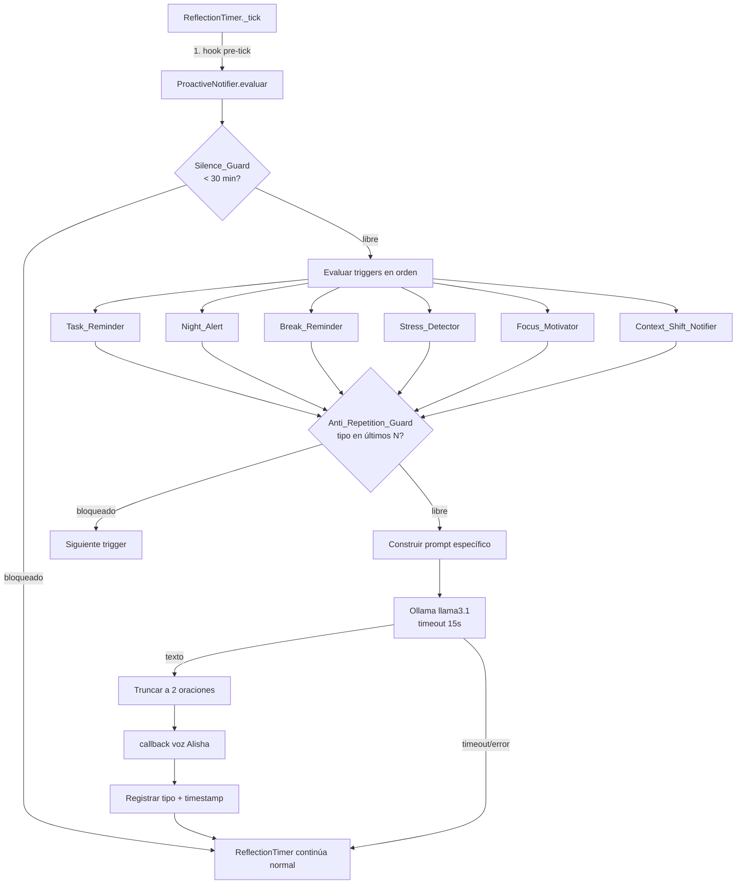
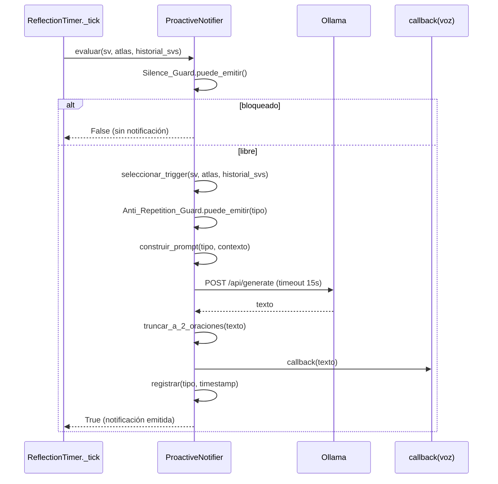

# Diseño: alisha-notificaciones-proactivas

## Overview

El módulo `proactive_notifier.py` extiende el sistema de Conciencia Situacional de Alisha para que hable de forma proactiva — sin que Camila le pregunte — cuando detecta situaciones que merecen atención. Se integra con el `ReflectionTimer` existente como un paso previo a la reflexión situacional habitual: primero evalúa si hay algo urgente que decir, y solo si no lo hay deja que el timer haga su reflexión normal.

Las notificaciones deben sonar humanas, en voseo rioplatense, nunca literales ni repetitivas. El sistema garantiza variedad real mediante un `Anti_Repetition_Guard` que rastrea los últimos N tipos emitidos (no solo el último), y silencio inteligente mediante un `Silence_Guard` que bloquea notificaciones si Alisha ya habló en los últimos 30 minutos.

### Principios de diseño

- **No romper lo existente**: `reflection_timer.py` no se modifica estructuralmente; el `ProactiveNotifier` se inyecta como un hook opcional.
- **Fail-silent**: cualquier excepción interna se silencia; si el notifier falla, el timer continúa normalmente.
- **Variedad real**: el `Anti_Repetition_Guard` rastrea los últimos `N` tipos (configurable, default 3) para garantizar rotación genuina.
- **Prompts semánticos**: cada trigger construye un prompt que habla del significado emocional, nunca de los datos técnicos que lo dispararon.

---

## Architecture



### Integración con ReflectionTimer

El `ReflectionTimer` no se modifica estructuralmente. Se agrega un atributo opcional `_proactive_notifier` que, si está presente, se llama al inicio de `_tick()` antes de construir el prompt situacional. Si el notifier emite una notificación proactiva, `_tick()` puede opcionalmente saltear la reflexión situacional de ese ciclo (configurable).



---

## Components and Interfaces

### ProactiveNotifier

Clase principal. Orquesta la evaluación de todos los triggers.

```python
class ProactiveNotifier:
    def __init__(self) -> None: ...

    def evaluar(
        self,
        sv: dict,
        atlas: AtlasMemory,
        historial_svs: list[dict],
        callback: Callable[[str], None],
    ) -> bool:
        """
        Evalúa todos los triggers en orden de prioridad.
        Retorna True si se emitió una notificación, False si no.
        """

    def actualizar_inactividad(self, sv: dict) -> None:
        """
        Llamado por ReflectionTimer en cada ciclo (incluso si no emite).
        Actualiza el registro de última inactividad del Break_Reminder.
        """
```

### SilenceGuard

```python
class SilenceGuard:
    VENTANA_MINUTOS: int = 30

    def puede_emitir(self) -> bool:
        """True si han pasado >= 30 min desde la última notificación."""

    def registrar_emision(self) -> None:
        """Actualiza el timestamp de la última emisión."""
```

### AntiRepetitionGuard

```python
class AntiRepetitionGuard:
    def __init__(self, ventana: int = 3) -> None:
        """
        ventana: cuántos tipos recientes rastrear.
        Default 3 para garantizar rotación real entre los 6 tipos disponibles.
        """

    def puede_emitir(self, tipo: str) -> bool:
        """True si `tipo` NO está en los últimos `ventana` tipos emitidos."""

    def registrar_emision(self, tipo: str) -> None:
        """Agrega `tipo` al historial circular."""

    @property
    def historial(self) -> list[str]:
        """Copia del historial actual (para tests)."""
```

### Triggers

Cada trigger es una función pura que recibe el contexto y retorna `True/False`:

```python
# Firmas de las funciones de evaluación
def evaluar_task_reminder(recordatorios: list[dict]) -> dict | None:
    """Retorna el recordatorio más próximo dentro de 2 días, o None."""

def evaluar_night_alert(sv: dict) -> bool:
    """True si hora_del_dia >= 23:00."""

def evaluar_break_reminder(ultima_inactividad: datetime | None) -> bool:
    """True si han pasado >= 90 min desde ultima_inactividad."""

def evaluar_stress_detector(sv: dict) -> bool:
    """True si cambios_ventana_por_minuto > 3 AND hora >= 22:00 AND (bateria <= 20 OR bateria is None)."""

def evaluar_focus_motivator(historial_svs: list[dict]) -> bool:
    """True si los últimos 3 SVs tienen la misma app_dominante y ritmo > 20."""

def evaluar_context_shift(sv: dict, registro_anterior: dict | None) -> bool:
    """True si resumen_semantico del registro anterior difiere del actual."""
```

### Constructores de prompts

```python
def prompt_task_reminder(recordatorio: dict) -> str: ...
def prompt_night_alert() -> str: ...
def prompt_break_reminder() -> str: ...
def prompt_stress_detector() -> str: ...
def prompt_focus_motivator() -> str: ...
def prompt_context_shift(resumen_ayer: str, resumen_hoy: str) -> str: ...
```

Todos los prompts incluyen el bloque de estilo obligatorio (Req 10).

---

## Data Models

### NotificationType (enum)

```python
from enum import Enum

class NotificationType(str, Enum):
    TASK_REMINDER      = "task_reminder"
    NIGHT_ALERT        = "night_alert"
    BREAK_REMINDER     = "break_reminder"
    STRESS_DETECTOR    = "stress_detector"
    FOCUS_MOTIVATOR    = "focus_motivator"
    CONTEXT_SHIFT      = "context_shift"
```

### SilenceGuard — estado interno

```python
{
    "ultima_emision": datetime | None   # None = nunca emitió en esta sesión
}
```
Persiste solo en memoria de sesión. Se reinicia al arrancar Alisha.

### AntiRepetitionGuard — estado interno

```python
{
    "historial": deque[str]   # deque(maxlen=N), N=3 por defecto
    # Ejemplo: deque(["night_alert", "break_reminder", "task_reminder"], maxlen=3)
}
```

El `deque` con `maxlen=N` garantiza que al agregar el tipo N+1, el más antiguo se descarta automáticamente. Con N=3 y 6 tipos disponibles, se garantiza que al menos la mitad de los tipos siempre están disponibles.

### Orden de prioridad de triggers

| Prioridad | Tipo | Razón |
|-----------|------|-------|
| 1 | `task_reminder` | Compromisos reales con fecha |
| 2 | `stress_detector` | Bienestar urgente |
| 3 | `night_alert` | Salud/descanso |
| 4 | `break_reminder` | Salud/descanso |
| 5 | `focus_motivator` | Motivación positiva |
| 6 | `context_shift` | Curiosidad/memoria |

### Estructura de recordatorio en ia_recuerdos.json

El campo `recordatorios` (puede no existir) contiene una lista de objetos. El sistema acepta cualquiera de estos formatos de fecha:

```json
{
  "recordatorios": [
    {
      "titulo": "Entrega TP Algoritmos",
      "fecha": "2025-07-15",
      "descripcion": "Opcional"
    },
    {
      "titulo": "Reunión con cliente",
      "fecha": "2025-07-15T14:00:00"
    }
  ]
}
```

Campos de fecha aceptados: `"fecha"`, `"date"`, `"vencimiento"`, `"deadline"`. Si ninguno está presente o es parseable, el recordatorio se ignora silenciosamente.

### Integración con ReflectionTimer — cambio mínimo

```python
# En ReflectionTimer.__init__:
self._proactive_notifier: ProactiveNotifier | None = None

# Método nuevo en ReflectionTimer:
def conectar_proactive_notifier(self, notifier: ProactiveNotifier) -> None:
    self._proactive_notifier = notifier

# En ReflectionTimer._tick(), al inicio:
if self._proactive_notifier is not None:
    try:
        emitido = self._proactive_notifier.evaluar(
            sv, self._atlas, list(self._historial_svs), self._callback
        )
        self._proactive_notifier.actualizar_inactividad(sv)
        if emitido:
            return  # Saltear reflexión situacional este ciclo
    except Exception:
        pass  # Fail-silent
```

Y en `SituationalAwareness.iniciar()`:

```python
from proactive_notifier import ProactiveNotifier
notifier = ProactiveNotifier()
self._reflection_timer.conectar_proactive_notifier(notifier)
```

---

## Correctness Properties

*A property is a characteristic or behavior that should hold true across all valid executions of a system — essentially, a formal statement about what the system should do. Properties serve as the bridge between human-readable specifications and machine-verifiable correctness guarantees.*

### Reflexión de redundancias (Property Reflection)

Antes de escribir las propiedades finales, identifico redundancias:

- **10.1, 10.2, 10.3** son tres propiedades sobre el mismo objeto (el bloque de estilo en los prompts). Se consolidan en una sola propiedad: "todos los prompts contienen el bloque de estilo obligatorio".
- **3.1 y 3.2** se solapan: si el historial siempre contiene los últimos N tipos (3.1), entonces puede_emitir() retorna False exactamente cuando el tipo está en el historial (3.2). Se consolidan en una propiedad de round-trip del Anti_Repetition_Guard.
- **5.1 y 5.2** son independientes y complementarias: una sobre activación, otra sobre el contenido del prompt. Se mantienen separadas.
- **4.2 y 4.4** son independientes: una sobre el rango de fechas, otra sobre la selección del más próximo. Se mantienen separadas.
- **7.1** cubre implícitamente **7.2** (batería None). Se mantiene una sola propiedad con la condición de batería opcional.

Propiedades finales después de la reflexión: **10 propiedades**.

---

### Property 1: Prioridad de triggers

*For any* StateVector que active simultáneamente múltiples Notification_Triggers, el tipo de notificación emitida SHALL corresponder al trigger de mayor prioridad que no esté bloqueado por el Anti_Repetition_Guard.

**Validates: Requirements 1.2**

---

### Property 2: Registro de emisión

*For any* notificación proactiva emitida (de cualquier tipo), después de la emisión el tipo SHALL aparecer en el historial del Anti_Repetition_Guard y el timestamp SHALL estar actualizado en el Silence_Guard.

**Validates: Requirements 1.6**

---

### Property 3: Silence_Guard bloquea dentro de la ventana

*For any* tiempo T tal que 0 ≤ T < 30 minutos desde la última emisión registrada, `SilenceGuard.puede_emitir()` SHALL retornar False.

**Validates: Requirements 2.2, 2.3**

---

### Property 4: Anti_Repetition_Guard — historial circular y bloqueo

*For any* secuencia de tipos emitidos y cualquier tipo candidato, `AntiRepetitionGuard.puede_emitir(tipo)` SHALL retornar False si y solo si `tipo` está en los últimos N tipos registrados en el historial. El historial SHALL contener exactamente los últimos N tipos emitidos (o menos si se emitieron menos de N).

**Validates: Requirements 3.1, 3.2, 3.4**

---

### Property 5: Task_Reminder activa con fechas en rango

*For any* lista de recordatorios donde al menos uno tiene una fecha dentro de los próximos 2 días, `evaluar_task_reminder()` SHALL retornar el recordatorio con la fecha más próxima. *For any* lista donde ningún recordatorio tiene fecha dentro de los próximos 2 días (o la lista está vacía), SHALL retornar None.

**Validates: Requirements 4.2, 4.4**

---

### Property 6: Night_Alert activa exactamente en horario nocturno

*For any* StateVector con `hora_del_dia` en el rango [23:00, 23:59] o [00:00, 02:59], `evaluar_night_alert()` SHALL retornar True. *For any* StateVector con `hora_del_dia` en el rango [03:00, 22:59], SHALL retornar False.

**Validates: Requirements 5.1**

---

### Property 7: Break_Reminder activa exactamente al superar 90 minutos

*For any* tiempo T desde la última inactividad registrada, `evaluar_break_reminder()` SHALL retornar True si y solo si T ≥ 90 minutos.

**Validates: Requirements 6.2**

---

### Property 8: Stress_Detector activa con la conjunción correcta de condiciones

*For any* StateVector, `evaluar_stress_detector()` SHALL retornar True si y solo si se cumplen simultáneamente: `cambios_ventana_por_minuto > 3` AND `hora_del_dia >= 22:00` AND (`bateria <= 20` OR `bateria is None`).

**Validates: Requirements 7.1, 7.2**

---

### Property 9: Focus_Motivator activa con concentración sostenida

*For any* historial de StateVectors donde los últimos 3 tienen la misma `app_dominante` y `ritmo_escritura_promedio > 20` en todos ellos, `evaluar_focus_motivator()` SHALL retornar True. Si cualquiera de las condiciones falla en alguno de los 3 últimos SVs, SHALL retornar False.

**Validates: Requirements 8.1**

---

### Property 10: Context_Shift activa con resúmenes semánticos diferentes

*For any* par (resumen_ayer, resumen_hoy) donde ambos son strings no vacíos y son diferentes entre sí, `evaluar_context_shift()` SHALL retornar True. Si son iguales o si registro_anterior es None, SHALL retornar False.

**Validates: Requirements 9.1**

---

### Property 11: Todos los prompts contienen el bloque de estilo obligatorio

*For any* tipo de notificación (task_reminder, night_alert, break_reminder, stress_detector, focus_motivator, context_shift), el prompt generado SHALL contener: (a) instrucción de voseo rioplatense, (b) instrucción de máximo 2 oraciones, (c) instrucción de prohibir datos técnicos.

**Validates: Requirements 10.1, 10.2, 10.3**

---

### Property 12: Truncado a 2 oraciones

*For any* texto retornado por el LLM con N oraciones donde N > 2, `truncar_a_2_oraciones(texto)` SHALL retornar exactamente 2 oraciones. Para textos con N ≤ 2 oraciones, SHALL retornar el texto sin modificar.

**Validates: Requirements 10.4**

---

## Error Handling

### Principio general: fail-silent

Todos los errores internos del `ProactiveNotifier` se silencian. Si el notifier falla por cualquier razón, el `ReflectionTimer` continúa su ciclo normal sin interrupciones.

### Casos específicos

| Situación | Comportamiento |
|-----------|---------------|
| `ia_recuerdos.json` no existe | `Task_Reminder` retorna None, sin excepción |
| Campo `recordatorios` ausente o vacío | `Task_Reminder` retorna None, sin excepción |
| Recordatorio sin fecha parseable | Se ignora ese recordatorio, se evalúan los demás |
| LLM no responde en 15s | Se omite la notificación, el timer continúa |
| LLM retorna string vacío | Se omite la notificación |
| `AtlasMemory.buscar_franja_horaria()` lanza excepción | `Context_Shift_Notifier` retorna False |
| `historial_svs` tiene menos de 3 elementos | `Focus_Motivator` retorna False |
| `hora_del_dia` tiene formato inválido | El trigger correspondiente retorna False |
| Cualquier excepción no capturada en `evaluar()` | Se captura en el bloque try/except del `_tick()` del timer |

### Robustez del Anti_Repetition_Guard

Si todos los triggers disponibles en un ciclo están bloqueados por el Anti_Repetition_Guard, el notifier retorna False y el timer continúa con su reflexión situacional normal. No se fuerza ninguna notificación.

---

## Testing Strategy

### Herramienta de PBT

Se usa **Hypothesis** (Python), la librería estándar de property-based testing para Python. Cada propiedad se implementa con `@given` y mínimo 100 iteraciones (`settings(max_examples=100)`).

### Estructura de tests

```
tests/
  test_proactive_notifier/
    test_silence_guard.py          # Properties 3
    test_anti_repetition_guard.py  # Property 4
    test_task_reminder.py          # Property 5
    test_night_alert.py            # Properties 6, 11 (night_alert)
    test_break_reminder.py         # Property 7, 11 (break_reminder)
    test_stress_detector.py        # Property 8
    test_focus_motivator.py        # Property 9
    test_context_shift.py          # Property 10, 11 (context_shift)
    test_prompt_style.py           # Property 11 (todos los tipos)
    test_truncar.py                # Property 12
    test_priority.py               # Property 1
    test_registro_emision.py       # Property 2
    test_integration.py            # Tests de ejemplo e integración
```

### Tests de propiedades (Hypothesis)

Cada test de propiedad lleva un comentario de trazabilidad:

```python
# Feature: alisha-notificaciones-proactivas, Property 3: Silence_Guard bloquea dentro de la ventana
@settings(max_examples=100)
@given(minutos=st.floats(min_value=0, max_value=29.99))
def test_silence_guard_bloquea_dentro_ventana(minutos):
    guard = SilenceGuard()
    guard._ultima_emision = datetime.now() - timedelta(minutes=minutos)
    assert guard.puede_emitir() is False
```

### Tests de ejemplo (unit tests)

- Verificar que el módulo importa correctamente (smoke)
- Verificar que el callback es llamado con el texto del LLM (mock)
- Verificar que el callback NO es llamado cuando el LLM hace timeout (mock)
- Verificar que el prompt de Night_Alert no contiene la hora exacta ni "tarde"
- Verificar que el prompt de Break_Reminder no contiene "descanso" ni números de minutos
- Verificar integración con `ReflectionTimer` via `conectar_proactive_notifier()`

### Tests de integración

- Verificar que `ProactiveNotifier` + `ReflectionTimer` + `AtlasMemory` funcionan juntos con mocks del LLM
- Verificar que cuando el notifier emite, el timer saltea la reflexión situacional
- Verificar que cuando el notifier no emite, el timer continúa normalmente

### Cobertura objetivo

- Todas las 12 propiedades cubiertas con tests Hypothesis
- Todos los casos de error cubiertos con tests de ejemplo
- Integración con ReflectionTimer verificada con mock del LLM
