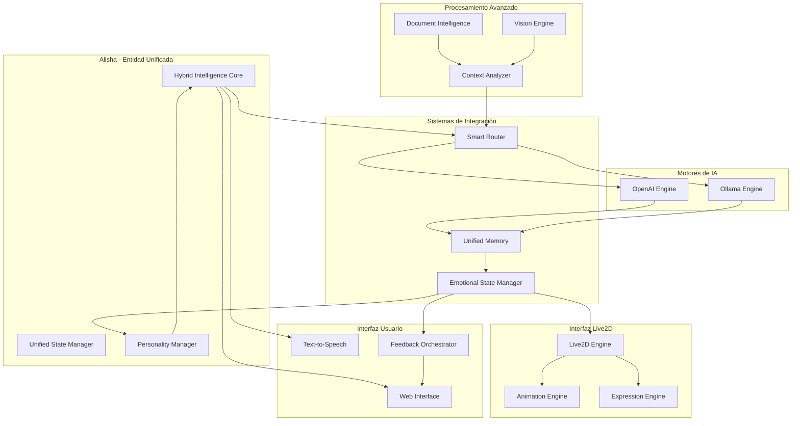

# Documento de Diseño Técnico

## Introducción

Este documento especifica el diseño técnico para la implementación del sistema de inteligencia híbrida de Alisha, que unifica OpenAI y Ollama en una sola entidad coherente con integración completa Live2D, procesamiento avanzado de documentos, visión computacional y personalidad orgánica rioplatense.

## Glosario

- **Hybrid_Intelligence_Core**: Núcleo central que unifica ambos motores de IA manteniendo coherencia de personalidad
- **Smart_Router**: Componente que decide qué motor usar basándose en análisis semántico y contextual
- **Unified_Memory**: Sistema de memoria compartida que mantiene coherencia conversacional entre motores
- **Live2D_Integration**: Integración completa entre estado emocional de IA y expresiones/animaciones Live2D
- **Document_Intelligence**: Procesador avanzado de documentos .docx/.pdf con análisis crítico
- **Vision_Engine**: Sistema de análisis de pantalla con OCR y detección de errores
- **Personality_Synthesizer**: Motor que mantiene personalidad rioplatense coherente entre ambos motores
- **Emotional_State_Manager**: Gestor de estados emocionales sincronizado entre IA y Live2D
- **Context_Analyzer**: Analizador de contexto para routing inteligente
- **Feedback_Orchestrator**: Orquestador de feedback visual diferenciado por motor

## Overview

El sistema de inteligencia híbrida de Alisha representa una evolución arquitectónica que unifica OpenAI (ChatGPT) y Ollama en una sola entidad coherente. La clave del diseño es que **Alisha es UNA SOLA PERSONA** - no dos sistemas separados, sino una inteligencia unificada que utiliza diferentes "hemisferios cerebrales" según el contexto.

### Principios Fundamentales

1. **Entidad Unificada**: Alisha mantiene una personalidad, memoria y comportamiento coherentes independientemente del motor activo
2. **Transparencia de Motor**: El usuario interactúa con Alisha, no con "OpenAI" o "Ollama"
3. **Integración Live2D Total**: Las expresiones y animaciones reflejan el estado interno real de la IA
4. **Personalidad Orgánica**: Comunicación natural estilo rioplatense sin artificialidad típica de IA
5. **Memoria Persistente**: Continuidad conversacional y emocional entre sesiones y motores

## Architecture

### Arquitectura de Alto Nivel



### Flujo de Procesamiento Unificado

1. **Input Reception**: La entrada del usuario llega al Hybrid Intelligence Core
2. **Context Analysis**: El Context Analyzer evalúa el tipo de consulta y contexto actual
3. **Smart Routing**: El Smart Router decide qué motor usar basándose en el análisis
4. **Processing**: El motor seleccionado procesa la consulta manteniendo la personalidad de Alisha
5. **Memory Integration**: La respuesta se integra en la Unified Memory
6. **Emotional Synthesis**: El Emotional State Manager actualiza el estado emocional
7. **Live2D Reflection**: Las expresiones Live2D reflejan el nuevo estado emocional
8. **Response Delivery**: La respuesta se entrega con feedback visual apropiado

## Components and Interfaces

### 1. Hybrid Intelligence Core (HIC)

**Responsabilidad**: Núcleo central que mantiene la coherencia de Alisha como entidad única.

**Interfaces**:
```python
class HybridIntelligenceCore:
    def process_input(self, user_input: str, context: Dict) -> AlishaResponse
    def maintain_personality_coherence(self) -> None
    def sync_emotional_state(self, new_state: EmotionalState) -> None
    def get_unified_context(self) -> UnifiedContext
```

**Funcionalidades**:
- Mantiene el "núcleo de personalidad" de Alisha
- Coordina entre todos los subsistemas
- Asegura coherencia conversacional
- Gestiona transiciones entre motores de forma transparente

### 2. Smart Router

**Responsabilidad**: Decide inteligentemente qué motor usar basándose en análisis semántico y contextual.

**Interfaces**:
```python
class SmartRouter:
    def analyze_query_complexity(self, query: str) -> ComplexityScore
    def route_to_engine(self, query: str, context: Dict) -> EngineChoice
    def learn_from_feedback(self, query: str, engine: str, success: bool) -> None
    def get_routing_explanation(self) -> str
```

**Criterios de Routing**:
- **OpenAI para**: Consultas técnicas complejas, razonamiento avanzado, análisis crítico de documentos
- **Ollama para**: Conversación casual, respuestas emocionales, interacciones rápidas
- **Factores**: Complejidad semántica, palabras clave técnicas, historial de éxito, carga del sistema

### 3. Unified Memory System

**Responsabilidad**: Memoria compartida que mantiene coherencia entre motores y sesiones.

**Interfaces**:
```python
class UnifiedMemory:
    def store_interaction(self, interaction: Interaction, engine: str) -> None
    def get_context_for_engine(self, engine: str) -> ContextData
    def sync_memory_between_engines(self) -> None
    def get_personality_context(self) -> PersonalityContext
```

**Estructura de Memoria**:
- **Memoria Episódica**: Conversaciones pasadas con contexto emocional
- **Memoria Semántica**: Conocimiento sobre el usuario y preferencias
- **Memoria Emocional**: Estados emocionales y patrones de comportamiento
- **Memoria de Personalidad**: Rasgos consistentes de Alisha

### 4. Live2D Integration System

**Responsabilidad**: Integración completa entre estado interno de IA y expresiones Live2D.

**Interfaces**:
```python
class Live2DIntegration:
    def update_emotional_state(self, state: EmotionalState) -> None
    def trigger_expression(self, expression: str, intensity: float) -> None
    def sync_with_speech(self, text: str, engine: str) -> None
    def set_thinking_mode(self, engine: str) -> None
```

**Estados Emocionales Mapeados**:
- **Alegría/Entusiasmo**: Expresiones brillantes, movimientos energéticos
- **Concentración**: Expresiones focalizadas, movimientos precisos
- **Curiosidad**: Expresiones inquisitivas, inclinación de cabeza
- **Crítica/Análisis**: Expresiones serias, cejas fruncidas
- **Relajación**: Expresiones suaves, movimientos fluidos

### 5. Document Intelligence Engine

**Responsabilidad**: Procesamiento avanzado de documentos con análisis crítico.

**Interfaces**:
```python
class DocumentIntelligence:
    def process_docx(self, file_path: str) -> DocumentAnalysis
    def process_pdf(self, file_path: str) -> DocumentAnalysis
    def analyze_structure(self, content: str) -> StructureAnalysis
    def detect_errors(self, content: str) -> List[Error]
    def suggest_improvements(self, content: str) -> List[Suggestion]
```

**Capacidades**:
- Extracción de texto preservando estructura
- Análisis ortográfico y gramatical
- Detección de inconsistencias lógicas
- Sugerencias de mejora contextual
- Procesamiento asíncrono para archivos grandes

### 6. Vision Engine

**Responsabilidad**: Análisis de pantalla con OCR y detección inteligente de contenido.

**Interfaces**:
```python
class VisionEngine:
    def capture_screen(self, region: Optional[Rect] = None) -> ScreenCapture
    def extract_text(self, image: Image) -> ExtractedText
    def analyze_content(self, text: str, image: Image) -> ContentAnalysis
    def detect_errors_visual(self, image: Image) -> List[VisualError]
```

**Funcionalidades**:
- Captura de pantalla inteligente
- OCR avanzado con corrección contextual
- Detección de errores visuales en documentos
- Análisis de interfaces de usuario
- Integración con análisis crítico

### 7. Personality Synthesizer

**Responsabilidad**: Mantiene personalidad rioplatense coherente entre motores.

**Interfaces**:
```python
class PersonalitySynthesizer:
    def apply_personality_filter(self, response: str, engine: str) -> str
    def generate_organic_response(self, base_response: str) -> str
    def maintain_consistency(self, new_response: str) -> str
    def adapt_to_context(self, context: ConversationContext) -> PersonalityState
```

**Características de Personalidad**:
- **Comunicación Natural**: Sin frases típicas de IA
- **Escepticismo Contextual**: Ironía y crítica constructiva
- **Compañera de Trabajo**: No asistente digital formal
- **Expresiones Rioplatenses**: Vocabulario y construcciones naturales
- **Coherencia Emocional**: Estados emocionales consistentes

## Data Models

### Core Data Structures

```python
@dataclass
class AlishaResponse:
    content: str
    engine_used: str
    emotional_state: EmotionalState
    confidence: float
    processing_time: float
    visual_feedback: VisualFeedback

@dataclass
class EmotionalState:
    dopamina: float  # 0.0 - 1.0
    humor: float     # 0.0 - 1.0
    irritabilidad: float  # 0.0 - 1.0
    tension: float   # 0.0 - 1.0
    flow: float      # 0.0 - 1.0
    hablando: bool
    categoria: str   # "flow", "tension", "neutro", "code"

@dataclass
class UnifiedContext:
    conversation_history: List[Interaction]
    emotional_history: List[EmotionalState]
    user_preferences: Dict[str, Any]
    current_session: SessionData
    personality_state: PersonalityState

@dataclass
class DocumentAnalysis:
    content: str
    structure: StructureAnalysis
    errors: List[Error]
    suggestions: List[Suggestion]
    metadata: DocumentMetadata
    processing_stats: ProcessingStats

@dataclass
class VisualFeedback:
    engine_indicator: str
    color_scheme: str
    animation_type: str
    intensity: float
```

### Memory Schema

```python
class MemoryEntry:
    timestamp: datetime
    user_input: str
    alisha_response: str
    engine_used: str
    emotional_state: EmotionalState
    context_tags: List[str]
    success_rating: Optional[float]

class PersonalityState:
    base_traits: Dict[str, float]
    current_mood: str
    interaction_style: str
    response_patterns: Dict[str, float]
    learned_preferences: Dict[str, Any]
```

## Error Handling

### Error Categories and Strategies

1. **Engine Unavailability**
   - **Strategy**: Automatic fallback to available engine
   - **User Feedback**: Transparent notification with personality
   - **Recovery**: Retry mechanism with exponential backoff

2. **Memory Synchronization Errors**
   - **Strategy**: Graceful degradation with local memory
   - **Recovery**: Background sync repair
   - **Fallback**: Use last known good state

3. **Live2D Integration Failures**
   - **Strategy**: Continue with text-only interaction
   - **Recovery**: Restart Live2D engine in background
   - **Fallback**: Static avatar mode

4. **Document Processing Errors**
   - **Strategy**: Partial processing with error reporting
   - **Recovery**: Alternative processing methods
   - **Fallback**: Basic text extraction

5. **Vision System Failures**
   - **Strategy**: Disable vision features gracefully
   - **Recovery**: Restart vision engine
   - **Fallback**: Text-only analysis mode

### Error Handling Implementation

```python
class ErrorHandler:
    def handle_engine_failure(self, engine: str, error: Exception) -> FallbackStrategy
    def handle_memory_sync_error(self, error: MemoryError) -> RecoveryAction
    def handle_live2d_error(self, error: Live2DError) -> DegradationMode
    def log_error_with_context(self, error: Exception, context: Dict) -> None
```

## Testing Strategy

### Dual Testing Approach

El sistema requiere una estrategia de testing dual que combine:

1. **Unit Tests**: Para componentes individuales y casos específicos
2. **Integration Tests**: Para verificar la coherencia entre sistemas
3. **End-to-End Tests**: Para validar la experiencia completa de usuario
4. **Personality Consistency Tests**: Para verificar coherencia de personalidad

### Testing Categories

**Unit Testing**:
- Smart Router decision logic
- Memory synchronization mechanisms
- Document processing algorithms
- Vision engine OCR accuracy
- Personality filter consistency

**Integration Testing**:
- Engine switching seamless operation
- Memory state consistency across engines
- Live2D synchronization with emotional states
- Document analysis integration with vision
- Error handling and recovery mechanisms

**End-to-End Testing**:
- Complete conversation flows
- Multi-session personality consistency
- Complex document analysis workflows
- Vision-assisted error detection scenarios
- Emotional state evolution over time

**Performance Testing**:
- Engine switching latency
- Memory synchronization performance
- Document processing efficiency
- Live2D animation smoothness
- Concurrent operation stability

### Test Configuration

- **Minimum test coverage**: 85% for core components
- **Integration test frequency**: Every major component interaction
- **End-to-end test scenarios**: All primary user workflows
- **Performance benchmarks**: Sub-200ms engine switching, <1s document analysis initiation
- **Personality consistency validation**: Automated personality trait scoring across engines

## Correctness Properties

*A property is a characteristic or behavior that should hold true across all valid executions of a system-essentially, a formal statement about what the system should do. Properties serve as the bridge between human-readable specifications and machine-verifiable correctness guarantees.*

### Property Reflection

Después de analizar todos los criterios de aceptación, he identificado varias propiedades que pueden consolidarse para evitar redundancia:

**Consolidaciones Realizadas**:
- Las propiedades de routing (1.1, 1.2, 7.2, 7.3) se consolidan en una propiedad comprehensiva de routing inteligente
- Las propiedades de coherencia de personalidad (4.6, 8.3) se combinan en una sola propiedad de coherencia
- Las propiedades de sincronización de memoria (1.5, 8.1, 8.2) se unifican en una propiedad de memoria unificada
- Las propiedades de feedback visual (1.4, 10.1, 10.2, 10.3) se consolidan en una propiedad de feedback diferenciado
- Las propiedades de expresiones Live2D (4.5, 5.2, 5.5, 6.5) se unifican en una propiedad de expresiones contextuales

### Property 1: Smart Routing Intelligence

*For any* user query with identifiable semantic characteristics, the Smart Router SHALL route casual/conversational queries to Ollama and complex/technical queries to OpenAI, while considering system load and historical success patterns.

**Validates: Requirements 1.1, 1.2, 7.1, 7.2, 7.3, 7.4, 7.5, 7.6**

### Property 2: Unified Memory Consistency

*For any* conversation involving both AI engines, the Unified Memory SHALL maintain complete context synchronization, preserve personality coherence, and enable seamless context transfer when switching between engines.

**Validates: Requirements 1.3, 1.5, 8.1, 8.2, 8.3, 8.4, 8.5, 8.6**

### Property 3: Engine Fallback Reliability

*For any* engine unavailability scenario, the Hybrid System SHALL automatically fallback to the available engine while maintaining conversation continuity and user experience quality.

**Validates: Requirements 1.6**

### Property 4: Document Processing Completeness

*For any* valid .docx or .pdf document, the Document Processor SHALL extract complete content while preserving structure, regardless of file complexity or size.

**Validates: Requirements 2.1, 2.2**

### Property 5: Asynchronous Processing Efficiency

*For any* file larger than 10MB, the Document Processor SHALL process asynchronously without blocking the interface while maintaining Live2D animation fluidity and showing real-time progress.

**Validates: Requirements 2.4, 9.1, 9.2, 9.3**

### Property 6: Real-time Buffer Monitoring

*For any* editor buffer change, the Buffer Monitor SHALL detect and notify relevant changes to Alisha in real-time without delay or loss of information.

**Validates: Requirements 2.5, 2.6**

### Property 7: Vision System Accuracy

*For any* screen capture request, the Vision System SHALL accurately capture, transcribe text via OCR, and analyze content for errors and inconsistencies with appropriate specialization for technical content.

**Validates: Requirements 3.1, 3.2, 3.3, 3.4, 3.5, 3.6**

### Property 8: Organic Personality Consistency

*For any* interaction across both AI engines, the Personality Engine SHALL maintain consistent rioplatense communication style, eliminate typical AI responses, and behave as a work companion rather than a digital assistant.

**Validates: Requirements 4.1, 4.2, 4.3, 4.4, 4.6**

### Property 9: Contextual Live2D Expression Synchronization

*For any* emotional state or interaction context, the Live2D Engine SHALL display appropriate expressions and poses that accurately reflect the current emotional state and interaction type (casual, technical, critical analysis).

**Validates: Requirements 4.5, 5.2, 5.3, 5.5, 6.5, 10.3**

### Property 10: Audio-Visual Synchronization Perfection

*For any* speech synthesis event, the TTS Engine SHALL synchronize perfectly with Live2D animations while adjusting tone and velocity according to the current emotional state.

**Validates: Requirements 5.1, 5.4**

### Property 11: Organic Movement Continuity

*For any* interaction duration, the Live2D Engine SHALL maintain organic and natural movements throughout the entire interaction without artificial pauses or mechanical behaviors.

**Validates: Requirements 5.6**

### Property 12: Comprehensive Error Detection

*For any* document analysis (visual or textual), the Critic Mode SHALL automatically detect spelling errors, logical inconsistencies, and structural problems while providing specific correction suggestions with natural rioplatense tone.

**Validates: Requirements 6.1, 6.2, 6.3, 6.4, 6.6**

### Property 13: Resource-Optimized Processing

*For any* memory-constrained scenario, the Document Processor SHALL implement intelligent caching, segment-based processing, and resource optimization to maintain system performance.

**Validates: Requirements 9.4, 9.5, 9.6**

### Property 14: Differentiated Visual Feedback

*For any* AI engine response or transition, the Feedback Visual system SHALL display engine-specific indicators, transition animations, and maintain visual consistency with the interface theme while clearly indicating errors and affected engines.

**Validates: Requirements 1.4, 10.1, 10.2, 10.4, 10.5, 10.6**

## Micro-Gestos de Realismo y Sarcasm Score

### Micro-Gestos de Duda y Procesamiento

Para eliminar los silencios incómodos durante el procesamiento de consultas complejas, el sistema implementa micro-gestos que reflejan el estado interno de procesamiento:

**Gestos de Procesamiento**:
- **Fruncir ceño**: Cuando analiza consultas técnicas complejas
- **Mirar hacia arriba**: Durante búsqueda en memoria o razonamiento
- **Inclinar cabeza**: Al evaluar múltiples opciones de respuesta
- **Parpadeo lento**: Durante transiciones entre motores
- **Micro-sonrisas**: Al encontrar la respuesta correcta

**Implementación**:
```python
class MicroGestureEngine:
    def trigger_processing_gesture(self, query_complexity: float, engine: str) -> None
    def show_thinking_animation(self, duration: float) -> None
    def express_uncertainty(self, confidence: float) -> None
    def celebrate_solution_found(self) -> None
```

### Sistema Sarcasm Score

El Sarcasm Score determina el nivel de acidez en las respuestas de Alisha basándose en la cantidad y gravedad de errores detectados:

**Escala de Sarcasmo**:
- **0.0-0.2**: Tono constructivo y alentador
- **0.3-0.5**: Observaciones directas con humor sutil
- **0.6-0.8**: Comentarios irónicos evidentes
- **0.9-1.0**: Sarcasmo directo estilo rioplatense

**Factores que Incrementan el Score**:
- Errores ortográficos básicos (+0.1 por error)
- Inconsistencias lógicas evidentes (+0.2 por inconsistencia)
- Repetición de errores ya señalados (+0.3)
- Errores en documentos "profesionales" (+0.2 multiplicador)

**Implementación**:
```python
class SarcasmScoreEngine:
    def calculate_sarcasm_level(self, errors: List[Error], context: DocumentContext) -> float
    def apply_sarcastic_filter(self, response: str, score: float) -> str
    def generate_sarcastic_comment(self, error_type: str, score: float) -> str
```

## Efecto "Primer Video" - Naturalidad Total

### Principios de Naturalidad

El objetivo es crear una experiencia tan natural que el usuario olvide que está interactuando con un sistema digital:

1. **Continuidad Emocional**: Los estados emocionales evolucionan naturalmente sin saltos abruptos
2. **Memoria Contextual**: Alisha recuerda no solo lo que se dijo, sino cómo se sintió al decirlo
3. **Reacciones Orgánicas**: Las respuestas incluyen elementos de sorpresa, duda, y descubrimiento
4. **Personalidad Persistente**: La personalidad se mantiene consistente pero evoluciona sutilmente

### Implementación de Naturalidad

**Emotional Continuity Engine**:
```python
class EmotionalContinuityEngine:
    def evolve_emotional_state(self, current: EmotionalState, trigger: Interaction) -> EmotionalState
    def maintain_emotional_memory(self, state_history: List[EmotionalState]) -> None
    def generate_organic_transition(self, from_state: str, to_state: str) -> TransitionAnimation
```

**Contextual Memory System**:
```python
class ContextualMemorySystem:
    def store_emotional_context(self, interaction: Interaction, feeling: EmotionalState) -> None
    def recall_similar_emotional_context(self, current_interaction: Interaction) -> List[MemoryEntry]
    def influence_current_response(self, memories: List[MemoryEntry]) -> PersonalityAdjustment
```

## Advanced Integration Patterns

### Seamless Engine Switching

El cambio entre motores debe ser completamente transparente para el usuario:

**Pre-Switch Preparation**:
1. Context compression and transfer
2. Personality state synchronization
3. Emotional state mapping
4. Memory context preparation

**During Switch**:
1. Micro-gesture activation (thinking animation)
2. Gradual transition of visual indicators
3. Maintained conversation flow
4. Emotional state preservation

**Post-Switch Integration**:
1. Response personality filtering
2. Emotional state update
3. Memory integration
4. Visual feedback completion

### Live2D State Synchronization

La sincronización entre el estado interno de la IA y las expresiones Live2D debe ser perfecta:

**State Mapping**:
```python
class Live2DStateSynchronizer:
    def map_ai_state_to_visual(self, ai_state: AIState) -> Live2DParameters
    def apply_personality_filter_to_animation(self, base_animation: Animation, personality: PersonalityState) -> Animation
    def sync_speech_with_expression(self, text: str, emotional_state: EmotionalState) -> SyncedAnimation
```

**Real-time Synchronization**:
- Estado emocional → Expresiones faciales (60fps)
- Procesamiento de consulta → Micro-gestos
- Cambio de motor → Transición visual
- Respuesta generada → Sincronización labial

## Error Handling

### Graceful Degradation Strategy

El sistema debe mantener la experiencia de usuario incluso cuando componentes fallan:

**Degradation Levels**:
1. **Full Functionality**: Todos los sistemas operativos
2. **Hybrid Mode**: Un motor de IA no disponible
3. **Single Engine Mode**: Solo un motor disponible
4. **Basic Mode**: Solo texto, sin Live2D
5. **Emergency Mode**: Funcionalidad mínima

**Error Recovery Patterns**:
```python
class ErrorRecoveryManager:
    def assess_system_health(self) -> SystemHealthStatus
    def determine_degradation_level(self, failed_components: List[str]) -> DegradationLevel
    def maintain_user_experience(self, level: DegradationLevel) -> UserExperienceStrategy
    def attempt_component_recovery(self, component: str) -> RecoveryResult
```

### Transparent Error Communication

Cuando ocurren errores, Alisha debe comunicarlos de manera natural y en carácter:

**Error Communication Strategies**:
- **Engine Failure**: "Che, se me trabó un poco el cerebro, pero seguimos..."
- **Memory Sync Issue**: "Perdón, se me mezcló un poco la información..."
- **Document Processing Error**: "Este archivo está medio rebelde, pero veamos qué podemos hacer..."
- **Vision System Failure**: "No puedo ver bien la pantalla ahora, contame vos qué ves..."

## Testing Strategy

### Comprehensive Testing Approach

**Unit Testing**:
- Smart Router decision accuracy (>95%)
- Memory synchronization integrity
- Document processing completeness
- Vision engine OCR accuracy (>90%)
- Personality consistency scoring

**Integration Testing**:
- Engine switching seamless operation (<200ms)
- Live2D synchronization accuracy
- Memory state consistency validation
- Error handling and recovery verification
- Multi-session personality persistence

**End-to-End Testing**:
- Complete conversation flows with engine switches
- Document analysis workflows with visual feedback
- Vision-assisted error detection scenarios
- Emotional state evolution over extended sessions
- Multi-modal interaction scenarios

**Performance Testing**:
- Engine switching latency benchmarks
- Memory synchronization performance
- Document processing efficiency metrics
- Live2D animation frame rate consistency (60fps)
- Concurrent operation stability testing

**Personality Consistency Testing**:
- Automated personality trait scoring across engines
- Response style consistency validation
- Emotional coherence verification
- Sarcasm score accuracy testing
- Natural language pattern consistency

### Test Configuration Requirements

- **Minimum Coverage**: 90% for core components, 85% for integration layers
- **Performance Benchmarks**: 
  - Engine switching: <200ms
  - Document analysis initiation: <1s
  - Live2D synchronization: 60fps sustained
  - Memory sync: <100ms
- **Personality Consistency**: Automated scoring >0.85 correlation between engines
- **Error Recovery**: 100% graceful degradation for all failure scenarios
- **User Experience**: Seamless operation perception in >95% of interactions
