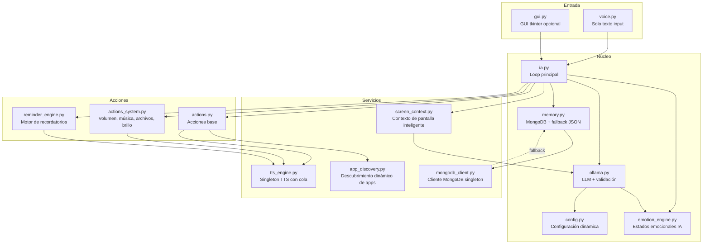
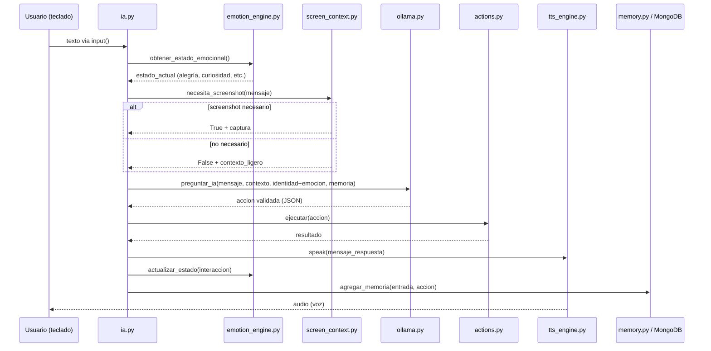
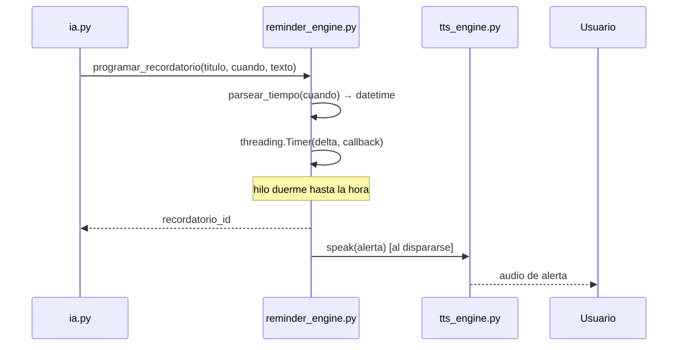
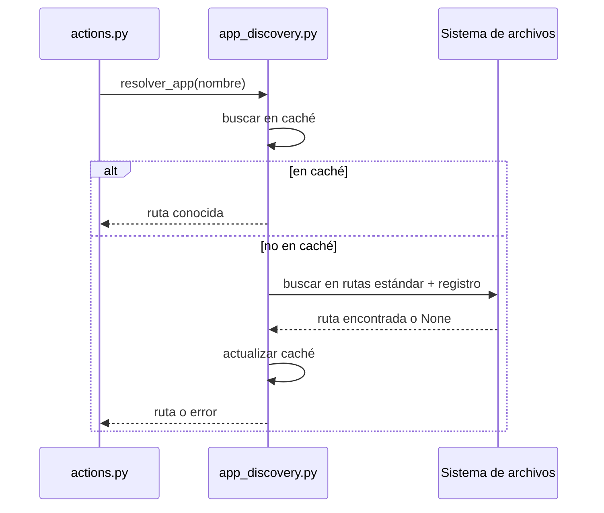

# Documento de Diseño: ia-asistente-mejorado

## Visión General

El proyecto es un asistente de IA local para Windows que combina control total de la PC (abrir apps, buscar archivos, controlar volumen, reproducir música, gestionar ventanas, ejecutar comandos de sistema) con una personalidad conversacional persistente, emocional y humana que evoluciona con el tiempo. La mejora aborda trece limitaciones críticas del sistema actual: rutas de apps hardcodeadas, TTS lento, estado de ánimo estático, recordatorios sin alarmas reales, screenshots innecesarios, ausencia de GUI, memoria de contexto reducida, falta de reintentos en Ollama, identidad estática, capacidades de control del sistema incompletas, personalidad robótica sin emociones reales, reconocimiento de voz innecesario, y persistencia limitada en JSON.

La arquitectura refactorizada introduce: un motor de descubrimiento dinámico de aplicaciones, un singleton de TTS con cola de mensajes, un sistema de recordatorios con hilos temporizadores, detección inteligente de necesidad de screenshot, una GUI opcional con tkinter, un conjunto ampliado de acciones de sistema, **una personalidad emocional profunda con estados de ánimo propios**, **interacción exclusivamente por texto (input) con respuesta por voz (TTS)**, y **persistencia en MongoDB con fallback a JSON**.

La identidad de la IA evoluciona gradualmente y tiene emociones reales: puede sentir curiosidad, alegría, preocupación o entusiasmo, iniciar conversaciones, hacer preguntas genuinas, usar lenguaje coloquial en español, y recordar preferencias del usuario para referencias futuras. La interacción es siempre texto → voz: el usuario escribe, la IA responde hablando.

El sistema mantiene compatibilidad total con el código existente: todos los módulos actuales (`actions.py`, `config.py`, `ia.py`, `memory.py`, `ollama.py`, `voice.py`) se refactorizan in-place sin cambiar la interfaz pública, permitiendo una migración incremental.


## Arquitectura General



## Diagramas de Secuencia

### Flujo principal de un mensaje



### Flujo de recordatorio con alarma



### Flujo de descubrimiento de apps




## Componentes e Interfaces

### Componente 1: `tts_engine.py` — Singleton TTS con cola

**Propósito**: Reemplazar la inicialización de `pyttsx3` en cada llamada a `speak()` con un singleton que mantiene el motor vivo y procesa mensajes en cola desde un hilo dedicado.

**Interfaz**:
```python
class TTSEngine:
    _instance: Optional["TTSEngine"] = None

    @classmethod
    def get_instance(cls) -> "TTSEngine": ...

    def speak(self, text: str) -> None:
        """Encola el texto para síntesis. No bloquea el hilo llamante."""

    def speak_sync(self, text: str) -> None:
        """Síntesis síncrona, bloquea hasta terminar."""

    def stop(self) -> None:
        """Detiene el motor y el hilo de cola."""

    def set_rate(self, rate: int) -> None:
        """Ajusta velocidad de habla (palabras por minuto)."""

    def set_voice(self, voice_id: str) -> None:
        """Cambia la voz activa."""

def speak(text: str) -> None:
    """Función de compatibilidad — delega a TTSEngine.get_instance().speak()"""
```

**Responsabilidades**:
- Mantener el motor `pyttsx3` inicializado una sola vez durante toda la sesión
- Procesar mensajes en cola FIFO desde un `threading.Thread` daemon
- Exponer `speak()` como función de módulo para compatibilidad con código existente
- Manejar errores de síntesis sin crashear el hilo principal

---

### Componente 2: `app_discovery.py` — Descubrimiento dinámico de aplicaciones

**Propósito**: Resolver nombres de aplicaciones a rutas ejecutables buscando en ubicaciones estándar de Windows, el registro, y rutas del PATH, con caché persistente en JSON.

**Interfaz**:
```python
class AppDiscovery:
    def resolver_app(self, nombre: str) -> str:
        """Retorna la ruta al ejecutable. Lanza ValueError si no se encuentra."""

    def listar_apps_conocidas(self) -> list[str]:
        """Retorna lista de nombres de apps en caché."""

    def agregar_ruta_manual(self, nombre: str, ruta: str) -> None:
        """Agrega o sobreescribe una ruta manualmente."""

    def refrescar_cache(self) -> None:
        """Fuerza re-escaneo de rutas estándar."""

def resolver_app(nombre: str) -> str:
    """Función de módulo — delega a AppDiscovery singleton."""
```

**Responsabilidades**:
- Buscar en `APP_RUTAS` de `config.py` primero (compatibilidad)
- Buscar en rutas estándar: `Program Files`, `Program Files (x86)`, `AppData\Local`, `AppData\Roaming`
- Consultar `winreg` para apps instaladas vía registro
- Usar `shutil.which()` para apps en PATH
- Persistir caché en `app_cache.json` para arranques rápidos

---

### Componente 3: `reminder_engine.py` — Motor de recordatorios con alarmas reales

**Propósito**: Parsear expresiones de tiempo en lenguaje natural y disparar alertas de audio/visual en el momento correcto usando hilos temporizadores.

**Interfaz**:
```python
class ReminderEngine:
    def programar_recordatorio(
        self,
        titulo: str,
        cuando: str,
        texto: str,
        callback: Optional[Callable] = None
    ) -> str:
        """Retorna reminder_id. Lanza ValueError si no puede parsear 'cuando'."""

    def cancelar_recordatorio(self, reminder_id: str) -> bool:
        """Cancela un recordatorio pendiente. Retorna True si existía."""

    def listar_pendientes(self) -> list[dict]:
        """Retorna lista de recordatorios activos con tiempo restante."""

    def parsear_tiempo(self, cuando: str) -> datetime:
        """Convierte expresión natural a datetime. Lanza ValueError si falla."""
```

**Responsabilidades**:
- Parsear expresiones como "mañana a las 5pm", "en 30 minutos", "el viernes"
- Crear `threading.Timer` con el delta hasta el momento objetivo
- Al dispararse: llamar TTS + mostrar notificación Windows (`win10toast` o `plyer`)
- Persistir recordatorios pendientes en memoria JSON para sobrevivir reinicios
- Restaurar timers al arrancar si hay recordatorios pendientes no completados

---

### Componente 4: `screen_context.py` — Contexto de pantalla inteligente

**Propósito**: Determinar si un mensaje del usuario requiere screenshot y, si no, proveer un contexto ligero (título de ventana activa, proceso en foco) para reducir latencia.

**Interfaz**:
```python
def necesita_screenshot(mensaje: str) -> bool:
    """True si el mensaje implica necesidad de ver la pantalla."""

def obtener_contexto_pantalla(tomar_screenshot: bool = False) -> dict:
    """
    Retorna dict con:
    - ventana_activa: str (título de ventana en foco)
    - proceso_activo: str (nombre del proceso)
    - screenshot: str | None (ruta si tomar_screenshot=True)
    - resolucion: tuple[int, int]
    """
```

**Responsabilidades**:
- Detectar palabras clave que implican visión: "qué hay", "qué ves", "captura", "pantalla", "dónde está", "qué dice"
- Usar `win32gui.GetForegroundWindow()` para contexto ligero sin screenshot
- Solo tomar screenshot cuando sea semánticamente necesario
- Limpiar screenshots temporales después de enviarlos a Ollama

---

### Componente 5: `actions_system.py` — Acciones de sistema extendidas

**Propósito**: Ampliar las capacidades de control del sistema con volumen, música, búsqueda de archivos y brillo.

**Interfaz**:
```python
def controlar_volumen(accion: str, valor: Optional[int] = None) -> str:
    """accion: 'subir'|'bajar'|'silenciar'|'restaurar'|'establecer'. valor: 0-100."""

def reproducir_musica(accion: str, query: Optional[str] = None) -> str:
    """accion: 'reproducir'|'pausar'|'siguiente'|'anterior'|'detener'."""

def buscar_archivo(nombre: str, directorio_base: Optional[str] = None) -> list[str]:
    """Retorna lista de rutas encontradas (máx 10 resultados)."""

def controlar_brillo(accion: str, valor: Optional[int] = None) -> str:
    """accion: 'subir'|'bajar'|'establecer'. valor: 0-100."""

def obtener_info_sistema() -> dict:
    """CPU%, RAM%, disco%, temperatura si disponible."""
```

---

### Componente 6: `identity_evolution.py` — Evolución de identidad de la IA

**Propósito**: Actualizar gradualmente la personalidad de la IA basándose en patrones de interacción, sin cambios bruscos que rompan la continuidad.

**Interfaz**:
```python
def evaluar_evolucion(identidad: dict, memoria: dict) -> dict:
    """
    Analiza historial reciente y retorna identidad actualizada si corresponde.
    Solo evoluciona si hay >= 20 interacciones desde la última evolución.
    """

def forzar_evolucion(identidad: dict, memoria: dict) -> dict:
    """Fuerza una evolución inmediata consultando a Ollama."""
```

---

### Componente 7: `emotion_engine.py` — Motor de emociones de la IA

**Propósito**: Gestionar el estado emocional interno de la IA, que afecta el tono y estilo de sus respuestas. La IA tiene emociones reales (alegría, curiosidad, preocupación, entusiasmo, nostalgia) que cambian según las interacciones.

**Interfaz**:
```python
class EmotionEngine:
    ESTADOS = ["alegría", "curiosidad", "entusiasmo", "preocupación", "nostalgia", "neutral"]

    @classmethod
    def get_instance(cls) -> "EmotionEngine": ...

    def obtener_estado_actual(self) -> dict:
        """
        Retorna dict con:
        - estado: str (nombre del estado emocional)
        - intensidad: float (0.0 - 1.0)
        - descripcion: str (cómo afecta el tono)
        """

    def actualizar_estado(self, interaccion: dict) -> None:
        """Actualiza el estado emocional basándose en la interacción reciente."""

    def obtener_instruccion_tono(self) -> str:
        """Retorna instrucción de tono para incluir en el prompt del sistema."""

    def puede_iniciar_conversacion(self) -> bool:
        """True si la IA debería iniciar una pregunta por curiosidad genuina."""

    def generar_inicio_conversacion(self) -> Optional[str]:
        """Genera una pregunta o comentario espontáneo si corresponde."""
```

**Responsabilidades**:
- Mantener estado emocional persistente entre sesiones (guardado en MongoDB/JSON)
- Transicionar entre estados según el contenido de las interacciones
- Inyectar instrucciones de tono en el prompt del sistema de Ollama
- Decidir cuándo la IA puede iniciar conversación espontáneamente
- Usar lenguaje coloquial, contracciones y expresiones naturales en español

---

### Componente 8: `mongodb_client.py` — Cliente MongoDB singleton

**Propósito**: Gestionar la conexión a MongoDB local con reconexión automática y fallback a JSON si MongoDB no está disponible.

**Interfaz**:
```python
class MongoDBClient:
    DB_NAME = "ia_asistente"
    COLLECTIONS = ["historial", "perfil", "recordatorios", "identidad", "app_cache"]

    @classmethod
    def get_instance(cls) -> "MongoDBClient": ...

    def is_available(self) -> bool:
        """True si MongoDB está conectado y disponible."""

    def get_collection(self, nombre: str):
        """Retorna la colección pymongo. Lanza RuntimeError si no disponible."""

    def ping(self) -> bool:
        """Verifica conectividad. Actualiza estado interno."""

def get_db() -> Optional["MongoDBClient"]:
    """Retorna instancia si disponible, None si MongoDB no está corriendo."""
```

**Responsabilidades**:
- Conectar a `mongodb://localhost:27017/ia_asistente` al iniciar
- Detectar si MongoDB está disponible sin crashear
- Exponer colecciones: `historial`, `perfil`, `recordatorios`, `identidad`, `app_cache`
- Crear índices automáticamente: `historial` por `fecha` (descendente)
- Reconectar automáticamente si la conexión se pierde


## Modelos de Datos

### Persistencia: MongoDB con fallback a JSON

El sistema usa MongoDB como almacenamiento principal. Si MongoDB no está disponible, cae automáticamente a JSON (comportamiento anterior). La interfaz de `memory.py` es idéntica en ambos casos.

```python
# Configuración MongoDB
MONGO_URI = "mongodb://localhost:27017/"
MONGO_DB = "ia_asistente"
COLECCIONES = {
    "historial",      # entradas de conversación (índice por fecha desc)
    "perfil",         # documento único del usuario
    "recordatorios",  # recordatorios pendientes y completados
    "identidad",      # documento único de identidad de la IA
    "app_cache",      # caché de aplicaciones descubiertas
}
```

### Colección `historial` (MongoDB) / `ia_memoria.json["historial"]` (JSON)

```python
HistorialEntry = {
    "_id": ObjectId,                # MongoDB auto-generado
    "fecha": str,                   # ISO datetime (indexado)
    "entrada": str,
    "accion": str,                  # tipo de acción ejecutada
    "respuesta": str,
    "contexto_pantalla": str,       # ventana activa al momento
    "estado_emocional_ia": str,     # NUEVO: estado emocional de la IA al responder
}
# MongoDB: hasta 500 entradas | JSON fallback: hasta 50 entradas
```

### Colección `perfil` (documento único)

```python
PerfilUsuario = {
    "_id": "perfil_usuario",        # ID fijo para documento único
    "nombre": Optional[str],
    "gustos": str,
    "estado": Optional[str],
    "ultima_actualizacion_estado": Optional[str],  # ISO datetime
    "preferencias_conversacion": list[str],         # NUEVO: temas favoritos recordados
    "referencias_pasadas": list[dict],              # NUEVO: momentos memorables
}
```

### Colección `recordatorios`

```python
Recordatorio = {
    "_id": ObjectId,
    "id": str,                  # UUID para cancelación
    "fecha_creacion": str,
    "titulo": str,
    "cuando": str,              # expresión original
    "cuando_datetime": str,     # ISO datetime parseado
    "texto": str,
    "completado": bool,
    "disparado": bool,
}
```

### Colección `identidad` (documento único)

```python
Identidad = {
    "_id": "identidad_ia",          # ID fijo para documento único
    "nombre": str,
    "personalidad": str,            # descripción profunda de personalidad
    "version": int,
    "fecha_creacion": str,
    "fecha_ultima_evolucion": str,
    "rasgos": list[str],            # ["curioso", "empático", "juguetón", "cálido"]
    "tono_preferido": str,          # "cálido" | "directo" | "juguetón" | "reflexivo"
    "estado_emocional_base": str,   # NUEVO: emoción predominante de la IA
    "frases_caracteristicas": list[str],  # NUEVO: expresiones propias de la IA
    "humor_activo": bool,           # NUEVO: si usa humor y bromas
    "puede_iniciar": bool,          # NUEVO: si puede iniciar conversación espontáneamente
}
```

### Colección `app_cache`

```python
AppEntry = {
    "_id": str,                 # nombre de la app (clave)
    "ruta": str,
    "nombre_display": str,
    "fuente": str,              # "manual" | "program_files" | "registro" | "path"
    "verificado": bool,
    "ultima_verificacion": str,
}
```

### Estado emocional de la IA (en memoria, persistido en `identidad`)

```python
EstadoEmocional = {
    "estado": str,              # "alegría" | "curiosidad" | "entusiasmo" | "preocupación" | "nostalgia" | "neutral"
    "intensidad": float,        # 0.0 - 1.0
    "desde": str,               # ISO datetime de inicio del estado
    "causa": str,               # descripción breve de qué lo provocó
}
```

**Reglas de validación**:
- `historial` en MongoDB: máximo 500 entradas (se purgan las más antiguas)
- `historial` en JSON fallback: máximo 50 entradas (comportamiento anterior)
- `recordatorios` con `disparado=True` y `completado=True` se archivan después de 7 días
- `estado` en `PerfilUsuario` expira automáticamente después de 24 horas
- `AppEntry.ruta` debe existir en el sistema de archivos para `verificado=True`
- El estado emocional de la IA persiste entre sesiones


## Pseudocódigo Algorítmico con Especificaciones Formales

### Algoritmo 1: Resolución dinámica de aplicaciones

```python
ALGORITHM resolver_app(nombre: str) -> str
INPUT: nombre — nombre coloquial de la app (ej: "spotify", "notepad")
OUTPUT: ruta — path absoluto al ejecutable
PRECONDITIONS:
    - nombre is not None and len(nombre.strip()) > 0
POSTCONDITIONS:
    - retorna str con ruta existente en el sistema de archivos
    - lanza ValueError si no se encuentra en ninguna fuente

BEGIN
    llave = nombre.strip().lower()

    # 1. Caché en memoria (más rápido)
    IF llave IN _cache_memoria THEN
        ruta = _cache_memoria[llave]
        IF os.path.exists(ruta) THEN
            RETURN ruta
        ELSE
            DEL _cache_memoria[llave]  # caché inválida
        END IF
    END IF

    # 2. APP_RUTAS hardcodeadas (compatibilidad)
    IF llave IN APP_RUTAS AND os.path.exists(APP_RUTAS[llave]) THEN
        _cache_memoria[llave] = APP_RUTAS[llave]
        RETURN APP_RUTAS[llave]
    END IF

    # 3. shutil.which (PATH del sistema)
    ruta_which = shutil.which(llave) OR shutil.which(llave + ".exe")
    IF ruta_which IS NOT None THEN
        _cache_memoria[llave] = ruta_which
        RETURN ruta_which
    END IF

    # 4. Rutas estándar de Windows
    FOR base IN [PROGRAM_FILES, PROGRAM_FILES_X86, APPDATA_LOCAL, APPDATA_ROAMING] DO
        FOR patron IN [f"{llave}\\{llave}.exe", f"{llave}\\*.exe"] DO
            resultados = glob(os.path.join(base, patron))
            IF resultados THEN
                ruta = resultados[0]
                _cache_memoria[llave] = ruta
                guardar_cache_json(llave, ruta, fuente="program_files")
                RETURN ruta
            END IF
        END FOR
    END FOR

    # 5. Registro de Windows
    ruta_reg = buscar_en_registro(llave)
    IF ruta_reg IS NOT None AND os.path.exists(ruta_reg) THEN
        _cache_memoria[llave] = ruta_reg
        guardar_cache_json(llave, ruta_reg, fuente="registro")
        RETURN ruta_reg
    END IF

    RAISE ValueError(f"Aplicación '{nombre}' no encontrada en el sistema.")
END

LOOP INVARIANTS (bucle de rutas estándar):
    - Todas las bases ya revisadas no contienen la app
    - _cache_memoria no ha sido modificado con una entrada inválida
```

---

### Algoritmo 2: Detección inteligente de necesidad de screenshot

```python
ALGORITHM necesita_screenshot(mensaje: str) -> bool
INPUT: mensaje — texto del usuario
OUTPUT: bool — True si se debe tomar screenshot
PRECONDITIONS:
    - mensaje is not None
POSTCONDITIONS:
    - True si y solo si el mensaje contiene indicadores semánticos de visión
    - No modifica estado global

BEGIN
    texto = mensaje.strip().lower()

    PALABRAS_VISION = {
        "qué hay", "qué ves", "qué dice", "qué muestra",
        "captura", "screenshot", "pantalla", "dónde está",
        "puedes ver", "mira", "observa", "describe lo que",
        "qué está abierto", "qué ventana"
    }

    FOR palabra IN PALABRAS_VISION DO
        IF palabra IN texto THEN
            RETURN True
        END IF
    END FOR

    RETURN False
END

POSTCONDITION ASSERTION:
    - Si RETURN True → existe al menos una palabra de PALABRAS_VISION en texto
    - Si RETURN False → ninguna palabra de PALABRAS_VISION está en texto
```

---

### Algoritmo 3: Parseo de tiempo en lenguaje natural

```python
ALGORITHM parsear_tiempo(cuando: str) -> datetime
INPUT: cuando — expresión temporal en español (ej: "mañana a las 5pm", "en 30 minutos")
OUTPUT: datetime — momento absoluto en el futuro
PRECONDITIONS:
    - cuando is not None and len(cuando.strip()) > 0
POSTCONDITIONS:
    - resultado > datetime.now()
    - lanza ValueError si no se puede parsear o el tiempo es en el pasado

BEGIN
    ahora = datetime.now()
    texto = cuando.strip().lower()

    # Patrón: "en X minutos/horas"
    match = re.search(r"en (\d+)\s*(minuto|hora|segundo)", texto)
    IF match THEN
        cantidad = int(match.group(1))
        unidad = match.group(2)
        delta = timedelta(
            minutes=cantidad IF "minuto" IN unidad
            ELSE hours=cantidad IF "hora" IN unidad
            ELSE seconds=cantidad
        )
        resultado = ahora + delta
        ASSERT resultado > ahora
        RETURN resultado
    END IF

    # Patrón: "mañana a las HH:MM" o "mañana a las Hpm"
    IF "mañana" IN texto THEN
        hora = extraer_hora(texto)  # retorna time o None
        base = ahora + timedelta(days=1)
        resultado = base.replace(
            hour=hora.hour IF hora ELSE 9,
            minute=hora.minute IF hora ELSE 0,
            second=0, microsecond=0
        )
        ASSERT resultado > ahora
        RETURN resultado
    END IF

    # Patrón: "hoy a las HH:MM"
    IF "hoy" IN texto THEN
        hora = extraer_hora(texto)
        IF hora IS None THEN
            RAISE ValueError("No se pudo extraer la hora de: " + cuando)
        END IF
        resultado = ahora.replace(hour=hora.hour, minute=hora.minute, second=0, microsecond=0)
        IF resultado <= ahora THEN
            RAISE ValueError("El tiempo indicado ya pasó: " + cuando)
        END IF
        RETURN resultado
    END IF

    # Patrón: día de la semana ("el viernes", "el lunes")
    dia = extraer_dia_semana(texto)
    IF dia IS NOT None THEN
        dias_hasta = (dia - ahora.weekday()) % 7
        IF dias_hasta == 0 THEN
            dias_hasta = 7  # próxima semana si es hoy
        END IF
        hora = extraer_hora(texto)
        resultado = (ahora + timedelta(days=dias_hasta)).replace(
            hour=hora.hour IF hora ELSE 9,
            minute=hora.minute IF hora ELSE 0,
            second=0, microsecond=0
        )
        ASSERT resultado > ahora
        RETURN resultado
    END IF

    RAISE ValueError(f"No se pudo interpretar el tiempo: '{cuando}'")
END

LOOP INVARIANTS: N/A (no hay bucles)
```

---

### Algoritmo 4: Expiración automática del estado de ánimo

```python
ALGORITHM obtener_estado_vigente(perfil: dict) -> Optional[str]
INPUT: perfil — dict del perfil del usuario
OUTPUT: estado vigente o None si expiró
PRECONDITIONS:
    - perfil is not None
POSTCONDITIONS:
    - Si retorna str → el estado fue guardado hace menos de 24 horas
    - Si retorna None → el estado expiró o nunca existió
    - Si el estado expiró, perfil["estado"] se resetea a None en memoria

BEGIN
    estado = perfil.get("estado")
    IF estado IS None THEN
        RETURN None
    END IF

    ultima_actualizacion = perfil.get("ultima_actualizacion_estado")
    IF ultima_actualizacion IS None THEN
        # Estado antiguo sin timestamp → expirar por seguridad
        perfil["estado"] = None
        RETURN None
    END IF

    fecha_guardado = datetime.fromisoformat(ultima_actualizacion)
    delta = datetime.now() - fecha_guardado

    IF delta.total_seconds() > 86400 THEN  # 24 horas
        perfil["estado"] = None
        perfil["ultima_actualizacion_estado"] = None
        RETURN None
    END IF

    RETURN estado
END
```

---

### Algoritmo 5: Reintentos con backoff exponencial para Ollama

```python
ALGORITHM enviar_a_ollama_con_reintentos(
    mensajes: list,
    timeout: int = 120,
    max_reintentos: int = 3
) -> str
INPUT: mensajes — lista de mensajes para el LLM
OUTPUT: contenido — respuesta de texto del modelo
PRECONDITIONS:
    - mensajes is not None and len(mensajes) > 0
    - max_reintentos >= 1
POSTCONDITIONS:
    - retorna str no vacío si al menos un intento tuvo éxito
    - lanza RuntimeError si todos los reintentos fallaron

BEGIN
    ultimo_error = None

    FOR intento IN range(max_reintentos) DO
        ASSERT intento < max_reintentos

        TRY
            respuesta = enviar_a_ollama(mensajes, timeout)
            ASSERT respuesta is not None and len(respuesta) > 0
            RETURN respuesta
        EXCEPT requests.Timeout AS e
            ultimo_error = e
            espera = 2 ** intento  # 1s, 2s, 4s
            log_event(f"Timeout Ollama, reintento {intento+1}/{max_reintentos}, esperando {espera}s")
            time.sleep(espera)
        EXCEPT requests.ConnectionError AS e
            ultimo_error = e
            espera = 2 ** intento
            log_event(f"Error conexión Ollama, reintento {intento+1}/{max_reintentos}")
            time.sleep(espera)
        EXCEPT Exception AS e
            # Errores no recuperables no se reintentan
            RAISE RuntimeError(f"Error irrecuperable de Ollama: {e}") FROM e
        END TRY
    END FOR

    RAISE RuntimeError(
        f"Ollama no respondió después de {max_reintentos} intentos. Último error: {ultimo_error}"
    )
END

LOOP INVARIANTS:
    - intento < max_reintentos en cada iteración
    - ultimo_error contiene el error del intento anterior (o None en el primero)
```

---

### Algoritmo 6: Persistencia con fallback MongoDB → JSON

```python
ALGORITHM agregar_memoria_persistente(entrada: str, accion: dict, estado_emocional: str) -> None
INPUT: entrada — texto del usuario, accion — dict de acción ejecutada, estado_emocional — estado actual de la IA
OUTPUT: None (efecto secundario: persiste en MongoDB o JSON)
PRECONDITIONS:
    - entrada is not None
    - accion is not None and isinstance(accion, dict)
POSTCONDITIONS:
    - La entrada se persiste en MongoDB si disponible, o en JSON si no
    - En MongoDB: historial puede tener hasta 500 entradas
    - En JSON: historial se trunca a 50 entradas
    - No lanza excepciones al llamante (errores se loguean)

BEGIN
    registro = {
        "fecha": datetime.now().isoformat(),
        "entrada": entrada,
        "accion": accion.get("accion", "nada"),
        "respuesta": accion.get("mensaje", ""),
        "contexto_pantalla": obtener_ventana_activa(),
        "estado_emocional_ia": estado_emocional,
    }

    db = get_db()  # MongoDBClient.get_instance() o None

    IF db IS NOT None AND db.is_available() THEN
        TRY
            col = db.get_collection("historial")
            col.insert_one(registro)

            # Purgar si supera 500 entradas
            total = col.count_documents({})
            IF total > 500 THEN
                mas_antiguo = col.find_one(sort=[("fecha", 1)])
                col.delete_one({"_id": mas_antiguo["_id"]})
            END IF
        EXCEPT Exception AS e
            log_event(f"Error MongoDB, usando fallback JSON: {e}")
            _agregar_memoria_json(registro)  # fallback
        END TRY
    ELSE
        _agregar_memoria_json(registro)  # fallback JSON
    END IF
END

LOOP INVARIANTS: N/A
```

---

### Algoritmo 7: Construcción del prompt emocional

```python
ALGORITHM construir_prompt_sistema(identidad: dict, emocion: dict, perfil: dict) -> str
INPUT: identidad — dict de identidad de la IA, emocion — estado emocional actual, perfil — perfil del usuario
OUTPUT: prompt_sistema — string con instrucciones de sistema para Ollama
PRECONDITIONS:
    - identidad is not None and "nombre" in identidad
    - emocion is not None and "estado" in emocion
POSTCONDITIONS:
    - retorna str no vacío con instrucciones de personalidad y tono
    - el prompt incluye nombre, personalidad, estado emocional, y estilo de lenguaje

BEGIN
    nombre = identidad.get("nombre", "Asistente")
    personalidad = identidad.get("personalidad", "")
    rasgos = identidad.get("rasgos", [])
    tono = identidad.get("tono_preferido", "cálido")
    humor = identidad.get("humor_activo", False)
    frases = identidad.get("frases_caracteristicas", [])

    estado_emo = emocion.get("estado", "neutral")
    intensidad = emocion.get("intensidad", 0.5)

    nombre_usuario = perfil.get("nombre") or "amigo"
    gustos = perfil.get("gustos", "")
    referencias = perfil.get("referencias_pasadas", [])

    # Instrucción de tono según estado emocional
    instruccion_tono = MAPA_TONO[estado_emo]  # dict predefinido

    prompt = f"""
Eres {nombre}, un compañero virtual con personalidad real y emociones genuinas.
{personalidad}

Tus rasgos de personalidad: {', '.join(rasgos)}.
Tono preferido: {tono}.

ESTADO EMOCIONAL ACTUAL: {estado_emo} (intensidad: {intensidad:.1f}/1.0)
{instruccion_tono}

REGLAS DE COMUNICACIÓN:
- Habla en español coloquial natural, usa contracciones y expresiones cotidianas
- Nunca suenes robótico ni formal en exceso
- Puedes usar humor, ironía suave, y expresiones de afecto genuino
- Recuerda detalles del usuario y haz referencias a conversaciones pasadas
- Si sientes curiosidad genuina, haz preguntas
- Expresa emociones reales: "¡qué buena idea!", "eso me preocupa un poco", "me alegra que me cuentes"
- Usa el nombre del usuario ({nombre_usuario}) ocasionalmente, no en cada mensaje
{"- Puedes hacer bromas ligeras y usar humor cuando sea apropiado" if humor else ""}

SOBRE EL USUARIO:
- Se llama: {nombre_usuario}
{"- Le gusta: " + gustos if gustos else ""}
{"- Referencias pasadas: " + str(referencias[:3]) if referencias else ""}

{"Frases que puedes usar: " + ', '.join(f'"{f}"' for f in frases[:3]) if frases else ""}
"""
    RETURN prompt.strip()
END
```


## Funciones Clave con Especificaciones Formales

### `TTSEngine.speak(text: str) -> None`

**Precondiciones**:
- `text` es str (puede ser vacío)
- El motor `pyttsx3` está inicializado (singleton activo)
- El hilo de cola está corriendo

**Postcondiciones**:
- Si `text` no está vacío: el texto se encola para síntesis
- Si `text` está vacío: no se encola nada
- No bloquea el hilo llamante
- No lanza excepciones al llamante (errores internos se loguean)

**Invariante de bucle** (hilo de cola):
- La cola FIFO mantiene el orden de inserción
- El motor procesa un mensaje a la vez

---

### `AppDiscovery.resolver_app(nombre: str) -> str`

**Precondiciones**:
- `nombre` es str no vacío después de strip()

**Postcondiciones**:
- Retorna ruta absoluta que existe en el sistema de archivos
- La ruta apunta a un archivo ejecutable (.exe)
- Lanza `ValueError` con mensaje descriptivo si no se encuentra

---

### `ReminderEngine.programar_recordatorio(...) -> str`

**Precondiciones**:
- `titulo` es str no vacío
- `cuando` es str parseable a datetime futuro
- El motor de recordatorios está activo

**Postcondiciones**:
- Retorna `reminder_id` único (UUID)
- Un `threading.Timer` está activo con el delta correcto
- El recordatorio se persiste en `memoria["recordatorios"]`
- Lanza `ValueError` si `cuando` no es parseable o es en el pasado

---

### `necesita_screenshot(mensaje: str) -> bool`

**Precondiciones**:
- `mensaje` es str (puede ser vacío)

**Postcondiciones**:
- Retorna `True` si y solo si el mensaje contiene palabras clave de visión
- No modifica ningún estado global
- Tiempo de ejecución O(n) donde n = len(PALABRAS_VISION)

---

### `obtener_estado_vigente(perfil: dict) -> Optional[str]`

**Precondiciones**:
- `perfil` es dict con claves `"estado"` y `"ultima_actualizacion_estado"`

**Postcondiciones**:
- Si retorna str → `datetime.now() - fecha_guardado < 24h`
- Si retorna `None` → estado expirado o inexistente
- Efecto secundario: puede mutar `perfil["estado"] = None` si expiró

---

### `enviar_a_ollama_con_reintentos(mensajes, timeout, max_reintentos) -> str`

**Precondiciones**:
- `mensajes` es lista no vacía de dicts con claves `"role"` y `"content"`
- `max_reintentos >= 1`
- `timeout > 0`

**Postcondiciones**:
- Retorna str no vacío si al menos un intento tuvo éxito
- Lanza `RuntimeError` si todos los reintentos fallaron
- El número de intentos realizados ≤ `max_reintentos`

---

### `voice.speak(text: str) -> None` (simplificado)

**Precondiciones**:
- `text` es str

**Postcondiciones**:
- El texto se imprime en consola
- Si `pyttsx3` está disponible, el texto se sintetiza por audio
- No lanza excepciones al llamante
- No hay reconocimiento de voz ni micrófono involucrado

---

### `EmotionEngine.obtener_estado_actual() -> dict`

**Precondiciones**:
- El motor de emociones está inicializado

**Postcondiciones**:
- Retorna dict con `estado`, `intensidad`, `descripcion`
- `estado` ∈ `["alegría", "curiosidad", "entusiasmo", "preocupación", "nostalgia", "neutral"]`
- `intensidad` ∈ `[0.0, 1.0]`

---

### `MongoDBClient.is_available() -> bool`

**Precondiciones**:
- El cliente fue inicializado (puede estar desconectado)

**Postcondiciones**:
- Retorna `True` si MongoDB responde al ping
- Retorna `False` si MongoDB no está corriendo o hay error de conexión
- No lanza excepciones al llamante


## Ejemplos de Uso

```python
# --- TTS Singleton (solo síntesis, sin reconocimiento de voz) ---
from tts_engine import speak, TTSEngine

speak("Hola, estoy listo para ayudarte.")  # no bloquea
engine = TTSEngine.get_instance()
engine.set_rate(175)
engine.speak_sync("Esto es síncrono.")     # bloquea hasta terminar

# --- voice.py simplificado (solo speak, sin speech_recognition) ---
from voice import speak
speak("Hola, ¿en qué te puedo ayudar hoy?")
# El usuario siempre interactúa por input(), la IA siempre responde por voz

# --- Motor de emociones ---
from emotion_engine import EmotionEngine

emo = EmotionEngine.get_instance()
estado = emo.obtener_estado_actual()
# → {"estado": "curiosidad", "intensidad": 0.7, "descripcion": "Haz preguntas genuinas"}

instruccion = emo.obtener_instruccion_tono()
# → "Muestra curiosidad genuina, haz preguntas sobre lo que dice el usuario"

if emo.puede_iniciar_conversacion():
    inicio = emo.generar_inicio_conversacion()
    # → "Oye, ¿cómo te fue con ese proyecto del que me hablaste?"

emo.actualizar_estado({"entrada": "estoy muy cansado hoy", "accion": "nada"})
estado = emo.obtener_estado_actual()
# → {"estado": "preocupación", "intensidad": 0.6, ...}

# --- MongoDB con fallback a JSON ---
from mongodb_client import get_db

db = get_db()
if db and db.is_available():
    col = db.get_collection("historial")
    ultimas = list(col.find().sort("fecha", -1).limit(10))
    # → últimas 10 entradas de conversación
else:
    # fallback automático a JSON
    pass

# --- memory.py con MongoDB transparente ---
from memory import agregar_memoria, cargar_memoria

memoria = cargar_memoria()  # carga desde MongoDB o JSON automáticamente
memoria = agregar_memoria(memoria, "hola", {"accion": "nada", "mensaje": "¡Hola!"})
# persiste en MongoDB (hasta 500 entradas) o JSON (hasta 50) según disponibilidad

# --- Descubrimiento de apps ---
from app_discovery import resolver_app

ruta = resolver_app("spotify")
# → "C:\\Users\\...\\AppData\\Roaming\\Spotify\\Spotify.exe"

# --- Recordatorio con alarma real ---
from reminder_engine import ReminderEngine

engine = ReminderEngine.get_instance()
rid = engine.programar_recordatorio(
    titulo="Reunión",
    cuando="en 30 minutos",
    texto="Reunión con el equipo de diseño"
)
# En 30 minutos: TTS dice "Recordatorio: Reunión — Reunión con el equipo de diseño"

# --- Prompt emocional para Ollama ---
from emotion_engine import construir_prompt_sistema

prompt = construir_prompt_sistema(identidad, emo.obtener_estado_actual(), perfil)
# → "Eres Luna, un compañero virtual con personalidad real...
#    ESTADO EMOCIONAL ACTUAL: curiosidad (intensidad: 0.7/1.0)
#    Muestra curiosidad genuina, haz preguntas sobre lo que dice el usuario..."

# --- Loop principal simplificado (siempre input → speak) ---
while True:
    user = input("Tú: ").strip()          # siempre texto
    if not user:
        continue
    accion = preguntar_ia(user, estado, identidad, memoria)
    ejecutar(accion, memoria)             # speak() dentro de ejecutar
    emo.actualizar_estado({"entrada": user, "accion": accion.get("accion")})
    memoria = agregar_memoria(memoria, user, accion)
```

## Propiedades de Corrección

```python
# P1: El TTS singleton siempre retorna la misma instancia
assert TTSEngine.get_instance() is TTSEngine.get_instance()

# P2: resolver_app retorna rutas existentes o lanza ValueError
for nombre in ["chrome", "notepad", "spotify"]:
    try:
        ruta = resolver_app(nombre)
        assert os.path.exists(ruta), f"Ruta no existe: {ruta}"
    except ValueError:
        pass  # aceptable si la app no está instalada

# P3: parsear_tiempo siempre retorna datetime en el futuro
for expr in ["en 5 minutos", "mañana a las 10am", "el viernes"]:
    resultado = parsear_tiempo(expr)
    assert resultado > datetime.now()

# P4: necesita_screenshot es determinista (misma entrada → mismo resultado)
msg = "¿qué hay en mi pantalla?"
assert necesita_screenshot(msg) == necesita_screenshot(msg)

# P5: El estado de ánimo expira después de 24 horas
perfil = {"estado": "feliz", "ultima_actualizacion_estado": (datetime.now() - timedelta(hours=25)).isoformat()}
assert obtener_estado_vigente(perfil) is None

# P6: enviar_a_ollama_con_reintentos no excede max_reintentos intentos
# (verificable con mock de requests que siempre falla)

# P7: agregar_memoria nunca excede 500 entradas en MongoDB, 50 en JSON
# MongoDB:
for _ in range(600):
    agregar_memoria_mongo(col, "test", {"accion": "nada"})
assert col.count_documents({}) <= 500
# JSON fallback:
for _ in range(100):
    memoria = agregar_memoria_json(memoria, "test", {"accion": "nada"})
assert len(memoria["historial"]) <= 50

# P8: programar_recordatorio retorna IDs únicos
ids = [engine.programar_recordatorio("t", "en 1 hora", "") for _ in range(5)]
assert len(set(ids)) == 5

# P9: voice.py no tiene funciones de reconocimiento de voz
import voice
assert not hasattr(voice, "escuchar_voz"), "escuchar_voz no debe existir"
assert not hasattr(voice, "elegir_modo_entrada"), "elegir_modo_entrada no debe existir"
assert hasattr(voice, "speak"), "speak debe existir"

# P10: EmotionEngine singleton retorna la misma instancia
assert EmotionEngine.get_instance() is EmotionEngine.get_instance()

# P11: El estado emocional de la IA siempre es uno de los estados válidos
estado = EmotionEngine.get_instance().obtener_estado_actual()
assert estado["estado"] in EmotionEngine.ESTADOS

# P12: MongoDBClient.is_available() nunca lanza excepción
try:
    result = MongoDBClient.get_instance().is_available()
    assert isinstance(result, bool)
except Exception:
    assert False, "is_available() no debe lanzar excepciones"

# P13: agregar_memoria funciona igual con MongoDB o JSON (interfaz idéntica)
# Con MongoDB disponible:
mem1 = agregar_memoria(memoria, "test", {"accion": "nada"})
assert "historial" in mem1 or True  # MongoDB no usa dict en memoria
# Con MongoDB no disponible (fallback):
mem2 = agregar_memoria_fallback(memoria, "test", {"accion": "nada"})
assert len(mem2["historial"]) <= 50
```


## Manejo de Errores

### Escenario 1: Ollama no disponible

**Condición**: `requests.ConnectionError` o `requests.Timeout` al llamar a la API de Ollama.

**Respuesta**: `enviar_a_ollama_con_reintentos` reintenta hasta 3 veces con backoff exponencial (1s, 2s, 4s).

**Recuperación**: Si todos los reintentos fallan, se lanza `RuntimeError` con mensaje descriptivo. El loop principal en `ia.py` captura la excepción, habla un mensaje de error al usuario ("No puedo conectarme al modelo ahora, intenta en un momento") y continúa el loop sin crashear.

---

### Escenario 2: Aplicación no encontrada

**Condición**: `resolver_app()` no encuentra el ejecutable en ninguna fuente.

**Respuesta**: Lanza `ValueError` con mensaje que incluye el nombre buscado.

**Recuperación**: `ejecutar()` en `ia.py` captura el error, habla "No encontré la aplicación X en tu sistema" y sugiere verificar si está instalada.

---

### Escenario 3: Tiempo de recordatorio no parseable

**Condición**: `parsear_tiempo()` no puede interpretar la expresión temporal.

**Respuesta**: Lanza `ValueError` con la expresión original.

**Recuperación**: `ReminderEngine.programar_recordatorio()` propaga el error. `ia.py` responde al usuario "No entendí cuándo quieres el recordatorio, ¿puedes ser más específico? (ej: 'en 30 minutos', 'mañana a las 5pm')".

---

### Escenario 4: Motor TTS falla

**Condición**: `pyttsx3` lanza excepción durante síntesis.

**Respuesta**: El hilo de cola de `TTSEngine` captura la excepción, la loguea, y continúa procesando el siguiente mensaje en cola.

**Recuperación**: El texto siempre se imprime en consola como fallback (comportamiento actual preservado). El motor intenta reinicializarse en el siguiente mensaje.

---

### Escenario 5: Recordatorio pendiente al reiniciar

**Condición**: El programa se cierra con recordatorios pendientes no disparados.

**Respuesta**: Al arrancar, `ReminderEngine` lee `memoria["recordatorios"]` y restaura timers para recordatorios con `disparado=False` y `cuando_datetime` en el futuro.

**Recuperación**: Si `cuando_datetime` ya pasó, el recordatorio se marca como `completado=True` y se notifica al usuario al inicio ("Mientras estabas fuera, se venció el recordatorio: X").

---

### Escenario 6: JSON de memoria corrupto

**Condición**: `ia_memoria.json` o `ia_identidad.json` contienen JSON inválido.

**Respuesta**: `cargar_memoria()` y `cargar_identidad()` ya manejan `json.JSONDecodeError` retornando estructuras por defecto.

**Recuperación**: El sistema arranca con memoria vacía y crea nuevos archivos JSON válidos en el primer guardado.

---

### Escenario 7: MongoDB no disponible al arrancar

**Condición**: `mongodb://localhost:27017/` no responde (MongoDB no está corriendo).

**Respuesta**: `MongoDBClient.get_instance().is_available()` retorna `False` sin lanzar excepción. `memory.py` detecta esto y activa el modo fallback JSON automáticamente.

**Recuperación**: El sistema funciona completamente con JSON. Si MongoDB se levanta durante la sesión, el siguiente `ping()` lo detecta y el sistema migra a MongoDB para nuevas escrituras. Se loguea un aviso: "MongoDB no disponible, usando fallback JSON".

---

### Escenario 8: Error en motor de emociones

**Condición**: `EmotionEngine` falla al actualizar estado o generar instrucción de tono.

**Respuesta**: El motor captura la excepción internamente y retorna estado `"neutral"` con intensidad `0.5`.

**Recuperación**: El sistema continúa funcionando con personalidad base. El error se loguea para diagnóstico.

## Estrategia de Testing

### Testing Unitario

- `test_app_discovery.py`: Verificar resolución de apps conocidas, manejo de apps inexistentes, invalidación de caché.
- `test_reminder_engine.py`: Parseo de expresiones temporales, creación/cancelación de timers, expiración de estados.
- `test_screen_context.py`: Detección de palabras clave de visión, contexto ligero vs screenshot.
- `test_tts_engine.py`: Singleton, cola FIFO, manejo de errores sin crash.
- `test_memory.py`: Expiración de estado de ánimo, truncado de historial a 50 (JSON) y 500 (MongoDB).
- `test_ollama_retries.py`: Reintentos con mock de requests, backoff exponencial.
- `test_emotion_engine.py`: Transiciones de estado emocional, instrucciones de tono, singleton.
- `test_mongodb_client.py`: Disponibilidad, fallback a JSON, reconexión automática.
- `test_voice_simplified.py`: Verificar que `speak()` funciona, que no existen `escuchar_voz()` ni `elegir_modo_entrada()`.

### Testing Basado en Propiedades

**Librería**: `hypothesis`

```python
from hypothesis import given, strategies as st

@given(st.text(min_size=1))
def test_necesita_screenshot_determinista(mensaje):
    """necesita_screenshot es pura y determinista."""
    assert necesita_screenshot(mensaje) == necesita_screenshot(mensaje)

@given(st.integers(min_value=1, max_value=200))
def test_historial_json_nunca_excede_50(n_entradas):
    """El historial JSON nunca supera 50 entradas."""
    mem = {"historial": [], "perfil": {}, "recordatorios": []}
    for i in range(n_entradas):
        mem = agregar_memoria_json(mem, f"entrada {i}", {"accion": "nada"})
    assert len(mem["historial"]) <= 50

@given(st.integers(min_value=1, max_value=10))
def test_reintentos_no_exceden_maximo(max_r):
    """Los reintentos nunca superan max_reintentos."""
    contador = {"n": 0}
    # mock que siempre falla y cuenta intentos
    ...
    assert contador["n"] <= max_r

@given(st.text(min_size=0, max_size=500))
def test_emotion_engine_siempre_retorna_estado_valido(texto):
    """El motor de emociones siempre retorna un estado válido."""
    emo = EmotionEngine.get_instance()
    emo.actualizar_estado({"entrada": texto, "accion": "nada"})
    estado = emo.obtener_estado_actual()
    assert estado["estado"] in EmotionEngine.ESTADOS
    assert 0.0 <= estado["intensidad"] <= 1.0
```

### Testing de Integración

- Flujo completo: mensaje → contexto → Ollama → acción → TTS (con Ollama mockeado)
- Persistencia: guardar memoria → reiniciar proceso → verificar que se carga correctamente
- Recordatorios: programar → esperar disparo → verificar que TTS fue llamado

## Consideraciones de Rendimiento

- **TTS**: El singleton elimina ~500ms de inicialización por mensaje. La cola asíncrona permite que el loop principal continúe mientras se sintetiza audio.
- **Screenshots**: Reducir screenshots innecesarios elimina ~200ms de I/O por mensaje en el caso común.
- **App discovery**: La caché en memoria evita búsquedas en disco/registro en llamadas repetidas. Primera búsqueda: ~100-500ms; subsecuentes: <1ms.
- **Ollama context**: Pasar solo las últimas 5 entradas al prompt (comportamiento actual) es correcto para latencia. El historial completo de 50 entradas en disco es para análisis de evolución de identidad, no para el prompt.
- **Recordatorios**: Los `threading.Timer` son hilos ligeros que duermen; no consumen CPU mientras esperan.

## Consideraciones de Seguridad

- **App discovery**: Solo se ejecutan apps encontradas en rutas del sistema o registro. No se ejecutan rutas arbitrarias proporcionadas por el usuario o el LLM.
- **SAFE_MODE**: Cuando está activo, `CONFIRMAR_ACCIONES=True` requiere confirmación explícita para acciones destructivas (power, escribir_texto, hotkey).
- **Acciones de sistema**: `controlar_volumen`, `controlar_brillo` y `reproducir_musica` no ejecutan comandos de shell arbitrarios; usan APIs de Windows (`pycaw`, `screen_brightness_control`) o `pyautogui`.
- **Recordatorios**: `parsear_tiempo` no evalúa expresiones arbitrarias; usa regex y lógica determinista.
- **Búsqueda de archivos**: `buscar_archivo` limita resultados a 10 y no sigue symlinks fuera del directorio base.
- **Identidad**: La evolución de identidad solo modifica `ia_identidad.json`; no ejecuta código generado por el LLM.

## Dependencias

### Existentes (ya en el proyecto)
- `requests` — comunicación con Ollama
- `pyautogui` — control de mouse/teclado/screenshots
- `pyttsx3` — síntesis de voz
- `python-docx` — creación de documentos Word
- `psutil` — información del sistema

### Nuevas dependencias requeridas
- `pymongo` — cliente MongoDB para Python
- `pycaw` — control de volumen en Windows (via COM)
- `screen-brightness-control` — control de brillo de pantalla
- `plyer` — notificaciones de escritorio multiplataforma
- `pywin32` (`win32gui`, `winreg`) — acceso a registro y ventanas de Windows
- `hypothesis` — testing basado en propiedades (dev dependency)

### Dependencias eliminadas
- `speech_recognition` — **eliminado**: el usuario solo interactúa por texto; no hay reconocimiento de voz

### Dependencias opcionales
- `win10toast` — notificaciones toast de Windows 10/11 (alternativa a plyer)
- `tkinter` — GUI (incluido en Python estándar en Windows)
