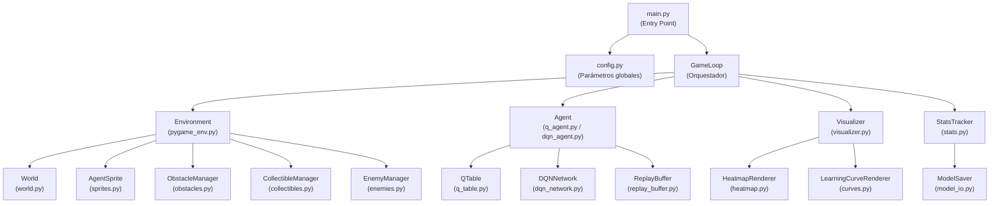
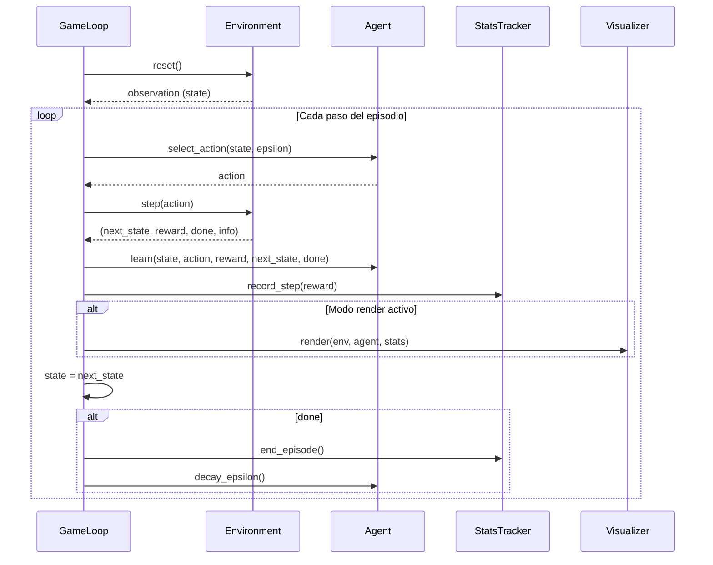
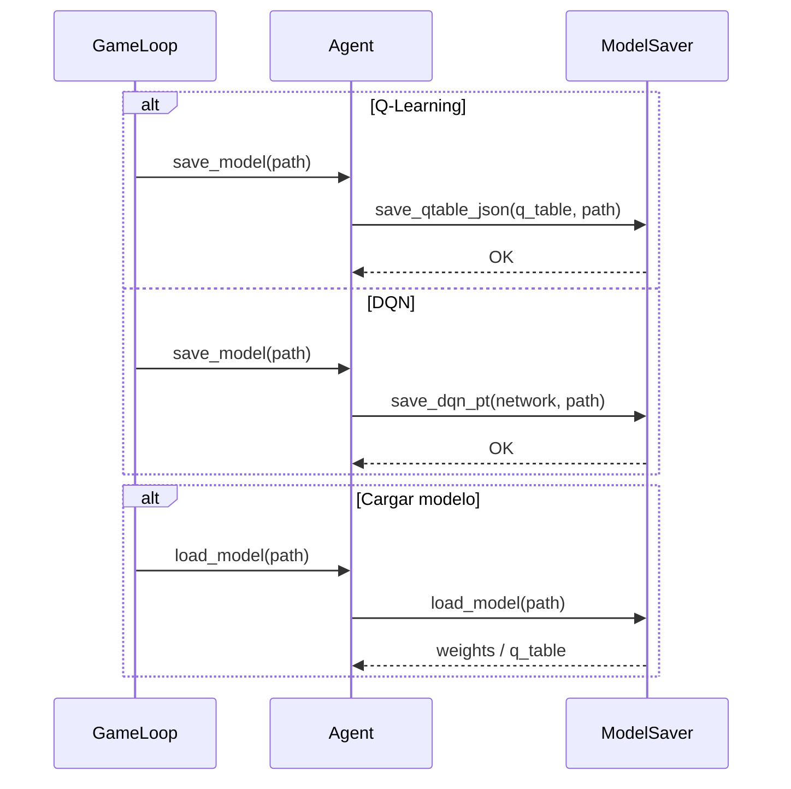

# Design Document: pygame-rl-simulacion

## Overview

Un entorno de simulación 2D construido con Pygame donde un agente IA aprende a navegar y tomar decisiones en un mundo con múltiples objetivos, obstáculos y peligros. El sistema implementa dos fases de aprendizaje progresivas: Q-Learning clásico con tabla de estados discretizados y Deep Q-Network (DQN) con red neuronal en PyTorch, ambas con visualización en tiempo real del proceso de aprendizaje.

La arquitectura sigue el patrón Entorno/Agente con interfaz compatible con Gymnasium (`step`, `reset`, `render`), lo que permite integración futura con librerías como Stable-Baselines3. El proyecto es completamente independiente y standalone, con modos de entrenamiento acelerado y demo para observar al agente entrenado.

El diseño prioriza la separación clara de responsabilidades: el entorno no conoce al agente, el agente no conoce los detalles de renderizado, y el sistema de visualización es un módulo independiente que observa ambos.

---

## Architecture



---

## Sequence Diagrams

### Flujo principal de un episodio de entrenamiento



### Flujo de guardado y carga de modelos



---

## Components and Interfaces

### Component 1: Environment

**Purpose**: Encapsula el mundo 2D, gestiona el estado del juego, calcula recompensas y expone la interfaz Gymnasium.

**Interface**:
```python
class Environment:
    def reset(self) -> np.ndarray:
        """Reinicia el episodio. Retorna observación inicial."""

    def step(self, action: int) -> tuple[np.ndarray, float, bool, dict]:
        """
        Ejecuta una acción.
        Returns: (observation, reward, done, info)
        """

    def render(self, mode: str = "human") -> None:
        """Renderiza el estado actual en Pygame."""

    def get_state(self) -> np.ndarray:
        """Retorna el vector de estado actual del agente."""

    def close(self) -> None:
        """Libera recursos de Pygame."""
```

**Responsabilidades**:
- Mantener el estado del mundo (posición del agente, objetos, enemigos)
- Calcular recompensas por cada acción
- Detectar colisiones y condiciones de fin de episodio
- Discretizar el estado para Q-Learning o retornar vector continuo para DQN

---

### Component 2: QAgent

**Purpose**: Implementa Q-Learning clásico con tabla de estados discretizados y política epsilon-greedy.

**Interface**:
```python
class QAgent:
    def select_action(self, state: tuple, epsilon: float) -> int:
        """Selecciona acción con política epsilon-greedy."""

    def learn(
        self,
        state: tuple,
        action: int,
        reward: float,
        next_state: tuple,
        done: bool
    ) -> None:
        """Actualiza la tabla Q con la ecuación de Bellman."""

    def decay_epsilon(self) -> None:
        """Reduce epsilon según el schedule configurado."""

    def save_model(self, path: str) -> None:
        """Guarda la Q-table como JSON."""

    def load_model(self, path: str) -> None:
        """Carga la Q-table desde JSON."""
```

**Responsabilidades**:
- Mantener y actualizar la tabla Q
- Implementar exploración epsilon-greedy
- Serializar/deserializar la tabla Q en JSON

---

### Component 3: DQNAgent

**Purpose**: Implementa Deep Q-Network con experience replay y target network.

**Interface**:
```python
class DQNAgent:
    def select_action(self, state: np.ndarray, epsilon: float) -> int:
        """Selecciona acción con política epsilon-greedy usando la red."""

    def learn(
        self,
        state: np.ndarray,
        action: int,
        reward: float,
        next_state: np.ndarray,
        done: bool
    ) -> float:
        """Entrena la red con un batch del replay buffer. Retorna loss."""

    def update_target_network(self) -> None:
        """Copia pesos de la red principal a la target network."""

    def save_model(self, path: str) -> None:
        """Guarda los pesos de la red en formato .pt"""

    def load_model(self, path: str) -> None:
        """Carga los pesos desde archivo .pt"""
```

**Responsabilidades**:
- Mantener red principal y target network
- Gestionar el replay buffer
- Calcular loss y actualizar pesos
- Sincronizar target network cada N pasos

---

### Component 4: Visualizer

**Purpose**: Renderiza en tiempo real el estado del aprendizaje: heatmap de Q-values, curva de recompensas, estadísticas del episodio.

**Interface**:
```python
class Visualizer:
    def render_heatmap(self, q_table: dict, world_size: tuple) -> None:
        """Dibuja el heatmap de Q-values sobre el mapa."""

    def render_learning_curve(self, episode_rewards: list[float]) -> None:
        """Dibuja la curva de recompensa acumulada por episodio."""

    def render_stats_overlay(self, stats: dict) -> None:
        """Muestra epsilon, episodio actual, recompensa, pasos."""
```

---

### Component 5: StatsTracker

**Purpose**: Registra métricas de entrenamiento y las expone para visualización y guardado.

**Interface**:
```python
class StatsTracker:
    def record_step(self, reward: float) -> None:
        """Registra la recompensa de un paso."""

    def end_episode(self) -> dict:
        """Cierra el episodio y retorna métricas: total_reward, steps, success."""

    def get_history(self) -> dict:
        """Retorna historial completo de episodios."""

    def save_csv(self, path: str) -> None:
        """Exporta estadísticas a CSV."""
```

---

## Data Models

### ObservationVector (Q-Learning)

```python
# Estado discretizado para Q-Learning
# Tupla hashable usada como clave en la Q-table
ObservationDiscrete = tuple[
    int,  # pos_x discretizada (grid cell)
    int,  # pos_y discretizada (grid cell)
    int,  # objeto_cercano_norte (0=libre, 1=pared, 2=recurso, 3=enemigo)
    int,  # objeto_cercano_sur
    int,  # objeto_cercano_este
    int,  # objeto_cercano_oeste
    int,  # recurso_en_radio (0/1)
    int,  # enemigo_en_radio (0/1)
]
```

### ObservationVector (DQN)

```python
# Vector continuo de features para DQN
# Shape: (STATE_DIM,) donde STATE_DIM = 12 por defecto
ObservationContinuous = np.ndarray  # dtype=float32

# Componentes:
# [0:2]  - posición normalizada (x/W, y/H)
# [2:4]  - velocidad (dx, dy)
# [4:8]  - distancias a paredes (norte, sur, este, oeste) normalizadas
# [8:10] - vector al recurso más cercano (dx, dy) normalizados
# [10:12]- vector al enemigo más cercano (dx, dy) normalizados
```

### Transition (Replay Buffer)

```python
from dataclasses import dataclass

@dataclass
class Transition:
    state: np.ndarray
    action: int
    reward: float
    next_state: np.ndarray
    done: bool
```

### EpisodeStats

```python
@dataclass
class EpisodeStats:
    episode: int
    total_reward: float
    steps: int
    success: bool       # llegó al objetivo sin morir
    epsilon: float
    loss: float         # solo DQN, 0.0 para Q-Learning
```

### WorldConfig

```python
@dataclass
class WorldConfig:
    width: int = 800
    height: int = 600
    cell_size: int = 40         # tamaño de celda para grid
    num_resources: int = 5
    num_enemies: int = 3
    num_obstacles: int = 15
    vision_radius: int = 3      # celdas de radio de visión del agente
    max_steps_per_episode: int = 500
```

---

## Algorithmic Pseudocode

### Algoritmo Principal: Q-Learning Update

```python
def learn(self, state, action, reward, next_state, done):
    """
    Preconditions:
    - state es una tupla hashable válida
    - action in range(NUM_ACTIONS)
    - reward es un float
    - next_state es una tupla hashable válida
    - done es bool

    Postconditions:
    - q_table[state][action] actualizado con la ecuación de Bellman
    - Todos los demás valores de q_table sin modificar

    Loop Invariants: N/A (operación atómica)
    """
    # Valor actual
    current_q = self.q_table[state][action]

    # Valor máximo del siguiente estado
    if done:
        target_q = reward
    else:
        max_next_q = max(self.q_table[next_state].values())
        target_q = reward + self.gamma * max_next_q

    # Actualización de Bellman
    self.q_table[state][action] = (
        current_q + self.alpha * (target_q - current_q)
    )
```

### Algoritmo: DQN Training Step

```python
def learn(self, state, action, reward, next_state, done):
    """
    Preconditions:
    - replay_buffer tiene al menos BATCH_SIZE transiciones
    - state.shape == (STATE_DIM,)
    - action in range(NUM_ACTIONS)

    Postconditions:
    - Pesos de la red principal actualizados
    - Retorna loss como float
    - Target network NO modificada (se actualiza por separado)

    Loop Invariants:
    - Durante el batch: cada transición procesada independientemente
    """
    # Almacenar transición
    self.replay_buffer.push(state, action, reward, next_state, done)

    if len(self.replay_buffer) < self.batch_size:
        return 0.0

    # Samplear batch aleatorio
    batch = self.replay_buffer.sample(self.batch_size)
    states, actions, rewards, next_states, dones = batch

    # Q-values actuales de la red principal
    current_q_values = self.network(states).gather(1, actions.unsqueeze(1))

    # Q-values objetivo de la target network
    with torch.no_grad():
        max_next_q = self.target_network(next_states).max(1)[0]
        target_q_values = rewards + self.gamma * max_next_q * (1 - dones)

    # Calcular loss y backprop
    loss = F.mse_loss(current_q_values.squeeze(), target_q_values)
    self.optimizer.zero_grad()
    loss.backward()
    self.optimizer.step()

    # Actualizar target network cada N pasos
    self.steps_done += 1
    if self.steps_done % self.target_update_freq == 0:
        self.update_target_network()

    return loss.item()
```

### Algoritmo: Cálculo de Recompensas

```python
def _calculate_reward(self, action_result: dict) -> float:
    """
    Preconditions:
    - action_result contiene claves: 'collision', 'collected', 'explored', 'died'

    Postconditions:
    - Retorna float en rango [REWARD_MIN, REWARD_MAX]
    - Recompensas positivas por colectar y explorar
    - Recompensas negativas por colisión y muerte

    Loop Invariants: N/A
    """
    reward = 0.0

    if action_result['died']:
        return REWARD_DEATH          # -10.0

    if action_result['collision']:
        reward += REWARD_COLLISION   # -1.0

    if action_result['collected']:
        reward += REWARD_COLLECT     # +5.0

    if action_result['explored']:
        reward += REWARD_EXPLORE     # +0.5

    # Penalización por paso para incentivar eficiencia
    reward += REWARD_STEP            # -0.01

    return reward
```

### Algoritmo: Discretización del Estado

```python
def _get_discrete_state(self) -> tuple:
    """
    Preconditions:
    - agent_pos es una posición válida dentro del mundo
    - cell_size > 0

    Postconditions:
    - Retorna tupla hashable de enteros
    - Cada componente está en rango discreto finito
    - Misma posición física → mismo estado discreto (determinista)

    Loop Invariants:
    - Para cada dirección en [N, S, E, O]: valor en {0,1,2,3}
    """
    grid_x = int(self.agent_pos.x // self.cell_size)
    grid_y = int(self.agent_pos.y // self.cell_size)

    # Escanear celdas adyacentes en radio de visión
    north = self._scan_cell(grid_x, grid_y - 1)
    south = self._scan_cell(grid_x, grid_y + 1)
    east  = self._scan_cell(grid_x + 1, grid_y)
    west  = self._scan_cell(grid_x - 1, grid_y)

    resource_nearby = int(self._resource_in_radius(self.vision_radius))
    enemy_nearby    = int(self._enemy_in_radius(self.vision_radius))

    return (grid_x, grid_y, north, south, east, west, resource_nearby, enemy_nearby)
```

---

## Key Functions with Formal Specifications

### `Environment.step(action)`

```python
def step(self, action: int) -> tuple[np.ndarray, float, bool, dict]:
```

**Preconditions:**
- `action in {0, 1, 2, 3}` (arriba, abajo, izquierda, derecha)
- El entorno ha sido inicializado con `reset()` previamente
- El episodio no ha terminado (`done == False`)

**Postconditions:**
- `observation` tiene la misma forma que la retornada por `reset()`
- `reward` es un float en `[REWARD_MIN, REWARD_MAX]`
- `done == True` si el agente murió, alcanzó el objetivo o se agotaron los pasos
- `info` contiene métricas de diagnóstico (colisiones, recursos recolectados)
- El estado interno del mundo avanza exactamente un paso

**Loop Invariants:** N/A

---

### `ReplayBuffer.sample(batch_size)`

```python
def sample(self, batch_size: int) -> tuple[torch.Tensor, ...]:
```

**Preconditions:**
- `batch_size > 0`
- `len(self.buffer) >= batch_size`

**Postconditions:**
- Retorna exactamente `batch_size` transiciones
- Las transiciones son muestreadas uniformemente sin reemplazo
- El buffer no es modificado
- Cada tensor retornado tiene `shape[0] == batch_size`

**Loop Invariants:** N/A

---

### `QAgent.select_action(state, epsilon)`

```python
def select_action(self, state: tuple, epsilon: float) -> int:
```

**Preconditions:**
- `0.0 <= epsilon <= 1.0`
- `state` es una tupla hashable válida

**Postconditions:**
- Retorna `int in range(NUM_ACTIONS)`
- Con probabilidad `epsilon`: acción aleatoria uniforme
- Con probabilidad `1 - epsilon`: `argmax(q_table[state])`
- Si `state` no está en q_table: inicializa con ceros y retorna acción aleatoria

**Loop Invariants:** N/A

---

## Example Usage

### Entrenamiento Q-Learning

```python
from environment.pygame_env import PygameEnvironment
from agents.q_agent import QAgent
from config import QLearningConfig, WorldConfig

# Configuración
world_cfg = WorldConfig(width=800, height=600, num_resources=5)
agent_cfg = QLearningConfig(alpha=0.1, gamma=0.99, epsilon=1.0, epsilon_min=0.01)

# Inicializar
env = PygameEnvironment(world_cfg, render_mode="fast")
agent = QAgent(num_actions=4, config=agent_cfg)

# Loop de entrenamiento
for episode in range(1000):
    state = env.reset()
    done = False
    total_reward = 0.0

    while not done:
        action = agent.select_action(state, agent.epsilon)
        next_state, reward, done, info = env.step(action)
        agent.learn(state, action, reward, next_state, done)
        state = next_state
        total_reward += reward

    agent.decay_epsilon()
    print(f"Episode {episode}: reward={total_reward:.2f}, epsilon={agent.epsilon:.3f}")

# Guardar modelo
agent.save_model("models/q_table.json")
env.close()
```

### Entrenamiento DQN

```python
from agents.dqn_agent import DQNAgent
from config import DQNConfig

agent_cfg = DQNConfig(
    state_dim=12,
    num_actions=4,
    hidden_dim=128,
    lr=1e-3,
    gamma=0.99,
    batch_size=64,
    buffer_size=10000,
    target_update_freq=100
)

env = PygameEnvironment(world_cfg, render_mode="fast", obs_type="continuous")
agent = DQNAgent(config=agent_cfg)

for episode in range(2000):
    state = env.reset()
    done = False

    while not done:
        action = agent.select_action(state, agent.epsilon)
        next_state, reward, done, info = env.step(action)
        loss = agent.learn(state, action, reward, next_state, done)
        state = next_state

    agent.decay_epsilon()

agent.save_model("models/dqn_model.pt")
```

### Modo Demo

```python
from utils.model_io import load_agent

env = PygameEnvironment(world_cfg, render_mode="human")
agent = load_agent("models/dqn_model.pt", agent_type="dqn")

state = env.reset()
done = False

while not done:
    action = agent.select_action(state, epsilon=0.0)  # sin exploración
    state, reward, done, info = env.step(action)
    env.render()
```

---

## Correctness Properties

```python
# Propiedad 1: El espacio de acciones es siempre válido
assert all(0 <= a < NUM_ACTIONS for a in range(NUM_ACTIONS))

# Propiedad 2: reset() siempre retorna una observación válida
obs = env.reset()
assert obs.shape == (STATE_DIM,) or isinstance(obs, tuple)
assert not np.any(np.isnan(obs))

# Propiedad 3: step() no modifica el estado si done=True
# (el entorno debe ser reseteado antes de continuar)

# Propiedad 4: Q-values convergen (no divergen a infinito)
# Para Q-Learning con alpha < 1 y gamma < 1, los valores son acotados

# Propiedad 5: El replay buffer no excede su capacidad máxima
assert len(replay_buffer) <= replay_buffer.max_size

# Propiedad 6: epsilon siempre está en [epsilon_min, 1.0]
assert epsilon_min <= agent.epsilon <= 1.0

# Propiedad 7: Las recompensas están acotadas
assert REWARD_MIN <= reward <= REWARD_MAX

# Propiedad 8: La observación discreta es determinista
state_a = env._get_discrete_state()
state_b = env._get_discrete_state()
assert state_a == state_b  # misma posición → mismo estado
```

---

## Error Handling

### Escenario 1: PyTorch no disponible

**Condición**: `import torch` falla al iniciar DQNAgent
**Respuesta**: El sistema detecta la ausencia de PyTorch en el import y lanza `ImportError` con mensaje descriptivo
**Recuperación**: El usuario es informado de instalar PyTorch o usar Q-Learning como alternativa. El modo Q-Learning siempre está disponible con solo numpy.

### Escenario 2: Modelo corrupto o incompatible al cargar

**Condición**: El archivo `.pt` o `.json` no corresponde a la arquitectura actual
**Respuesta**: `ModelSaver.load_model()` captura la excepción y retorna `None`
**Recuperación**: El agente inicia con pesos aleatorios y registra un warning en consola

### Escenario 3: Ventana de Pygame cerrada durante entrenamiento

**Condición**: El usuario cierra la ventana de Pygame
**Respuesta**: El `GameLoop` detecta el evento `pygame.QUIT` y llama a `env.close()`
**Recuperación**: Se guarda el modelo actual antes de terminar el proceso

### Escenario 4: Estado fuera de los límites del mundo

**Condición**: El agente intenta moverse fuera de los límites del mapa
**Respuesta**: `Environment.step()` aplica clipping a la posición y retorna recompensa de colisión
**Recuperación**: El episodio continúa; el agente aprende a no chocar con los bordes

---

## Testing Strategy

### Unit Testing

- `test_environment.py`: Verificar que `reset()` retorna observación válida, `step()` retorna tupla correcta, recompensas están en rango esperado
- `test_q_agent.py`: Verificar actualización de Bellman, política epsilon-greedy, serialización JSON
- `test_dqn_agent.py`: Verificar que el replay buffer funciona, que el loss disminuye en un batch simple, sincronización de target network
- `test_replay_buffer.py`: Verificar capacidad máxima, muestreo uniforme, no modificación del buffer

### Property-Based Testing

**Librería**: `hypothesis`

- **Propiedad**: Para cualquier estado válido y acción válida, `step()` siempre retorna una observación del mismo shape
- **Propiedad**: Para cualquier secuencia de transiciones, el replay buffer nunca excede `max_size`
- **Propiedad**: `select_action()` siempre retorna un entero en `[0, NUM_ACTIONS)`
- **Propiedad**: La discretización del estado es determinista: misma posición → mismo estado

### Integration Testing

- `test_training_loop.py`: Ejecutar 10 episodios completos de Q-Learning y verificar que epsilon decrece y las recompensas no son NaN
- `test_save_load.py`: Entrenar, guardar, cargar y verificar que el agente cargado produce las mismas acciones que el original
- `test_demo_mode.py`: Cargar un modelo y ejecutar un episodio en modo demo sin errores

---

## Performance Considerations

- **Modo entrenamiento rápido**: Desactivar render de Pygame (`render_mode="headless"`) para maximizar velocidad de entrenamiento. Se espera >1000 pasos/segundo en modo headless.
- **Replay buffer eficiente**: Implementar con `collections.deque(maxlen=N)` para O(1) en push y pop.
- **Discretización del estado**: La función `_get_discrete_state()` debe ser O(1) para no ser el cuello de botella del loop de entrenamiento.
- **Batch GPU**: Si PyTorch con CUDA está disponible, los tensores del DQN se mueven a GPU automáticamente.
- **Renderizado selectivo**: El Visualizer solo redibuja componentes que cambiaron (dirty rects en Pygame).

---

## Security Considerations

- Los archivos de modelo (`.pt`, `.json`) se cargan con validación de formato antes de deserializar para evitar ejecución de código arbitrario en pickles de PyTorch. Se usa `torch.load(..., weights_only=True)`.
- Las rutas de guardado/carga se sanitizan para evitar path traversal.

---

## Dependencies

| Dependencia | Versión mínima | Uso |
|-------------|---------------|-----|
| Python | 3.10+ | Lenguaje base |
| pygame | 2.5+ | Renderizado 2D y manejo de eventos |
| numpy | 1.24+ | Q-Learning, vectores de estado |
| torch | 2.0+ | DQN (opcional) |
| hypothesis | 6.0+ | Property-based testing |
| pytest | 7.0+ | Test runner |

**Estructura de directorios del proyecto:**

```
pygame-rl-simulacion/
├── main.py
├── config.py
├── environment/
│   ├── __init__.py
│   ├── pygame_env.py
│   ├── world.py
│   ├── sprites.py
│   ├── obstacles.py
│   ├── collectibles.py
│   └── enemies.py
├── agents/
│   ├── __init__.py
│   ├── base_agent.py
│   ├── q_agent.py
│   ├── dqn_agent.py
│   ├── q_table.py
│   ├── dqn_network.py
│   └── replay_buffer.py
├── visualization/
│   ├── __init__.py
│   ├── visualizer.py
│   ├── heatmap.py
│   └── curves.py
├── utils/
│   ├── __init__.py
│   ├── stats.py
│   └── model_io.py
├── models/           # modelos guardados
├── tests/
│   ├── test_environment.py
│   ├── test_q_agent.py
│   ├── test_dqn_agent.py
│   ├── test_replay_buffer.py
│   ├── test_training_loop.py
│   └── test_save_load.py
└── requirements.txt
```
